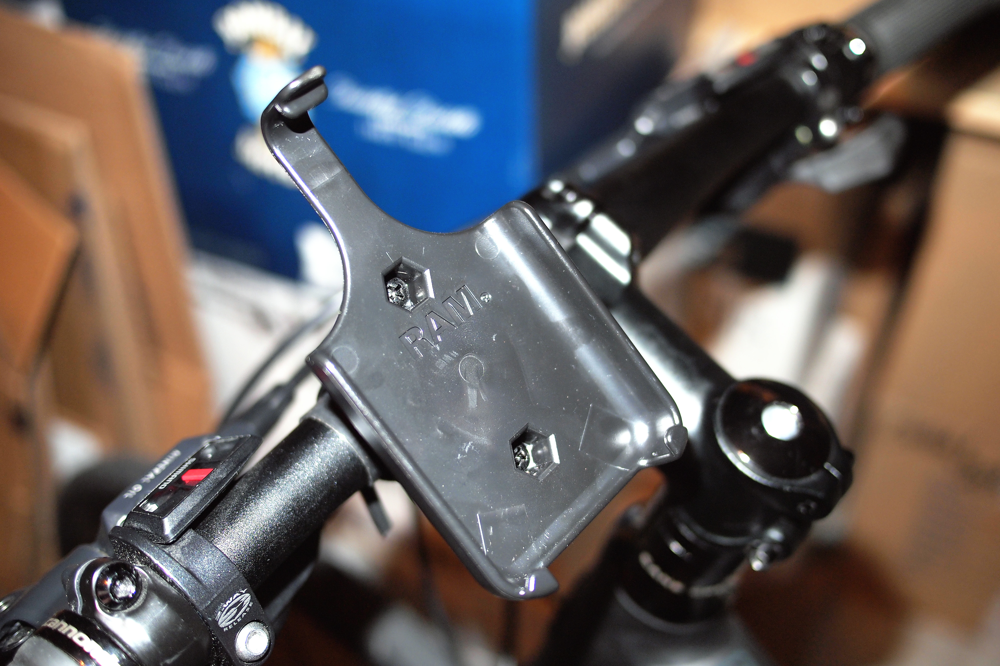
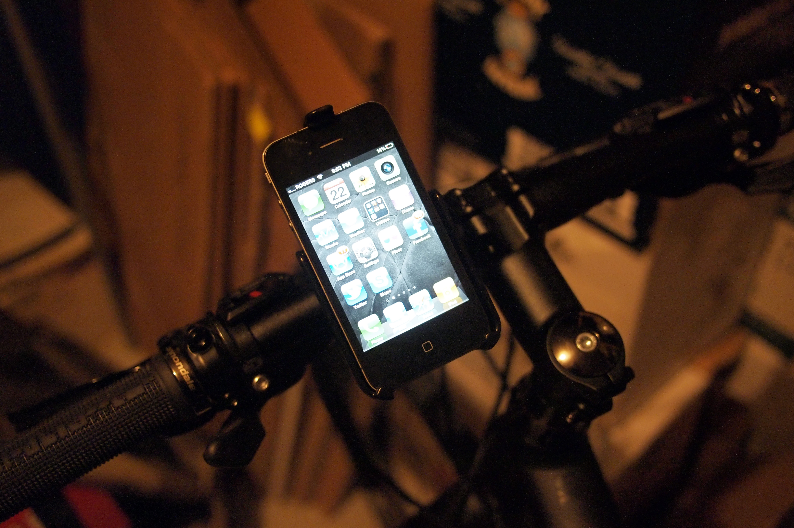
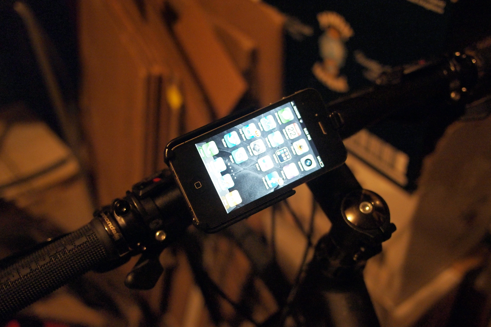

I’m up to a little over 60 kilometres worth of biking on my new bike, and so far I’m really enjoying getting outside again. The first few rides I did were pretty painful, both from a muscle perspective and also from a cardio perspective. But I’m up to about 16 kilometres a ride now, and I can see myself doing a 25 kilometre ride fairly soon as well.

I’ve actually been using the [RunKeeper](http://runkeeper.com) application on my iPhone to track my progress. It’s a free application as well as a free service (there’s a paid upgrade option). I don’t think I’ll upgrade, mainly because I don’t think I’d need any of the perks at the higher level. That said, I get enough out of RunKeeper that I would gladly pay for it if some features become available that I think I might use.

Part of why I like it is that it keeps me motivated. It’s one thing to sit on the couch and do nothing on a particular day, but quite a different thing to do so when your friends are posting 30 – 40 kilometre rides while you’re lounging around. It’s sort of like having a virtual gym buddy, and so far it’s been keeping me motivated enough to get out a few times a week.

The first few rides I did on my bike I simply shoved my iPhone in my pocket. That works fine, but you can’t see your progress or easily adjust your music. So one of the first items I decided to order was an iPhone bike mount for my bike.

I did a bit of research, and the [Ram iPhone Bike Mount](http://www.ram-mount.com/NewProducts/appleiphone4mounts/tabid/2858/Default.aspx) for the iPhone 4 came up quite a bit on various forums. Since it listed for about $30 online, I made a purchase and waited for it to show up. It arrived in the mail the other day and I’ve used it for a few rides now. So here’s what I think.

Installation of the RAM iPhone Bike Mount was a breeze. The first step is placing a rubber/foam backing onto your handlebars where you want the mount to go. This has the dual purpose of helping to absorb shocks on the road as well as stopping the mount from scratching your paint. Next, a clamp goes onto your handlebars and it’s zip tied into place. I’m not entirely sure why it doesn’t use screwed for this, but the zip ties seem to suffice and the mount is firmly in place. Finally, a quick release adapter (that holds the iPhone) fits into a cylindrical hole and locks into place with a slight counterclockwise rotation.

Completed iPhone 4 Mount

I haven’t really made use of the quick release mechanism, but it’s there in case you want to remove the top part of the mount as well as your iPhone 4. As for me, I simply remove the iPhone 4 from the quick release mechanism whenever I’m done, and lock it back into place for every ride.

Here’s a shot of the iPhone 4 when it’s properly seated in the mount and the quick release mechanism is locked into place.

Ram iPhone 4 with Phone Inserted

Another cool aspect of the mount is that if you press down on the entire mechanism you can rotate the phone into a landscape orientation as well.

Ram iPhone 4 Mount With Phone In Landscape Orientation

Having gone on a few rides with it, I’m definitely happy I got it. I think the setup is extremely stable, and I don’t think the phone is being subjected to any significant shocks or bumps. In fact, about 60% of my riding so far has been on packed gravel trails, and the phone doesn’t even seem to blink while riding along them. I haven’t hit any rain yet, but I could have the phone in my pocket in about 5 seconds if it were to occur, so that’s not a concern for me. But it’s definitely nice to simply glance down at it from time to time to see what my current pace is or how far I’ve ridden.

The only other adjustment I’d be inclined to make is to put some kind of plastic guide on my stem for my headphones. It’s not really a huge deal, but the headphone cables for my music does flop around a little bit, and it’s brushed against my knee from time to time. If I did accidentally hook it the worse thing that would happen is that it would come unplugged from my phone. But it would probably startle me a bit, and I don’t like being startled. So I think having a plastic guide would ensure that the headphone cable was always in the proper place.

But in short, I’d definitely recommend this mount to anyone who is doing a lot of biking, using some kind of tracking application like RunKeeper, and also wanting to view their stats while they are biking.

If you’re looking to pick one up for the iPhone 4, here’s the [Ram iPhone 4 Mount on Amazon](http://www.amazon.com/gp/product/B003ZFL4K2/ref=as_li_qf_sp_asin_il_tl?ie=UTF8&tag=duanstor-20&linkCode=as2&camp=1789&creative=9325&creativeASIN=B003ZFL4K2).

### 2013 Updates

You can also pick up a [RAM iPhone 5 Bike Mount](http://www.amazon.com/gp/product/B00AG1K3NC/ref=as_li_qf_sp_asin_il_tl?ie=UTF8&camp=1789&creative=9325&creativeASIN=B00AG1K3NC&linkCode=as2&tag=duanstor-20) from Amazon.