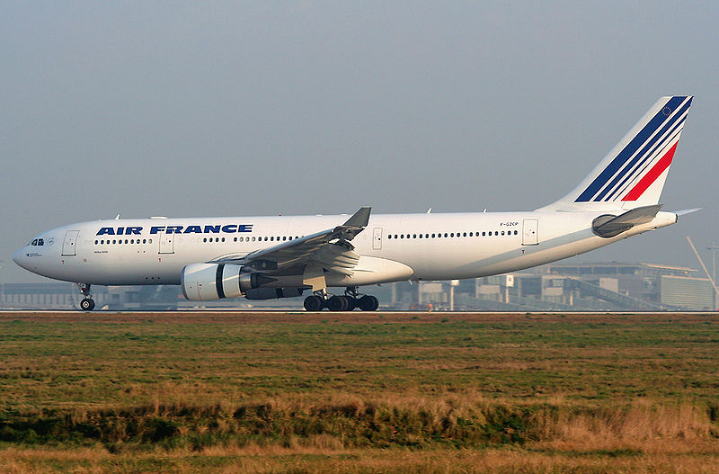

I’ve been following along with the Air France crash investigation with interest. I don’t like flying: I get anxious on airplanes and would rather not be hurtling through the atmosphere. But I know that if you want to go anywhere fast, you need airplanes. So whenever I hear about a plane crash, it always unnerves me a bit.

Normally I put the crash out of my mind as simply a crappy plane used by a lesser-known airline, or the result of some route I’ll probably never go on. But the crash of Air France 447 was neither: it was a one of the more well-known airlines in the world, and it was on a route between two major cities: Rio De Janeiro and Paris.

Air France Flight 447, Photo from Wikipedia

Another point of interest is that it seemed to crash while traveling through the Intertropical Convergence Zone (ITCZ), which is where the northern hemisphere air meets the southern hemisphere air – it usually results in a few bumpy rides, but has also been known to present severe turbulence.

Because the plane crashed over deep waters, it’s taken investigators more than two years to locate the wreckage and obtain the flight data recorders. Some of the preliminary data was released, and it looks like [Air France 447](http://www.businessweek.com/news/2011-05-27/air-france-probe-shows-jet-stall-in-free-fall-into-atlantic.html) fell for nearly four minutes with its nose pitched up almost 35 degrees.

There’s no official ruling yet, but here’s what the chain of events look like to me.

- The pilot went on a break and handed the controls over to the two junior pilots.
- The plane hit a storm area in the ITCZ that contained supercooled water
- The pitot sensors (which the plane uses to determine its airspeed) failed due to the supercooled water and started reporting invalid airspeed data to the flight computer
- The flight computer, which was set in autopilot mode, realized there was disagreement between the various speed indicators and correctly detected a fault condition
- The flight computer disabled the autopilot due to the fault, and removed the flight protection envelopes that are part of Airbus’ fly-by-wire systems (which makes sense – the plane is in a weird state, and the pilots may need to take drastic measures to restore stable flight)
- With autopilot disengaged, the plane entered a stall (this has nothing to do with the engines – basically the plane had slowed to the point where the wings were no longer generating lift, which caused the plane to start falling)
- The junior pilots increased the engine thrust and put the plane into a pitch up position – this is the opposite of what you are supposed to do in a stall, you should point the nose down to regain airspeed. This is lesson #1 or #2 in almost all flight simulators I’ve played
- Junior pilots maintained nose-up attitude until the computer issued an audible impact warning in the cockpit at 1,500 feet
- Plane crashes into the Atlantic, killing everyone on board

The main question right now is why the pilots put the plane into a nose-up position when the plane was in a stall. Either they didn’t recognize it as a stall, or they thought the Airbus flight protection systems (which normally will auto-correct a stall) were still in place. So the failure of the pitot tubes (which isn’t confirmed yet, but seems likely due to previous other incidents involving them) seems to be the catalyst for the accident, but it appears likely that pilot inexperience and potentially pilot error resulted in the plane never recovering from the initial failure.

We’ll see what the official ruling is, probably in a few weeks, but that’s what it looks like to me right now.