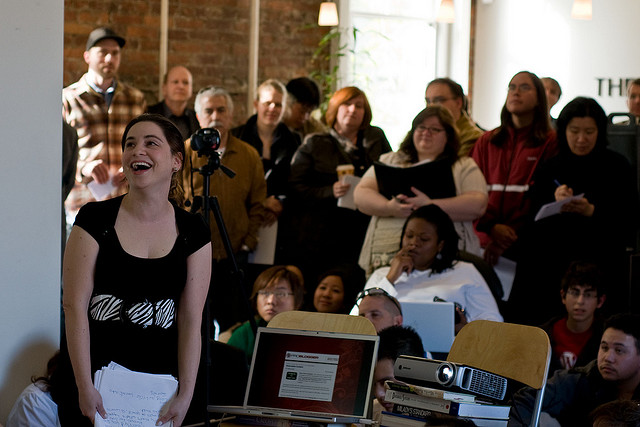

WordPress Presentations at the Network Hub, photo by Ianiv and Arieanna

[Rebecca](http://www.miss604.com) is over in Victoria right now for Social Media Camp, and it sounds like it’s a great event. WIthout a doubt, everyone is interested in social media right now, and learning how they can leverage it to build relationships and better run their business.

While it hasn’t been officially announced yet, I’ll be giving a talk about WordPress and social media on June the 23rd at the monthly WordPress meet-up in Vancouver. It’ll be at the Network Hub, and should be a fun event. Hopefully whoever comes out will be up for hitting a pub afterwards and continuing on the WordPress discussions over a few beers. The first few pitchers of beer will be on me!

But if you’re a WordPress user, either personal or business, and would like to better understand how to leverage the platform for interacting with social media, then this will probably be an event that you will want to check out.

I’ll update this post with the page to RSVP as soon as it’s ready, and also put a tweet or two out — hopefully I’ll see some of you there.