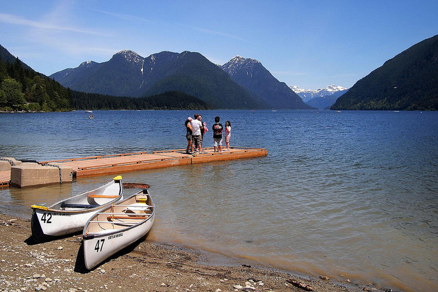
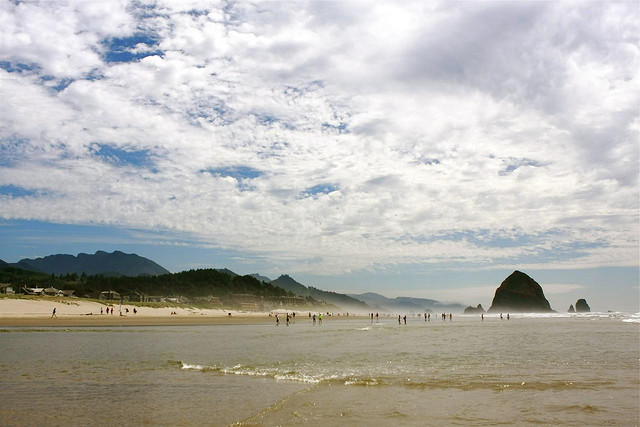

Yesterday I went up to Golden Ears park to scope out some campgrounds for the summer. I was actually surprised just how pretty it is up there, and am regretting that I only just discovered the area now. From the front door of where I live to the entrance of Golden Ears is only about a 30 minute drive, so it’s quite conceivable I can be camping in about an hour after I decide to go camping.

Alouette Lake, Near Golden Ears Park

It sounds weird, but I still get surprised when I realize that I can simply get in the car or on a plane and go somewhere new whenever I want. I spent the morning today getting some of my camping gear in order, and briefly debated finding a campground today. There are enough coffee shops around with WiFi that I can simply find one of those and do some work as I go.

I came back from my trip to South America and Europe with the intention of spending a lot of time outdoors this summer in the area. In the short term I have a trip planned to San Francisco, possibly Toronto, a camping trip up by Pemberton, and then a few weeks on Vancouver Island. Outside of that though, I’m probably going to pack my car and head down the coast again to the Portland area for a few weeks. I also wouldn’t mind scoping out a pile of campgrounds in Oregon and sampling some of the local breweries in the area.

Cannon Beach, Oregon

Unfortunately for me, I don’t know many people who have the ability to travel as easily as I do. I’m going to have to put some feelers out and see who else is in a similar scenario, because I wouldn’t mind doing a few road trips this summer and it’s always better to have a friend or two along for the ride. Campgrounds south of the border are generally cheap, and most can be had for around $10 or $15 a night.

But definitely I’m going to spend a lot of time outside this summer. I have a bike now, and a bike rack, so I can take my bike with me wherever I go. As soon as I get a knee brace as well I’d like to start doing a hike every weekend or so if I can. And now that the sunshine is starting to come out, I’m starting to feel like this is going to be a really great summer.