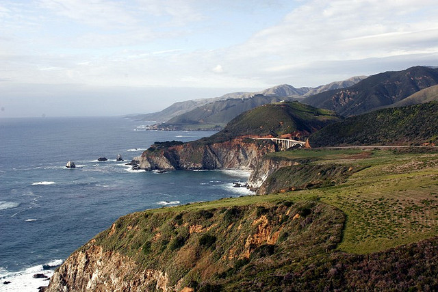

A few weeks ago I made an impromptu decision to escape some of the rain here in BC and head down to California to visit a few friends for this upcoming weekend. Back when I used to work in the Voice Over IP field, I probably made at least 2 or 3 trips a year down to the Bay Area to work with some Yahoo! people and also to attend various functions at Google.

Now the weekend is approaching, I need to decide just what it is I want to do in San Francisco. My friends live near Palo Alto (home of Apple store #1), so I plan to spend an afternoon there. Outside of that I’m actually thinking I may rent a car and go camping down the coast for a few days.

I debated grabbing a hotel, but that will run me about $500 for three days. Instead I can rent a car and camp for a few days, bringing the cost down to more like $120 for three days. I’ve been meaning to get a new tent for a while now, so with the difference in cost between a hotel and a campground, I can simply buy a nice new tent from MEC later this week and bring it with me.

Monterey Coast, California

One of the nicest drives I’ve ever been on is down the Monterey coast in California. So I’m thinking I may try and camp in that area for a night or two, and spend the day hanging out around Carmel by the Sea. I’ve spent enough time in downtown San Francisco that there’s really not much left for me to see in the city, so it might be nice to simply spend some time driving down the coast and enjoying some 25C weather.

I still have a few days to decide, but that’s the direction I’m leaning towards. Regardless of what I do though, it looks like I’ll get two or three days of nice weather along the coast, which is well worth the flight down in my opinion.