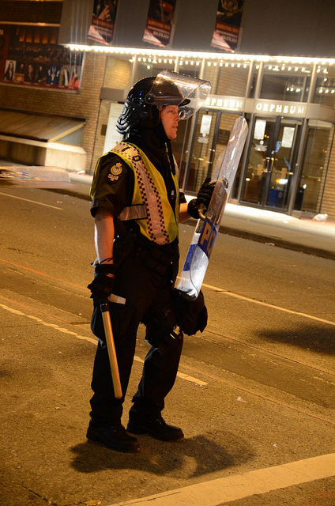
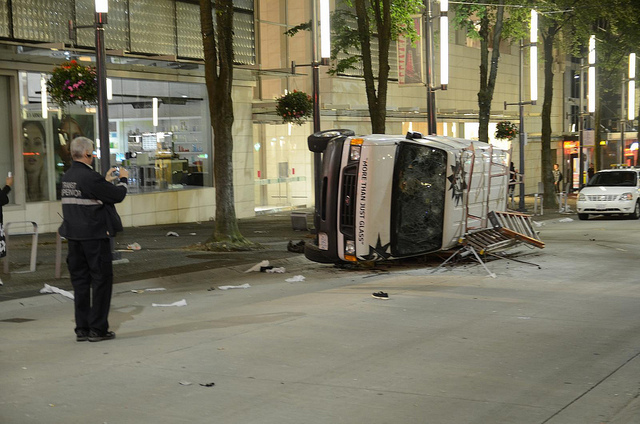

It seems that no very long ago I was writing about some looting and rioting with regards to the winter olympics. By comparison to what happened here in Vancouver two nights ago, those acts were relatively minor and forgettable.

An officer in Riot Gear during the Vancouver Riots, 2011

By this time everyone knows what happened after game 7. A few drunken idiots decided to cause trouble, and other idiots got on the bandwagon. The media has tried to label most of these people as individuals from out of town, but not all of them were. They have also tried to scapegoat the entire group, saying they were thugs or anarchists that were dressed like Canucks fans. I’m sure some were, but one was a Water Polo Champion with a scholarship to a Calgary university, another was a secondary school teenager from Richmond, and another a school kid from the Burnaby area. Not exactly out of towners by my definition, and not exactly what comes to mind when I think of thugs or anarchists.

As for me, I ended up at a small pub at the foot of the Granville Street bridge after the game. I was there with about six other people, and we shared a few pitchers of beer while catching up. My phone was dead, or on the verge of dying, and it was off at this point. There was a TV on, and it showed a garbage can burning at one point, but it wasn’t until I left the pub that I realized just how bad things were outside.

Overturned Car, Vancouver Riots 2011

When I walked outside, I found myself in the thick of police with riot gear. At this point, I had no idea that the Riot Act had been read, and I was simply trying to walk to a hotel to grab a room for the night. I talked to a police officer at this point who told me that all of us had to get off the roads immediately or risk being arrested, which when you’re not expecting that intensity from a police officer comes as a bit of a shock. Obviously, seeing the aftermath of what they were dealing with that night, I understand completely now the force they were using. Unfortunately for me it meant that I was stuck downtown with nowhere to go.

My idea at that point was to try and make my way to my friend’s place in the West End. Unfortunately there were police officers at every intersection, and they wouldn’t let anyone by. I ended up basically having to loop around the downtown core and make my way to the West End the long way. It took a while, but I eventually made it. I had my SLR on me, so I took a few photos along the way, but basically was trying my best to get out the core as quickly as possible. I passed cars that had been flipped and streets covered in glass, and it was a strange out-of-city experience walking down the streets at that hour.

[")](http://www.migratorynerd.com/wordpress/wp-content/uploads/2011/06/5838801716_8668fc2ed1_z-1.jpg)Smashed Cars

Some people want to blame the Mayor for allowing 100,000 people downtown to watch the game. Other say that the closure of the liquor stores downtown at 4pm contributed. I visited a few restaurants and pubs during the day, and most weren’t allowing reservations for the game – that meant line-ups had formed by 11:30am and that people in the pubs were being forced to drink all day simply to secure their seats. There were lots of contributing factors that led to what happened.

But the reality is that the blame needs to fall on the individuals who initiated the illegal activities, and those that got on the bandwagon after. Many of the individuals I saw on TV jumping on cars were indeed wearing the same bandanas on their faces as the ones from the winter olympics, so it seems likely that many people came with the sole intent of causing trouble – they were obviously successful.

## The Aftermath

I woke up the next day in the West End and made my way back into the core to pick up my car and head home. The night prior I had briefly debated parking on the street, and was extremely thankful I made a last minute decision to park underground at Pacific Centre. The final fee for parking there overnight was $52, but at least I still had my car in one piece.

I passed several people on the way that were wearing Canucks jerseys and helping to clean up some of the glass. Other than the obvious damage at Chapters, Sears and Future Shop, the streets were already relatively clean at this point in time. All in all, I believe somewhere near 13,000 people volunteered and came out to help clean up the city, which everyone is obviously thankful for.

Already websites have sprung up that are trying to get viewers to identify some of the perpetrators. I have no problem with that, but some of the content and the comments on those sites remind me of the mob mentality that occurred during the riots themselves, except instead of flipping cars people are trying to flip lives. We shouldn’t forget that we have a proper legal system that is meant to deal with these types of infractions and to bring people to proper justice, not the vigilante justice that people seem to be wishing for on these sites.

## The Future

I give credit to Mayor Robertson – he immediately said that plans would continue to go ahead for future events and that Vancouver wouldn’t cave into a few individuals trying to cause trouble. I also give full credit to the Vancouver Police Department for dispersing the entire crowd within three hours. Obviously many buildings and cars were damaged by the rioters in that time, but nobody was killed and the response was substantially improved since the last major riot in 1994.

I suspect for future events that a police presence will be felt at all times, as well as a no tolerance policy for liquor and minor infractions. But based on Mayor Robertson’s interviews, I’m happy that at least those events will be allowed to proceed and that Vancouver won’t be held hostage for a few individuals looking to cause trouble.