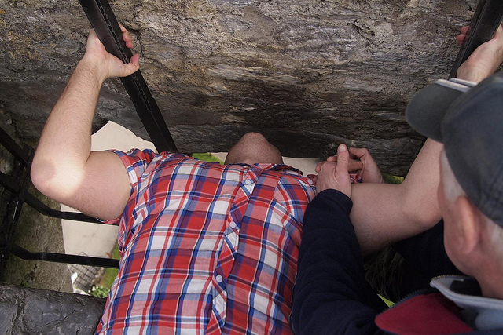

Voted the #1 most unsanitary tourist attraction in the world several times, I managed to visit the Blarney Stone back in March and give it a little smooch.

Me Kissing The Blarney Stone - Photo by Andy Peatling

Apparently I now have “The Gift Of Gab”. So if I talk your ear off with eloquent speech, you now know why.

It’s actually kind of awkward to kiss it as you have to learn all the back and lower yourself down. But, I somehow managed to pull it off.