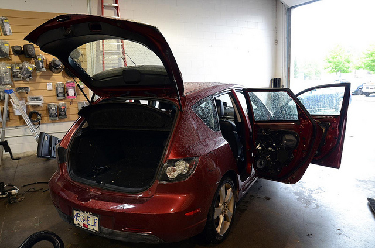
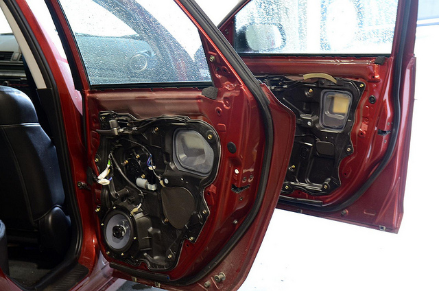
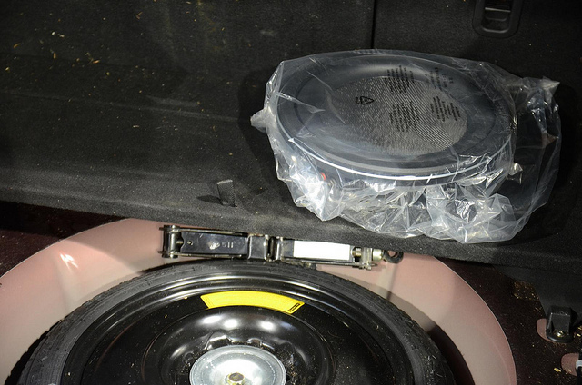

I’m down at Driven Audio down in Abbotsford right now getting some new speakers, an amplifier and a subwoofer put into my Mazda 3 sport. I’ve been meaning to upgrade the audio system for years, but have never gotten around to it. Considering I’m heading off on a bit of a road trip next weekend, I thought now would be a good time.

Driven Audio

Mostly Disassembled Mazda 3 Sport

10:45am – speakers in the doors are being removed

Mazda 3 Sport Audio Makeover

1pm – Installing tweeters and 5x7s in the doors, along with the crossover

Speaker and Crossover Installation

2:30pm – I wasn’t going to replace the deck in my car, but the guys convinced me it will sound a lot better than the stock unit, and doesn’t require the use of a line voltage converter to match the stock components. Plus, the new unit would have built in Bluetooth and function better with the existing audio – something the after-market Bluetooth unit I had installed previously didn’t really accomplish. Plus the new deck also has a direct USB interface, which is a nice addition.

Bye Bye Stock Mazda Head Unit

The installers also decided to install the subwoofer in the spare tire well as opposed to a box sitting in the trunk. The is a much better solution for me, since having a box in the trunk somewhat defeats the purpose of having a hatchback. The tradeoff is that the trunk is raised by about an inch, which removes a bit of the available space, but in a way that’s far more workable than a big box sitting in the back permanently.

Subwoofer About To Go To His New Home