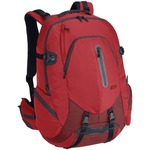

Prior to setting out on my last adventure, I went down to Mountain Equipment Co-op (MEC) here in Vancouver and tried to find a backpack to take with me on my trip. I was looking for a backpack with the following qualities:

- Should fit as carry-on for most airlines
- Should have room for a laptop and my iPad
- Should be large enough to carry basic necessities like a few changes of clothes and toiletries

With these criteria in mind, I eventually settled on [purchasing the MEC Pangea 40](/2010/carry-on-sized-backpack-to-take-traveling/), which is a 40 litre travel backpack that’s constructed so it will fit as carry-on for most airlines.

### How It Stood Up?

*Should fit as carry-on for most airlines* – Well, it definitely fit as carry-on for all of the major airlines I attempted to fly on. That included Continental, LAN Argentina and Air Lingus (Ireland). The only time I had any sort of “trouble” was in Ushuaia, Argentina. They had one of those metal frames to measure the size of your carry-on, and I could tell just by looking at it that there was no way my entire bag would fit in it (since I had stuffed it pretty full). I went to the bathroom and re-organized my back to make it taller instead of fatter. When I went back to the counter, they had stopped checking bags, so I never got a chance to see if it was small enough, but they let me take it on anyways.

*Should have room for a laptop and my iPad* – It worked flawlessly in this department for the most part. The only caveat I have is that my Kindle screen broke while flying to Cancun on a test run of this backpack. At the time I didn’t have a Kindle case, so I suspect my SLR camera in my bag simply applied pressure during the flight and cracked the screen. Amazon replaced it free of charge, so it was more of an annoyance. But if you travel with anything like a Kindle, make sure you have a protective cover for it.

*Should be large enough to carry basic necessities like a few changes of clothes and toiletries* – Being 40L, it definitely had quite a bit of room inside, and easily fit my laptop, my iPad, my camera, and enough clothes and toiletries for a few days. In fact, the backpack was on the only luggage I took for several of my weekend trips, including a visit to the penguins off of [Ushuaia, Argentina](/2011/update-from-the-end-of-the-world/), and to [Iguazu Falls](2011/weekend-trip-to-iguazu-falls/).

### What I Didn’t Like

MEC Pangea 40 in Red

So while the backpack met my primary criteria and functioned adequately, there were a few things about it I didn’t like.

*The colour*: When I went to MEC that day, they had the old version of the MEC Pangea 40 in black, but all the new ones were red. I chose the red version since I wanted the new styling, but the backpack was definitely an eyesore during most of my trip. When your backpack is full of expensive electronics it pays to be less conspicuous not more conspicuous. Also, it just looked kind of bad walking around with it, and I didn’t see many other backpacks in four months with the same colour.

*Straps*: The backpack has waist straps that you can use while walking around. The issue is this isn’t really a huge bag, so I don’t believe they are necessary. The straps actually take up a lot of room, and don’t really stow anywhere if you aren’t using them. So you end up with these awkward straps aatnd the bottom of your backpack that dig into your back from time to time. I read a review from another traveler who actually cut his off. That might be an option, but then I would be concerned that the bag would be compromised for strength.

### Will I Take It Traveling Again?

That’s the million dollar question, and right now the jury is out. If I’m in a pinch, I’ll load up that backpack and take it again. But truthfully, I’m going to look for something else. When I set out traveling on my last adventure, I assumed I would be spending a lot of time with my backpack on. That turned out not to be the case. Everywhere I went I had a home base where I could store items (and my small suitcase, which I brought at the last minute as well), which meant I didn’t have to load up my entire backpack for each trip. So I could have just as easily managed with a 30L or something a bit smaller, which also would have made it easier to get on planes (not that I was rejected, but it was a possibility at at least one airport), and might remove the need for waist straps.

So I’ll definitely be looking for something new, but managed to make the MEC Pangea 40L work for my journey, even though it was a bit lacking in the two areas I mentioned above.