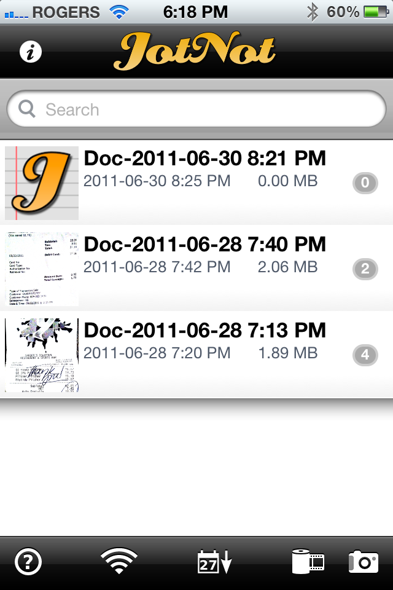

Inside my suitcase upstairs is a huge manilla envelope that has the majority of receipts in it for my trip to South America. Since some of them represent expenses that I can write-off on the business side, it was important to keep them for Revenue Canada in the odd event of an audit down the road.

Unfortunately for me though, it meant that I had to collect all my receipts while traveling around the world. It’s one thing when you have an apartment in Canada and everything can be sorted into file folders once a week or so, but when you’re traveling with a backpack and trying not to accumulate anything else, having to store paper receipts is a pretty big drag. Not only is storing receipts a pain, but often the ink will rub off on the ones that stay in your pocket or your wallet for more than a few days, at which point they are useless.

For my next trip, I’ve basically committed to myself that I’m going to go completely paperless. I spent an evening researching portable receipt scanners that I could take along with me, but many of them had mediocre reviews. In addition, I’m not particularly keen on adding anything else to my suitcase or backpack.

JotNot Pro for the iPhone

I eventually stumbled upon the [JotNot Pro iPhone application](http://itunes.apple.com/us/app/jotnot-scanner-pro/id307868751?mt=8) which does exactly what I need it to do. Basically you point your iPhone at a receipt as soon as you get it and take a photo. The application will then superimpose a polygon over what it thinks is the actual receipt in the photo. At this point you can adjust the four corners slightly to make sure the application has the total receipt inside the polygon. Once you commit the shape, JotNot Pro will crop the receipt and translate it back into a rectangle. You can then convert it into a PDF and either save it for later or email it to someone (i.e. yourself).

I’ve been playing around with it, and I think it’s going to work really well while traveling. I’ve made a few different folders in one of my email accounts, so I can simply email the receipts to myself and quickly archive them in the appropriate folder. In theory I can then toss the receipt away and rely entirely on the digital copy going forward.

I’ll give it a try when in Thailand, but so far it has worked flawlessly here in Canada, and I’m hopeful my days of flying receipts tens of thousand of kilometers are over.