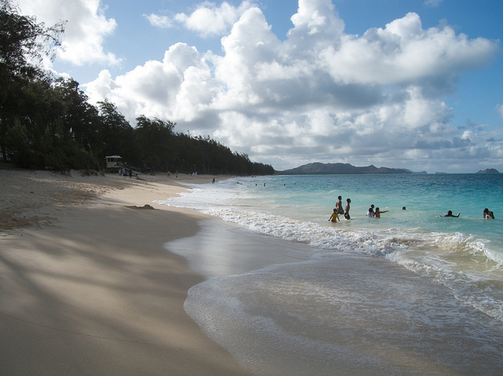

Oahu, Photo By John Biehler

I have to admit, this weather has been getting me down. Other than a few days of sun on Vancouver Island last week, I haven’t really seen much in the way of warmth or sunshine since returning from South America. When I looked at the forecast this morning and saw 7 days of rain in the long term forecast, I decided to do something about it.

I spent about 15 minutes bouncing around Expedia and Travelocity, and eventually honed in on a flight to Hawaii for a little over $400 out of Bellingham. Given that it’s not amazingly far away and that I’ve always wanted to see Hawaii, I decided to simply go for it. So I’m heading to Hawaii for nine days, leaving this weekend.

I have some work to do next week, but there are lots of coffee shops on Oahu (so I’m told), so I’ll simply work out of them. I also have a mobile stick for the United States that I may picked up from back in Chilliwack and take with me. I rented a car for a week, and plan to explore the Island with my camera. There are apparently gorgeous campgrounds along the Northern and Western shores of Oahu, so I’m going to bring along one of my smaller tents and possibly spend a few nights sleeping at a few campgrounds near the beach.

Other than that, I don’t really have any plans. But I figure it’s a golden opportunity to escape the rain and also see a different part of the world while at it.