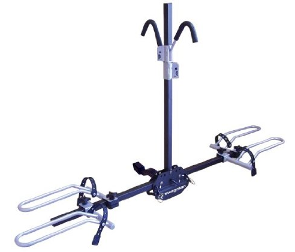

While the weather in Vancouver hasn’t exactly been stellar lately, I’ve still managed to get out for a bike ride from time to time. Given that I envisioned myself wanting to take my bike to Stanley Park from time to time or out to Chilliwack, I decided a while ago that I would need some type of bike rack.

The easiest option for my Mazda 3 was a roof rack. The Mazda 3 already has a built in header that allows a rack to easily be mounted onto it. But truth be told, the idea of having a bike floating way above my car has never really sat easy with me.

First, it means I would really have to be careful when driving into parking garages. I’ve heard plenty of horror stories of bikes being sheared while trying to enter a parking garage or other low clearance areas. Given that I just dropped $1,000 for a bike, I didn’t really want that to be a possibility.

And second, I don’t like the idea of not being able to see my bike while I’m driving. Having driven a vehicle where stuff has flown out the back before, I would like a bit of warning before my bike or some piece of it potentially slips off.

Between the two that pretty much eliminated a roof rack as an option, so I decided to get a hitch-mount bike rack instead.

Unfortunately, the Mazda 3 doesn’t come standard with a hitch, so I had to take my car to a place in Langley and have them install a Class I hitch. It’s essentially concealed under my car, and has a tongue weight (the weight the hitch can support in the vertical direction) of around 200 pounds.

Swagman XTC 2-Bike Rack

I did a bit of research at that point for bike racks, and eventually decided on the [Swagman XTC Cross-Country 2-Bike Hitch-Mount Rack](http://www.amazon.com/gp/product/B001DMJPLO/ref=as_li_qf_sp_asin_tl?ie=UTF8&tag=duanstor-20&linkCode=as2&camp=217145&creative=399377&creativeASIN=B001DMJPLO). This was one of the most popular racks at Mountain Equipment Co-op (where I purchased it), and it also had great reviews online.

A class I hitch can really only hold 2 or 3 bikes, so I was forced to get the 2-bike version. But if you’re looking to carry more bikes, and you have a sturdier hitch, then definitely check out the larger XTC racks by Swagman.

The hitch cost me about $220, and the rack another $200 or so. I’ve already taken my bike on it a few times and it’s worked flawlessly. While simple, the XTC 2 is sturdy and allows a bike to secured to the rack in about 60 seconds once the hitch is installed. The hitch bolt is threaded for the Swagman XTC, so it takes a few minutes to put the hitch on and thread the bolt through. But once it’s on it performs extremely well, and I haven’t had any issues whatsoever with it.