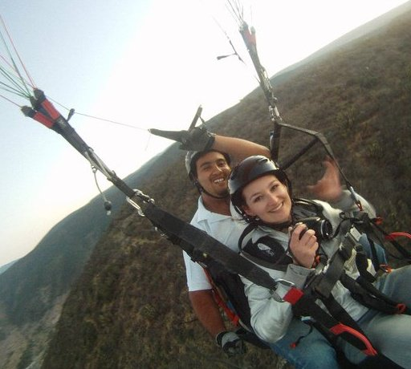

This is the first post in an ongoing series where I’ll be featuring a few of the travellers I’ve encountered on the road or whose web sites I’ve frequented during my travels.

First up is Alexandra Kovacova, also known as the [CrazySexyFunTraveler](http://crazysexyfuntraveler.com/). I’ve chatted with Alex a few times on Twitter about travel, and asked her a few questions which she graciously answered for this post:

**First, what’s your name and where are you originally from?**

My name is Alexandra Kov·Ëov· and I was born in a small Slovak town Snina. People at home call me Saöka, but abroad I’m known just as Alex.

**Where are you now, and what made you decide to visit there?**

It is very weird as I have been living abroad for 8 years already, but right now I am back at home, in Slovakia, for the summer. I came to visit my family and friends after I spent the last 6 months mostly in Italy, Mexico, Spain, Czech Republic and UK.

**What made you decide to leave home and start traveling the world?**

That’s a hard one! First, I moved to the Czech Republic to study when I was 18 and since then I just keep coming to Slovakia just for holidays. I love to meet new people, get in touch with new cultures, do crazy things and I just get bored of the same place after a while. So all that, and much more, including some family problems back home, make me enjoy what the world has to offer.

Probably the most significant reason to leave home was that travel the world is my biggest dream. I do not want to realize one day, when old, that I have done nothing to make my dreams come true. I live only once, right? So let’s travel.

**What are your top three favourite places that you have visited so far, and why?**

Barcelona always top 1 – I keep saying Barcelona has it all (history, beaches, great shops, yummy food, night life …)

Then I always enjoy big cities (Prague, Paris, London, Stockholm, Mexico City, Edinburgh…) but quiet beaches, islands or mountains (The High Tatras, Cozumel Island, Holbox, Malta, Gran Canaria…). Too many places would belong to the 2nd and 3rd position of my favourite places!

**What is your least favourite place that you’ve visited and why?**

I spent hours thinking about the answer, but there is none. I liked all the places I have ever visited. I try to find something nice and good everywhere. Travel made me this way 🙂

**How do you pay for most of your travel? Are you working while traveling, or do you save money between trips for the next adventure?**

I saved some money during the last two years working as a cabin crew so right now just spending those on my trips. Hopefully soon I will earn money by traveling though.

**You travel mostly alone it seems – do you find that you’re ever lonely while traveling?**

Hm, I have to admit, yes. But it is just always for a bit, very rarely. I travel alone because it is easier to do what I want, when I want and where I want. I do not have to wait for anyone if they feel like doing what I want, because like that I miss things I really want to experience. But then, on the other hand, you can have more fun with more people, or some things/places remind you of someone and then obviously, I can feel lonely for a sec. But I learnt how to deal with it. Some emails/facebook messages, good music and I’m great again on my own 🙂

**What is your best memory or experience from all your travels?**

I have a weak spot for all the flying activities – from plane flights, through sky-diving, tandem jumps to ultralight flights. So always the time in the skies!

**Where do you plan to visit next any why?**

I decided to go to Thailand, Malaysia and the Philippines in October and November. I have been listening about their beautiful beaches, fun places, great weather, nice people etc from so many friends recently, that it makes me impossible to wait more. Anyway, still have to plan it properly but it will be my next big trip, after some short trips here around Europe before I visit Asia.

### More About Alexandra

You can read more about Alex over at her blog [CrazySexyFunTraveler.com](http://crazysexyfuntraveler.com/), or by following along with her on [Twitter](http://twitter.com/Sexyfuntraveler).