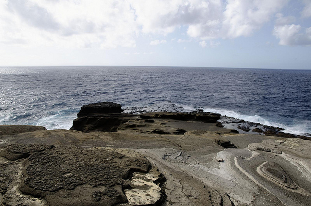
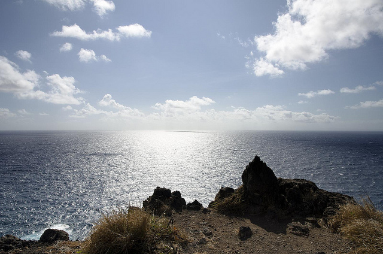
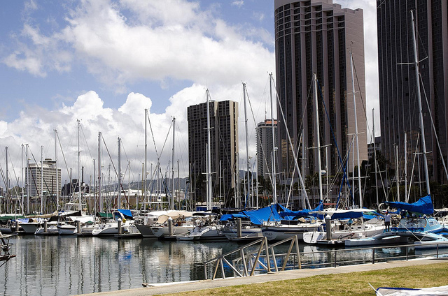
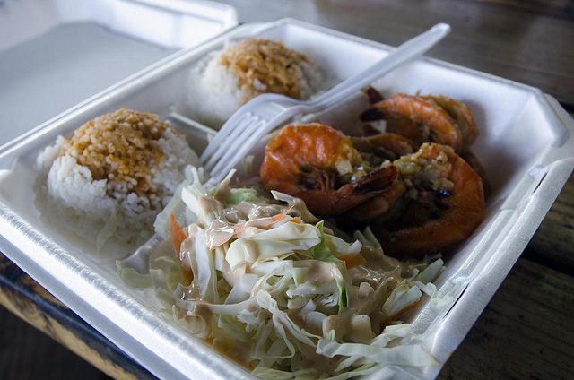
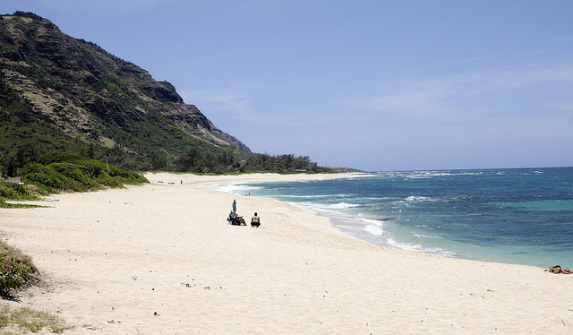
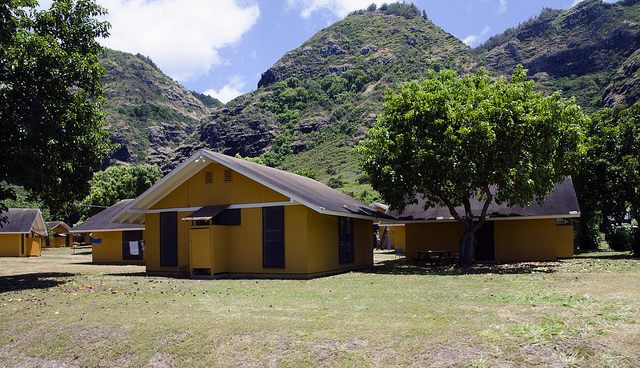
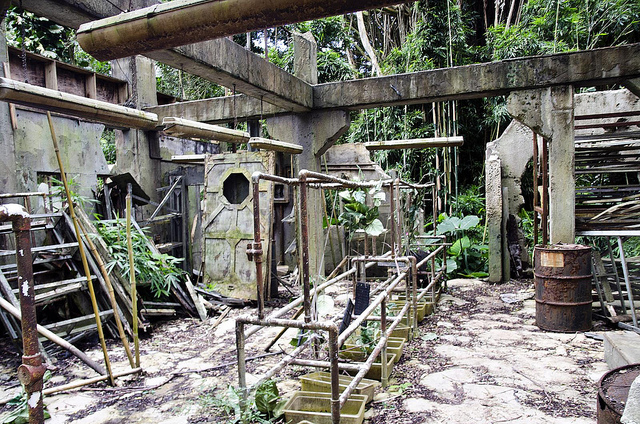
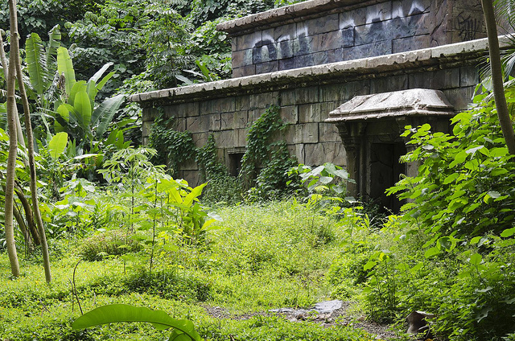
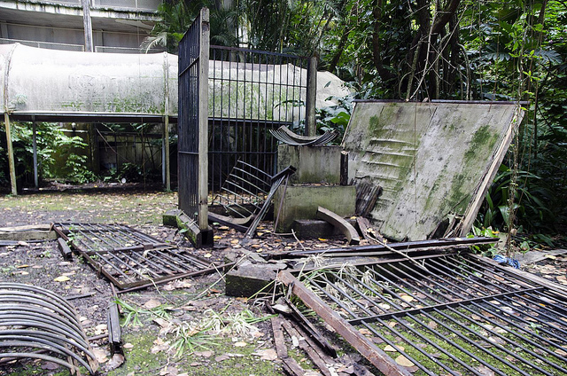

Like most people in North America over the previous six or so years, I was a pretty big fan of the TV Show, Lost. While the ending caused a lot of controversy, I watched the show pretty religiously over the last few years, and still even occasionally fire up an episode or so on my iPad.

One of the reasons I was drawn to Oahu, Hawaii, was because I was a fan of the beautiful geography that was featured in Lost. In case you weren’t aware, almost 100% of the show was filmed here.

### Hawaiian Escapades Tour

I did a quick Google search for Lost tours on Oahu, and found a few different operators that offered them. Prices varied from around $80 USD for a half-day adventure, all the way up to around $199 USD for a full day in a Hummer.

The one tour in particular I gravitated towards was the [Hawaiian Escapades](http://www.hawaiianescapades.com/tours/lost_tours/lost_legends.php) Lost “Legends” Tour:

> Hawaiian Escapades’ most comprehensive LOST Tour for fans of the T.V. series – a full island tour from eastern to western most points. Together, guests and guide will trace the steps of your new favorite castaways histories both off- and on-Island locations from the hit show. Around every turn, you’ll find settings and sites that are more than what they originally appear to be.

Several other Lost tours are offered by the group, but I was informed prior to booking that if I was interested in photography then the “Legends” tour was probably the best fit. So I called in over the phone from Vancouver and gave my credit card information to complete by booking

### The Tour

I was told that I would be picked up in front of my hotel at around 8:10am in the morning. Sure enough, a fairly modern van showed up at pretty much exactly that time. It was then that I met Tom, our extremelly knowledgable Lost tour guide for the day. After picking up two more people at another hotel near Waikiki, we set off towards the Diamond Head Crater for some of the first few stops.

There were so many different locations visited over the course of the day, that I simply wouldn’t be able to document them all (some of them we only drove by quickly as they were pointed out). But I’ll do my best to remember them in order.

We past an area by the Diamond Head Crater where apparently Ben met up with Sayid to try and get his assistance when off the island. Afterwards we drove past the Hawaii film studios in Honolulu, and then made our way to the Windward part of Oahu, and one of the lookouts.

On the way we stopped and toured the black rock area where Jack and the Man in Black fought during the series finale.

Next we did a little hike up to the eastern most lookout on Oahu. This is the same vantage point where [Ben shows Sawyer the other island](http://images4.wikia.nocookie.net/__cb20100501070636/lostpedia/images/thumb/9/97/3X04yourisland.jpg/671px-3X04yourisland.jpg) in the distance (which was added via CGI later). It was also where the Lighthouse was that Hurley and Jack hiked up to, as well as one other scene that I can’t seem to recall.

Next we drove over to Waimanalo Beach, which was used as the stand-in beach for Thailand in episode *Stranger in a Strange Land*.

")

We then headed back to Honolulu, passing by a few other minor locations that were used in a few scenes. Once we arrived back in the city, we stopped at St. Andrews Priory, which is where the Oxford scenes were shot with Faraday, as well as a few scenes with Charlie.

[")](http://themigratorynerd.com/2011/lost-legends-tour-on-oahu/5952654487_0b6c1f7a35_z-1/)

Next we drove down to the Waikiki Marina and found the exact same vantage point that [Desmond and Penny used for their famous photograph](http://www.migratorynerd.com/wordpress/wp-content/uploads/2011/07/desmond.jpg).

After this scene, we drove the other two individuals back to their hotel as they apparently had only booked a half day. That left me with Tom one-on-one for the next four hours, which was cool.

Tom drove us up to Oahu’s North Shore where we stopped at a Shrimp Truck (in keeping with the Lost theme) for some lunch.

We then made our way to the north-western most area of Oahu, which contains a little lesser known beach called Mokule’ia Beach. This is where the Losties spent most of season one, and is also the crash site of Oceanic 815.

Just down the road from the Beach is YMCA Camp Erdman, which is where the outside shots were filmed of the Others camp on Hydra Island.

At this point we were running out of time, so Tom asked me if I’d rather see the Waterfall that Kate and Sawyer were in, or see some of the actual Dharma sets located on some private property. Since we had primarily seen beaches all day, I thought it would be cool to see some actual set pieces from the show, so I opted for that option.

We drove to Manoa Valley, and went through a locked gate (which Tom had the combination for) into Paradise Park. Right away we encountered *The Orchid*, one of the Dharma stations used in the show.

It was pretty cool seeing the door with the familiar Dharma outline on it. The filming in this station stopped several years ago now, and it was one of the only set pieces to be left intact (at the owner’s request). Tom said that one of the far walls recently fell down from the set, but in general it’s all still fairly recognizable.

We walked a bit further into Paradise Park, eventually coming across the set piece for The Temple in the sixth and final season. Other than a lot of growth around The Temple and a bit of graffiti, the set piece is mostly intact as well. The actual set is only two stories tall, but in the TV show there are several more stories – these were added in post production using CGI (which was quite common apparently in many scenes – trees were added, signs removed, and often set pieces were extended further in post production).

On the way out of Paradise Park we passed *The Hydra*, which is the Dharma Station where Sawyer and Kate were kept outside in those bear cages. The cages are still there (although partially dismantled), as is the outside facade for The Hydra Station. You can even see the faint outline of the Dharma Hydra logo on the white canopy.

The tour was eight hours long, and included lunch. For $139, I felt like I got really great value out of the excursion. Not only was our tour guide extremely knowledgeable about Lost, but we also got to visit most of the key areas for the Lost show.

The only area that we didn’t make it to that I would have liked to have seen was [Kualoa Ranch](http://www.kualoa.com/) – it’s the area where Hurley built his golf course, and was used extensively over the course of the series. It was also part of the geography in Jurassic Park, so it’s a well used part of Oahu.

Unfortunately the ranch is on private property, and at 4,000 acres it’s basically a full tour unto itself. So perhaps I’ll get a chance to visit that before I leave, or on another trip to Oahu.

But I definitely had a great time, and had a chance to see most of the island of Oahu. I’d definitely recommend the tour for any Lost fan that wants to see where the six seasons came to life.