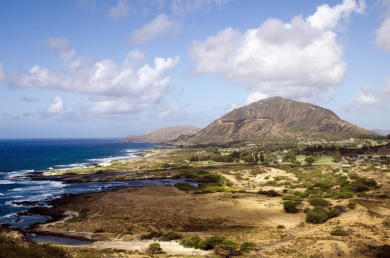
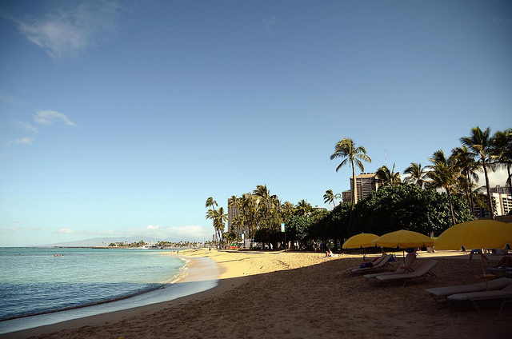

I recently returned from a one week impromptu trip to Oahu, Hawaii, and wanted to share my final thoughts.

The flight time from Vancouver was around six hours, so it was still a relatively short jaunt. Not as short as flying to the west coast of Mexico mind you, but about the same amount of time as flying to Cancun or the Dominican Republic.

### The Island

During the [Lost Legends tour](http://themigratorynerd.com/2011/lost-legends-tour-on-oahu/) we drove over the entire island in the course of a day. I’d say it takes less than an hour to criss cross the island in any direction, so Oahu is fairly tiny. The eastern side is called the *Windward* side of the island, and it’s characterized by cliffs and green vegetation. The western side, also called the *Leeward* side of the island, is a bit dryer and more flat.

Windward side of Oahu

I had originally planned on renting a car and doing a bit of exploration on my own, but after criss-crossing the island a few times on the Lost tour, I felt like I saw most of the coastline and ended up not bothering with a car on my own.

### Cost

Hawaii is expensive, make no mistake. In fact, I’d say it’s the most expensive destination I’ve been to so far, and that includes a few European countries like Ireland and Scotland. Eating out in Hawaii will cost you around $18 or so for a mediocre entree, and many of the locals consider food in Honolulu to be a bit boring (at least the ones I talked to). There are reminders at many restaurants and tourist areas reminding people that a standard gratuity is between 15 and 20%, so if you factor that in as well, the cost is even higher.

The majority of restaurants in Honolulu catered to tourists, complete with typical American cuisin: burgers, tacos, and pizza. There are definitely a few foodie gems within the city, but you have to pound the pavement a bit to find them.

That said, once you leave Honolulu you’ll find food that is more reasonably priced with more local flare. For example I had a really great meal fresh from a Shrimp Truck on Oahu’s North Shore during the Lost tour, so I’d definitely recommend having a few meals outside of the city.

### Canadian, Eh?

I actually had three separate incidents where someone made fun of the fact I was a Canadian. Having traveled to a lot of other countries, and the contiguous United States, that’s not something I’ve ever encountered before. I smiled and nodded each time someone made a Canadian joke at my expense, thinking they were just making conversation. But one time in particular, when a waitress apologized to me for being Canadian in a nice restaurant, I was bothered a bit.

That said, I know most of it was probably in good jest, so I didn’t let a few random encounters take away from my trip. I should probably bring a few South Park shirts with Terrance and Phillips on them to give away if that ever happens again.

### Wireless

I actually had some work to do while on Oahu, so I had to use the internet in a few areas. Thankfully since Oahu is part of the United States, finding WiFi isn’t that difficult. That said, most of the WiFi around the beach areas was pay-to-play. But at $20 a week roughly it’s not really that big an expense.

### Final Thoughts

I had wanted to visit Hawaii for at least ten years. After seeing the Island weekly on the TV series *Lost* I decided to finally make a trip happen.

I spent a week on Oahu, with most of my time spend around Honolulu and Waikiki. Probably my best experience on the Island was the Lost Legends tour I took, as I got to see much of Oahu’s hidden beauty and also visit many of the sites from the TV show.

In short, Oahu is a very beautiful Island, with great beaches and lots of activities to see or do. I’m definitely glad I finally managed to make it over and to spend some quality beach time around the Island.

Waikiki Beach

That said, as someone who hates spending a huge pile of money when I travel, Hawaii is definitely more expensive than some of the other tropical areas such as Thailand or Mexico. But for most people Hawaii provides a beautiful, tropical retreat with pretty much one of the world’s best climates (it’s basically 28C or so all year round).