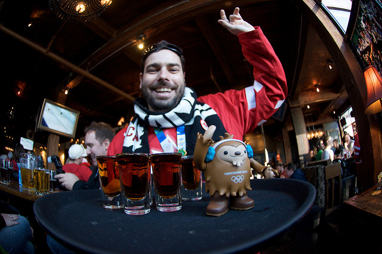
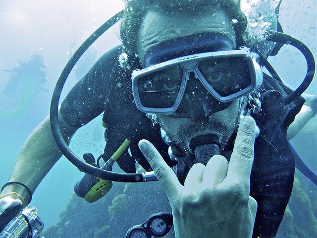
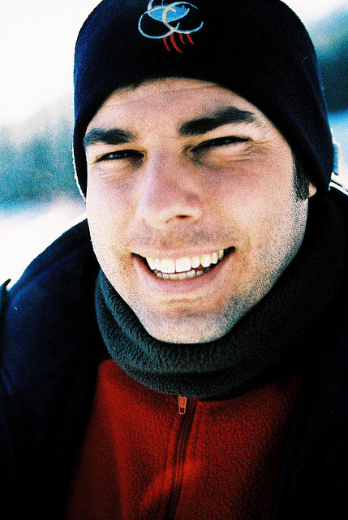

Prior to leaving on my first travel adventure, there were a few key people that helped inspire me to leave my North American life behind. One such person is a good Vancouver friend of mine, Robert Scales.

Here’s Robert’s latest BIO:

> PADI Master Scuba Diver Trainer with a passion for management, teaching, underwater photography, and digital media. I’m currently working in Bali, I am the General Manager and a Master Scuba Diver Trainer at Dive Concepts.
> 
> I’m a former digital media executive. As founder &amp; CEO of Raincity Studios, I spent the last decade working with emerging media and web technologies. As a photographer and citizen journalist I covered events including Olympic games in Turin, Beijing and Vancouver, Dalai Lama’s visit to Vancouver and rock bands and tech luminaries.
> 
> Winner of a 2006 Canadian New Media Award, I created and taught several courses for Vancouver Film School and I was an advisor on various Boards. I participated in the Canada World Youth cultural exchange program as well as various social change workshops and training courses.
> 
> Since May 2010, I’m following my dream; mixing digital media and scuba diving as I explore planet Ocean

Robert Scales, Photo by John Biehler

I recently pinged Robert over email and asked him a few questions about his life and his travels.

**Can you tell us a bit about yourself and where you are from originally?**

I’m a former new media executive and professor morphed into a PADI scuba diving instructor and resort manager! Currently I am living in Bali, Indonesia. I was born in Montreal and made Vancouver my home for the better part of the past 2 decades.

**A few years ago, you were running one of Vancouver’s hottest web startups, Raincity Studios, and now you are in Bali teaching scuba diving. Can you tell us a bit more about the road that led you to current occupation?**

I always hoped it would be in the cards for me to go back to my dream career: being a professional diver, working at a resort in the tropics. I just didn’t know how I was going to get there! In the mid 1990s while living in the Caribbean, I became a Divemaster. Ever since then I’ve been wanting to go back to a simpler life: living in the tropics and diving daily. My passion for diving and technology has taken me to interesting places over the years.

I kind of fell in and out of both fields over the past 20 years. I consider myself lucky to have been able to go back and forth between careers. Ultimately I was not entirely happy while running Raincity. I lost my passion for technology and digital media, it started to affect my health and more importantly my personal life and the people that I loved. It took me a few years to get back to a healthy place before I was able to move on and find my passion again. Today I am happier than ever, I work hard, yet I’m hardly working. I get to dive amazing sites, meet brilliant people from around the world and found balance between my professional and personal lives. I am grateful to be where I am, surrounded by supportive friends, partners and work colleagues.

**What was the first travel trip you took and how old were you?**

My parents loved to travel and we used to go on road trips down the eastern coast of Canada and the US when I was young. I still remember the feeling of exploring a new place and the sense of adventure it awoke in me each time. I knew before I was 12 that I would not stay at the same place for very long and that as much as I loved my home town of Montreal and family, I needed to stretch my legs and spread my wings… Home for me is here and now, wherever that is!

**What do you miss the most from back home when you’re on the road traveling to new destinations?**

Depending on the day and who I spoke with on the internet, it could be a number of things. From Quebec, I miss my immediate family, friends, maple syrup, creton, poutine, speaking Quebecois and the warmth of the people there, the summer festivals, cultural diversity and openness, and the cheap cost of living. From Vancouver I miss my dog and my friends, the mountains, skiing, living in a clean city, the Canucks and great food. I could continue this list by adding a few more places I consider home, but overall, I tend to find my space wherever I am and try to live in the moment, enjoying life to the fullest.

**You mention on your website about your love for Thailand. What do you love about Thailand? Do you have any plans to end up back there?**

Thailand hold a sacred place in my heart, as a Buddhist I feel at home there! The culture, the people, the food and the cheap cost of living are all factors that attract me there time and time again. I met good people in Thailand and it is a great place to visit, travel or live. Perhaps one day, I will live there again but for now, Bali is my home.

**Not long ago you suffered motorcycle accident in Thailand and flew back home to Canada for treatment. Can you explain what happened, and any experiences you had with obtaining medical treatment abroad?**

Long story short, I crashed my bike on my way back diving. I broke my clavicle, scapula and 2 ribs. I have good travel insurance and highly recommend to anyone traveling to make sure they get good coverage. Getting hurt or sick while abroad is never fun, specially when traveling alone! But it can be relatively easy to get support and get back on your feet if you have the right coverage. I opted to go back to Canada because it was the best option for me, it helped speed up my recovery plan and ensure that I would come out of my injuries without complications. Having had a few accidents over the years, I knew I wanted to work with a physio therapist that knew me and my body. I’m thankful for my friend Mariska and my physiotherapist, Syd – with their support, I was back on my feet and diving within 6 weeks of my accident. Today I am 100% recovered.

**Out of all the places you have visited in your life, what are some of your favourite destinations or favourite memories from your trips?**

Hard question to answer, but in all honesty I’m a big fan of the “here and now” philosophy! I don’t tend to live in the past much! That said, the places that stand out after all these years include Canada, India, Thailand, Bali, Honduras, Guatemala, Mexico, Hungary, Poland and Italy. I’m leaving a few out and avoiding narrowing the list down to regions or cities, there are too many amazing places to explore in this world. In general sunrises and sunsets are always good memories wherever I am! Something about the sounds and colours that leave a permeable trace in my mind.

Robert Scales, Photo by Kris Krug

**On Twitter you’ve routinely used the hash tag referring to your quest for a simpler life. Do you think many more people like yourself are longing for a slower pace and a simpler life as well?**

Aren’t we all? I use many different hash tags, #simplelife was first use at a time where my life was over complicated, I was near depression, using drugs, unhappy and my whole world was crumbling down, it was something that I aspired to achieve. Now, I use it to remind myself that life can be simple, there is no need to complicate things. It’s like a digital mantra of some sort!

**Why is traveling the world important to you?**

Because later on I will thrive to achieve stillness, so while I am free, able and “younger”, it is important to go out there and experience the world for myself.

**If you could give one piece of advice to any of your peers at startups or in technology related jobs, what would it be?**

Hind sight is always 20/20, most people don’t listen to others and often advises are just cliche! So do what you do best! But don’t push for later what you can do now, if you are not happy doing what you do today, you’re not doing the right thing.

Lastly keep things simple, trust your instincts and the people you surround yourself with. Life is beautiful when you do what you love.

*To follow Robert and his adventures, you can follow [@scales](http://twitter.com/scales) on Twitter. For information on diving in Bali, check out Robert’s company [Dive Concepts](http://diveconcepts.com), or follow [@diveconcepts](http://twitter.com/diveconcepts) on Twitter.*