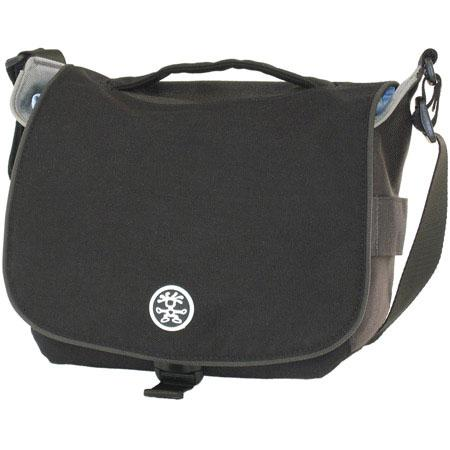

One of the hardest parts about traveling with technology is lugging all of your gear around with you. Once you arrive at a destination and rent an apartment, you can store some items and only carry along a few things at a time. But when you’re in the process of traveling to or from a destination, you have to have all your items on your person for a period of time.

I’m actually using the [MEC Pangea 40 litre backpack](/2010/carry-on-sized-backpack-to-take-traveling/) as my main travel bag. For small trips I only bring the backpack with me, but for my major travel between destinations that I plan to live at for more than a week, I store everything that isn’t technology related in a suitcase and bring that along on the plane.

### My Backpack

In terms of technology, I currently have the following items in my backpack when I travel.

- 13″ Apple Macbook Pro laptop ($1,600)
- Apple 32GB iPad ($600)
- Nikon D7000 DSLR body ($1,200)
- Sigma AF 17-50mm f/2.8 EX DC HSM OS Nikon Mount lens ($800)
- Olympus E-PL2 Micro four-thirds camera body w/ kit lens ($650)
- Panasonic Lumix 20mm f/1.7 pancake lens ($360)
- Kodak Playsport HD video camera ($130)
- Amazon Kindle ($130)

If you add all of that up, it’s a little shy of $5,500, and it’s generally all on my back when I’m between locations.

Not only is the bag worth a lot of money, but it’s also amazingly heavy. But having heard horror stories of people having their entire Nikon camera kits stolen from checked airplane bags before, I simply refuse to check any technology when flying by air.

In truth, I could be rather screwed if any airline were to say that my backpack was too large to take as carry-on. It hasn’t happened yet, but I’ve been pretty close a few times. I’m actually debating removing the waist straps from my backpack since I never use them and they take up quite a bit of room.

To help protect against that scenario, I recently purchased the Crumpler 5 Million Dollar Home which is a photo-bag that can store most of my SLR gear. It also fits rather nicely at the bottom of my MEC Pangea bag, which adds protection for the SLR against things pressing up against it in my bag. If an airline ever says my backpack is too large now, I can simply remove the entire camera bag and claim it as my one personal item (which in turn should make my backpack significantly smaller).

I am also in the process of replacing my Macbook Pro with a Macbook Air, which should reduce the size of my backpack slightly and also shave about three pounds off of the total weight (which will be a welcome change).

I’ll do a post when it’s all done and probably weigh everything, as I’m curious myself just how much weight the total setup has. My friend Scott recently did a post showing how he packs, so [check it out](http://scotthadfield.ca/2011/07/17/what-i-pack).

### Theft

Obviously one of the concerns when you travel with expensive gear is theft. If anyone ever stole some of my gear, I would be pretty devastated I think as most items are personal to me. But it’s always an eventuality you have to prepare for.

I have house insurance, and most of my expensive items are listed as scheduled items which means I can get full value for them. I’m probably paying an extra $20 a month for the items I have on there, but it provides extra peace of mind in case they are ever stolen. I’ll be refreshing the list with the insurance agency before I leave to make sure it’s all up to date.

But on my next adventure, the list above is basically what I’ll be taking with me on the plane. It’s heavy, and it’s expensive, but I need the laptop to work, and the photography gear to photograph the world as I go. I can’t really imagine not bringing any of these items, except maybe the Kindle (which is made sort of redundant with the iPad, but still useful I found in sketchier areas since it’s less of a target for theft than something like an iPad).