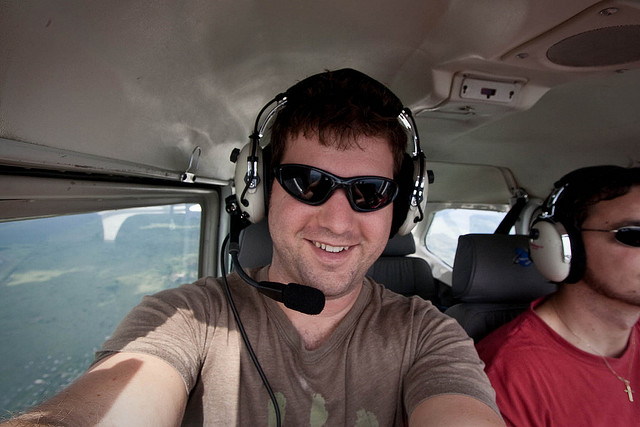
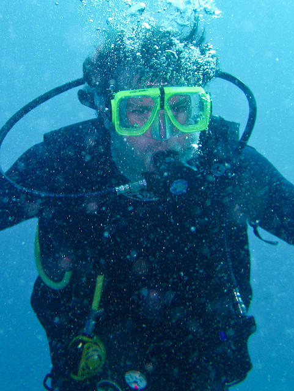

If there is one person in particular who has inspired my travels to date, it would be [Scott Hadfield](http://scotthadfield.ca/). Scott discovered he had the ability to work remotely years ago, and left to go explore the world while still working for a North American company. He would show up in Vancouver from time to time, but mostly he was working remotely in Buenos Aires or South Africa.

I was recently planning a trip to New Zealand for the fall when Scott and his wife Samantha informed me they were going to be having a three month party in Thailand.

A party? Without me? Not gonna happen. So I bought a flight and will heading down on August 31st to crash it.

So without further ado, here are some wise words from one of my traveling mentors, Scott Hadfield:

**Tell everyone a bit about yourself – what you do for work, and what you like to do for fun**

Scott, shortly after I taught him how to fly a plane

My “day job” is as a web developer. I do a lot of freelance work but am also building my own business called [Wedful](http://wedful.com/) which is effectively a website building tool for couples building their own wedding website. I love what I do, which I think helps keep me motivated to work even when I might rather go out and explore a new place (I’ve found a pretty decent balance for this over the past few years).

What I do “for play” seems to change quite frequently. I love exploring new cities and learning new things (languages, guitar, surfing… unfortunately my motivation for all of these comes and goes). When I have the opportunity I also love hiking and scuba diving.

**If you had to pick one place as your “favourite” destination on your travels so far, which would it be and why?**

I have two favourite destination, one is Barcelona. I love this city for so many reasons; cheap sangria, paella, patatas bravas (mmm!), [La Boqueria](http://en.wikipedia.org/wiki/La_Boqueria), the architecture, beaches, and the entire vibe of the city. It’s also where I met the love of my life (and travel buddy), [Sammy](http://atsmath.com/)!

My other favorite destination is Bangkok. When we landed in Bangkok I think all my senses just hit overload… the heat, humidity, people harassing you, the smell of street food, the smell of traffic and trash, tuk tuks and taxis weaving in an out of traffic, a foreign language that looks like it came from Middle Earth. Probably a lot of these things that make other people hate bangkok made me immediately fall in love with it.

**You used to live in Vancouver, and are now in South Africa. Can you describe how you ended up there?**

In the past two years I’ve spent almost 12 months in South Africa. It’s a beautiful country and the cultural differences between the different groups of people here make it very interesting to me. I met Sam at a conference in Spain and after chatting online for several months decided to come visit her in Johannesburg. One thing led to another and two years later we were traveling around the world together. Last year we bought an apartment in Cape Town as sort of a home base in this part of the world (property here is very cheap compared to, say, Vancouver).

**Traveling often involves mishaps – what would you consider the biggest mishap that you’ve encountered so far while on the road?**

Scott in Times Square, New York City

I haven’t actually had many mishaps at all, so maybe I’m not trying hard enough ;-). Though when Sam and I were in New York we had a bit of an incident that more or less ended with us being called both serial killers and terrorists and out on the street with no where to stay for the night. We were subletting a place (quite common in New York, but also usually not 100% legal) from a friendly girl who was going overseas to study for a few months and the landlord found out about this a few days into our stay. The guy was a bit off his rocker and started yelling at us complaining that he had no idea who we were and for all he knew we could be terrorists. After all, we weren’t Americans and he thought our passports were likely fake. Since we both have a ton of stuff about us online we suggested he google us at which point he yells “Ted Bundy was on the internet!” (??) and he’s going to call the police if we’re not out that day, unless of course we were willing to pay him another $1500 (one month rent) for his troubles. At this point we decided to grab our things and take off, but we had no where at all to stay, and after having already paid $3000 for two months rent up front couldn’t exactly afford a New York hotel room.

In the end, and after a whole lot of stress it all worked out for us though. A friend of ours who lives in New York saw my facebook status update and gave me a call that same night. He was out of town and hooked us up with his apartment (in an amazing location) for the week. We also got our $3000 back and were able to sort out new accommodation within a couple days.

**English is spoken in many parts of the world. Have you ever visited a destination where the language presented a significant barrier? If so, how did you overcome it?**

Language can be a tough one for a lot of people (myself included), but I’ve started to be able to have more fun with it too. One thing I realized quite early is that most people, though they may not speak a word of English, can actually understand it well enough to have some level of communication. You just need to play your part in figuring out what they’re saying to you. I find I mostly figure things out by the context and using non-verbal communication.

Generally the more educated people in the country can speak English, but if you’re only able to communicate with one small subset of the people you miss out on a lot of culture. Lately I try a lot harder to learn some of the key words and phrases before I arrive in a place and then make it a priority to learn a bit of the language while I’m there.

**You recently did a video post showing what you put in your backpack. How has your packing strategy changed over the years?**

Scott, dressed up for another work day

The first time I went backpacking through Europe I had about a 70L backpack with about 10 days of clothes, a sleeping bag, probably 5 pounds worth of travel books, and some canned food among other things. I also had a second smaller backpack that I had snacks, digital camera, and other little “important” things. Thinking back to that, I think I may have been packing around europe more things than I even own today! 😉

I now only pack the things that I know I’ll need. If I’ll be hopping from one city to another for several weeks I’ll pack as lightly as possible, no more than a small backpack. To be honest I used to hate travel where I’d just stay in each place for a few days, but then I realized all I hate is lugging my bags around.

If I’m going to be staying in a single place for several months then I’ll tend to take more “convenience” things and more changes of clothes.

**When you’re outside of North America, what are some of the things you routinely miss?**

My first really longer trip outside of North America was to South America where I lived for 3 months (primarily in Buenos Aires). It was the food I missed more than anything. On my way back I had a 12h stopover in Houston (damn you Orbitz!!) and went to every terminal eating donuts, burgers, pulled pork sandwiches, pizza, nachos, etc. Ya, I’m a real health food nut ;-). I don’t really miss the food at all anymore, there’s the odd thing that I’ve experienced that I really miss though… actually, I could make a long list of foods I crave from various places I’ve been.

The thing I miss more than anything though is my friends and family. I have friends from all over the world now, mostly in Canada and South Africa though. It’s definitely the hardest thing about the travel for me.

**Where are you headed next and why?**

Next? Thailand. Why? Duh!

Nah, I love Thailand and after doing 3 winters in a row (bad timing with our travels caused us to miss both Cape Town’s and Vancouver’s summers and arrive just in time for winter 3 times in a row), both Sam and I are ready for some warmth.

**What advice would you give to anyone considering embarking on a long term travel adventure?**

Just go. Besides that, I think you should ignore any other advice I or anyone else can give you. Different things work well for different people. Everyone’s going to give you advice on what you *MUST* do, or *MUST* see, but part of the fun is really learning what works for you.

*You can follow along with Scott’s adventures via Twitter ([@hadsie](http://twitter.com/hadsie)), or via his blog, [ScottHadfield.ca](http://www.scotthadfield.ca)*