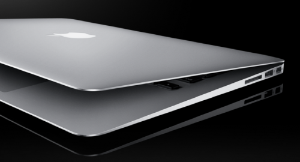

I’ve been a pretty loyal user of Apple’s Macbook Pro line for the last few years. I purchased my first one after Northern Voice in 2007, mostly because the laptop that I recently had Vista installed on failed to work for me during a presentation. Since then I’ve probably been through three or four of them, often upgrading every year or so to keep up with technology. The first few were the 15″ model, and the last Macbook Pro I purchased was a 13″ model.

Macbook Air

While the Macbook Pro is a great computer, the Macbook Air has always intrigued me. Most of my uber techie friends have one, and I’ve always thought it was cool how small and light it was.

But other than its startling good looks, the Macbook Air line has always been underpowered compared to the Macbook Pro line. And while I don’t really do anything computationally intensive like playing 3D games, I still appreciate a fast machine, more-so since my income is dependent on one.

I’ve been considering upgrading to a Macbook Air for almost a year now, but decided to hold myself over with the last Macbook Pro I purchased. But when Apple announced the new Macbook Airs with the i7 processors (the 13″ Macbook Pro still uses the Core2Duo processors, which are two generations old now), I decided to finally take the plunge.

Considering that my laptop generates my only real source of income, I generally don’t cheap out when I make a hardware upgrade. That’s why I ordered the $100 upgrade from the 1.7 GHz i5 processor to the 1.8 GHz i7 version and opted for the 256 GB SSD drive instead of the 128 GB SSD drive. It’s the highest end 13″ model Apple is currently offering.

### Delivery

Considering you can’t get the 1.8 GHz version of the Macbook Air in the Apple Store, I didn’t have any other choice but to order online. I really wanted to have the new machine in my hand before the long weekend (mostly so I could tinker with it and get it ready to go), so I ended up getting the expedited shipping which ultimately shaved a few days off of the delivery time. Even so, it still took about three business days before Apple shipped the laptop, and another three days before it arrived at my door.

### Weight

I held my Macbook Pro in my right arm and the Macbook Air in my left to do a weight comparison when I received my new machine. Compared to the Macbook Air, the Macbook Pro felt like a brick in my other hand. It’s really amazing how light the 13″ Macbook Air is. I’m sure it weighs more than my first generation iPad, but it honestly doesn’t feel much heavier than it.

I carried my Macbook Pro around in Argentina in my backpack, so I’m definitely looking forward to having a lighter load on my next round of travel to Thailand.

### Display

A lot of people don’t know this, but the 13″ Macbook Air has the same screen resolution as the 15″ Macbook Pro. So the resolution I lost by dropping from the 15″ Macbook Pro down to the 13″ Macbook Pro has now been regained on the 13″ Macbook Pro.

And the difference is quite remarkable.

Not only is the screen vibrant, but the extra pixels really make fonts seems more clear compared to my Macbook Pro. Granted, it could have been all the gunk on my old LCD, but the new display seems gorgeous by comparison.

### Performance

The day my new laptop arrived a series of benchmarks were released comparing the new Macbook Airs with the previous generation of Macbook Pros. The results showed that the new Macbook Airs were [faster than every single 2010 Macbook Air released](http://electricpig.co.uk/2011/07/20/2011-macbook-air-benchmarks-are-amazing-outperforms-all-2010-macbook-pros/).

That’s a big deal.

While the Macbook Air has always been a novelty item due to its size, the new processors really do take the machine into the realm of performance computing. Not only is the laptop lightening fast, but the removal of a normal hard drive has rendered the machine virtually silent. It’s actually quite eerie to be using it and not have the machine make any sound.

I’d say that this is the fastest machine I’ve ever owned, but every laptop I purchase typically is at the time. But this definitely feels like one of the most noticeable performance upgrades I’ve ever had.

### Does It Blend?

Without a doubt this is the nicest machine I’ve ever used. One of my main concerns with the Macbook Air prior to owning one was that I thought it might feel fragile. But in fact the opposite is true: it feels amazingly sturdy and well made.

A friend of mine said once I “upgraded” to the Macbook Air line that I’d never go back, and that’s absolutely the case. The form factor is amazing, and the SSD and processor combination delivers a huge punch in terms of speed and usability. In all honestly, I’ve hardly put the machine down simply because it’s such a joy to use.

So if you’re thinking about getting one, [I definitely recommend the Macbook Air](http://amzn.to/18XX8Hb) – it’s fast, it’s light, it looks cool, and it works flawlessly.