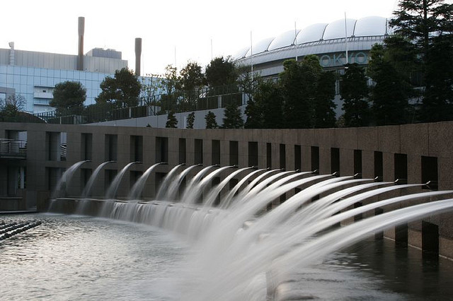
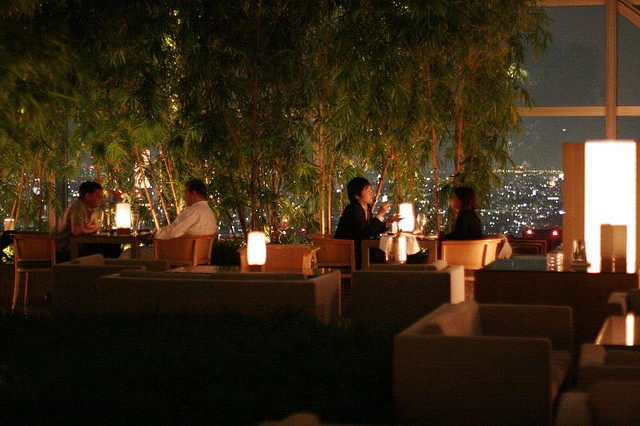

I’ve been going through some old photos recently, and was reminded of a trip I took a few years ago to Japan. I spent nine days there and thought I would give a little overview of the trip and would I ultimately thought of Tokyo

### Travel From Vancouver

At the time the flight to Tokyo was the longest I had ever experienced. From Vancouver it’s approximately a ten hour flight over the Pacific Ocean. I remember how weird it was looking out of the plane on the way back and realizing I was over Vancouver Island – prior to that trip, I had always flown in the other direction, which meant a return a flight always approached Vancouver from the east.

The main airport in Tokyo, Narita, is actually almost an hour and a half outside of the city centre. Thankfully there are many airport shuttles that can take one downtown, which is how we ended up in the city.

### Tokyo Dome Region

Tokyo Dome

Our hotel was the [Tokyo Dome Hotel](http://www.tokyodome-hotels.co.jp/e/index.html) in the Tokyo Dome region. We chose it at the time because it was between [Akihabara](http://en.wikipedia.org/wiki/Akihabara) and Shinjuku, two regions I was going to visit during the course of my visit.

The hotel was fairly high by Vancouver standards, and I believe my room was on the 35th floor. There was also a bar at the top of the hotel that we spent a bit of time at.

### Shibuya Crossing

One of the highlights for me, and somewhat representative of my visit in Tokyo, was Shibuya Crossing, one of the busiest intersections in the world. It was only a few subway stops away from Tokyo Dome, so we made quite a few trips to the area.

There is so much pedestrian traffic in the area that when the traffic lights stop, they do so in all directions at the same time so people can cross simultaneously. The end result is a massive amount of people walking in every direction across a huge intersection. It definitely makes for some interesting photo opportunities.

As well, the area is full of great little stores and a lot of great hole in the wall restaurants. We had a few meals at the various noodles shops around Shibuya, and I remember then being not only cheap, but relatively tasty as well.

### Akihabara

A lot of nerds who end up in Tokyo make a special trip to Akihabara. If you’re ever been to the United States, they have a retail chain called Fry’s which is basically like a massive Canadian Radio Shack – basically you can get everything electronic there. Akihabara contains a whole city block of these type of stores, so if computers and photography are your thing, then definitely check the area out. I was attending a conference in the area, so I spent a full week walking around there in my spare time. I actually thought the prices were rather high compared to what I had hoped they would be, but there are still deals to be had.

### Lost In Translation &amp; The Park Hyatt Hotel

Not that long before we went to Tokyo, the movie *Lost In Translation* was released. If you’ve seen it, you’ll probably remember a bar that is used repeatedly for some of the scenes in the film. That bar is actually called the [New York Bar](http://www.tokyo.park.hyatt.com/hyatt/hotels/entertainment/lounges/index.jsp), and it’s located on the 52nd floor of the prestigious Park Hyatt Hotel in Tokyo.

Park Hyatt Lobby

I found several websites that said you had to book two weeks in advance, so I made arrangements while still in Canada. I managed to convince three of my friends to go with me, so we headed down to Shinjuku to make a night of it.

Shinjuku is also known as the skyscraper district of Tokyo. Basically all the land that is seismically stable enough to support large buildings is part of Skinjuku, so many office buildings and high hotels are in the area. It’s only a few subway stops away from Akihabara, so we were there in about 15 or 20 minutes.

To get to the New York Bar you have to walk through the lobby of the Park Hyatt Hotel, and also down through the library. It’s an absolutely amazing looking hotel, with a huge atrium filled with bamboo and running water. The architecture is amazing as well, which is probably why basic rooms started at around $600 CAD per night when I was there.

New York Bar

The New York Bar is basically exactly as it’s portrayed in the movie *Lost In Translation*. There’s live piano and jazz during the night, often flown in from the cities in the United States such as Chicago. People were allowed to smoke as well, and while I’m not normally a fan of smoking in public places, it definitely added to the ambiance of the room.

We had dinner and drinks there, and my friend Nils even ordered a piece of Kobe beef steak for the low price of $100 CAD for just the steak itself (the other fixings on the plate were extra). All in all, my night out at the Park Hyatt hotel was probably one of my most memorable experiences ever, and probably the most expensive meal I’ve ever had as well (approximately $1200 for the four of us). I’m more of a $20 dinner kind of guy, but I was a fan of the movie and I looked at it like a potential one-in-a-lifetime type experience.

### Heading Home

I had a great time in Japan, and managed to visit quite a few of the areas within Tokyo. We visited a outdoor shrine one day, and bounced around on the subway a few times to visit various different restaurants within the city. Once of the cool parts about Tokyo is how so many regular buildings go up 10 floors or more. That means when you’re walking down the street looking for a restaurant or a store, you have to look upwards as many times they are on a higher floor and you’ll have to climb stairs or take an elevator to get to.

When most people think of Japanese cuisine, they often think of sushi. And while sushi is a big part of the Japanese diet, there are many other types of great experiences such as [shabu-shabu](http://en.wikipedia.org/wiki/Shabu-shabu).

I had a great time in Tokyo, and would like to go back again at some point. Prior to that though, I’d really like to visit some of the outskirts of Japan. I’ve also always wanted to visit Hiroshima at some point as well as the city of Kyoto. And while I am passing through Narita airport on my way to Thailand, I won’t have a chance on this trip to visit the country again, at least not until maybe next year.