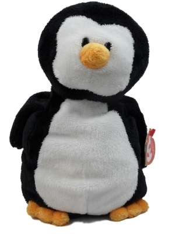

Earlier this year I was visiting the city of [Ushuaia, Argentina](/category/argentina/ushuaia/), which is the southern most city in the world. I spent an afternoon visiting a penguin rookery, which was absolutely amazing and probably one of my best memories from my last trip. In the town of Ushuaia I ran into a store that was selling a bunch of plush penguins. I thought at the time it would be pretty cool to take one along with me on my travels, but unfortunately just didn’t have the room in my bag to bring one back with me on that trip.

But that idea has been on the back of my mind for quite a while now. I was joking to my friend John that it would be fun to take something like a Garden Gnome around the world with me and get shots of it in various locations. But the Garden Gnome itself has been done quite a bit, so I didn’t want to bring one of those.

I have another friend of mine which likes to bring a sheep with her whoever she goes, and I was even down in Vegas when one of the shots was taken. I just think it’s a fun thing to do and adds another element of “fun” to a trip, especially when you visit somewhere new.

Waddles

As for me, I really can’t imagine a better mascot to bring along with me than a stuffed penguin. So without further ado, meet “Waddles”.

Waddles had been stuck on eBay for quite some time, and I was worried they were going to have to put him down soon. While taking a penguin around the world with me will be a lot of work, it’s a responsibility I’m willing to take on in order to rescue Waddles from the pound.

I’m hoping one day I can maybe take him to visit some of his friends again back in Ushuaia or even Antarctica, but until then he’s going to have to put some sunscreen on and get used to some tropical climates for a while. I suspect going forward you may even see the odd blog entry from Waddles, as I’ve been told he’s quite smart and used to write often in the Happy Feet Daily paper back home.