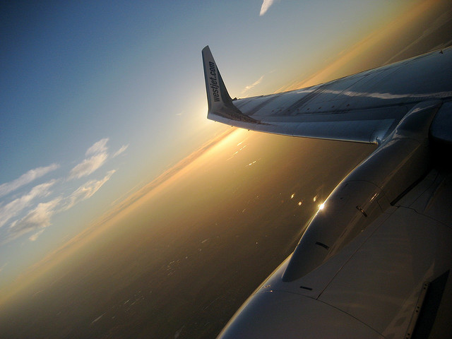

Almost all airlines have some type of frequent flyer program designed to reward individuals who fly their airline repeatedly. While I’ve collected them periodically, I’ve never really obtained anything substantial using my accumulated frequent flyer milage.

When I set out on my adventure back in January of 2011, I had a goal in the back of my mind to finally achieve some type of elite status on an airline this year or the next. I have worked with many business people who had either silver or gold elite status, and I imagine bypassing a huge lineup or getting the odd free flight is a pretty great feeling. Here are some tips for how to collect frequent flier mileage so you can earn free flights.

### Choose Your Main Frequent Flyer Program

Despite being a rather seasoned traveler, I have come to the realization recently that I’ve wasted some of my mileage by making a few minor mistakes while traveling.

To collect frequent flyer mileage, you need to pick one frequent flyer plan and stick with it almost exclusively. In the old days most airlines had their own independent plans. Things are a bit different nowadays and many airlines allow mileage obtained on another airline to be credited to their frequent flyer program. One of the largest collections of airlines that accept each other’s mileage is known as the [Star Alliance](http://www.staralliance.com/en/about/airlines/) program.

My frequent flyer plan of choice right now is Continental Airline’s *OnePass*, since they have reasonable fares and fly pretty much wherever I want to go. Technically you could use any Star Alliance member’s frequent flyer program, but if you want to use points for free flights, you need to make sure your main frequent flyer airline actually flies to destinations you’d like to visit.

### Use Your Frequent Flyer Number Whenever You Fly

The Star Alliance members fly to almost all locations I have been or am going to. The trick is that when you book your flight on a member airline, you need to give them your primary frequent flyer account number. Often you can do this during the booking process, in person at the counter, or by submitting your travel documents after your flights are over.

The biggest mistake you can make (and I’ve unfortunately made it) is to accidentally assign frequent flyer miles to the wrong frequent flyer program. For example, on a recent trip I made to Ireland, Expedia for some reason defaulted to my Air Canada Aeroplan account for the mileage, and the flights were credited there. Since the majority of my miles have been accumulating into my OnePass account, and most airlines don’t allow transferring miles between programs, I basically tossed those miles in the garbage when they could have been used to further my status on my main mileage account. So definitely double check during the booking process that your mileage is being credited properly.

### Elite Status Tiers

While every frequent flyer program has different tier levels, most have some sort of *Silver* and *Gold* tiers. For *OnePass* silver is attained when 25,000 miles are accumulated and gold is attained at 50,000 miles. At both levels members will enjoy faster mileage accumulation, priority check-in, priority boarding, and often free upgrades to business class when space is available.

The advantage of a program such as Star Alliance is that every member airline will honour elite status obtained via another member airline in the Star Alliance program. That means that silver elite status obtained via Continental’s *OnePass* program can be used for the same privileges for silver status on Air Canada.

The smart reader will immediately realize that it may be advantageous to accumulate mileage on a program that has lower tiers. In fact, Aegean Airlines recently joined the Star Alliance network and offers a [Blue Card](http://en.aegeanair.com/milesandbonus/program-description/benefits/blue-card-privileges/) status level (which translates to Silver Status on most other airlines) for only 4,000 miles. So a few people on the Internet have switched to using Aegean Airlines in an attempt to obtain elite status far quicker than they could have on a North American carrier. Had I known about this pseudo-loophole earlier, I may have taken advantage of it, but as it is I’m already on track to hit silver status this year with Continental, which will hopefully allow me to hit Gold next year.

So if you haven’t been accumulating airline mileage previously, now is probably a good time to start. I prefer Continental’s program myself, but any airline in the Star Alliance network is a pretty good place to start for accumulating mileage.

*I recently released my free 47 page travel eBook which covers this topic in more detail. Pick up the [Beginner’s Guide to Long-Term Travel and Lifestyle Design](http://mignerd.com/book) guide for free.*