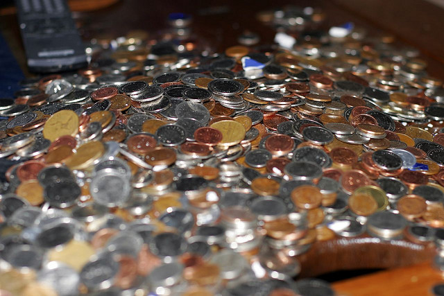

In North America, it’s pretty easy to get by without carrying much cash around. For the most part I pay for all my smaller purchases with debit these days. If I have a larger purchase to make, I generally use my credit card to accumulate some points.

But outside of North America and Europe, it’s been my experience that cash is generally still king. And while having a credit card is great for emergencies (such as being able to get a hotel or a flight in a pinch), I generally make a run to an ATM machine once a week and pull out enough cash to get me by.

Local currency is best for obvious reasons, but it also helps to carry some foreign cash as well. In most places I’ve been to, many establishments will usually accept either US dollars or the Euro as well as local currency, so it’s good to have a stash of either of those.

For example, one time in Buenos Aires (a city where nobody really understands why things happen the way they do, especially when government is concerned) the banks all decided to shut down for a few days while the ATM machines were restocked within the city. That basically meant I was unable to obtain cash for a few days. Because I had some US dollars in my safe, I simply went down to the local supermarket and paid using that. So having a fall-back currency is definitely a good idea to have while traveling.

I usually bring no more than a few hundred dollars of foreign currency, previously US dollars, but I will probably be bring some Euros this time around (since the US dollar seems a bit fragile lately). And while I mostly leave the majority of it stashed in an in-room safe, I generally keep $100 or so of foreign cash on me just for emergency purposes.