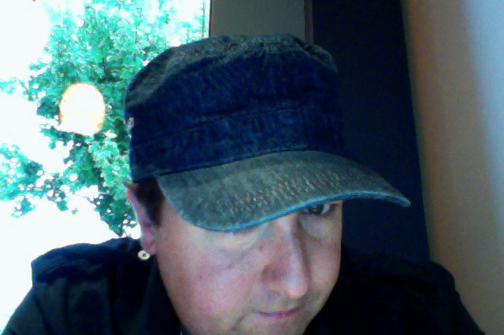

I have this fear, especially as a guy with a bit of meat on his bones, that it’ll always be hard for me to obtain clothing in other countries. It is probably unfounded, as not everyone in Buenos Aires was rail thin, but it’s still one of the things I worry about when abroad.

It’s frustrating enough buying clothing for myself in North America and having things not fit my Ukrainian physique, but when you toss in a language barrier as well, it’s not something I’m entirely looking forward to attempting one day.

That’s why prior to all my trips so far I’ve made a point of buying some new clothes that will (hopefully) last the duration of my trip.

A few weeks ago I bought a few new pairs of shorts, something I haven’t done in about a year. I actually tried to buy some summer clothes before going to Argentina, but it’s actually fairly difficult to find summer wear in British Columbia in December, for obvious reasons. But I now have three or four pairs of shorts, so I should be good in that department.

This last week I went out and bought a few new t-shirts as well as some new jeans. The jeans were actually better quality than the ones I usually buy, as I stumbled upon some great sales and had to take advantage of them. Unfortunately I always need to hem my jeans, and these ones are no different. So now I have to work towards washing all the pairs and taking them down to be hemmed, which I’ll do tomorrow most likely. But the benefit will be some jeans that actually fit properly, something that I only have for brief periods at a time it seems.

A New Hat

I also bought a few new hats. I used to wear hats quite a bit around my first few years of university, but stopped for some reason. Since I’m in the process of trying to grow my hair out (something I haven’t done since I was 18 or so), I decided I’ll probably need a hat or two to help hide the multi-month awkward phase, which has thankfully already started.

I have a feeling I’m going to be overpacking on this trip, but given how I had half a suitcase empty the last time I started, I’m thinking I may as well fill it up this time and have a few more comforts from home. Other than when I may be renting a campervan in New Zealand in January, I should have an apartment whenever I go, so storing a suitcase shouldn’t be a problem.

Scott and Sam arrive in Bangkok today, and are heading to Koh Samui the following Monday. I’m heading to Richmond for the night next Tuesday, and then am off to Thailand as well on Wednesday. So in about a week I’ll be starting the next round of travels. Once my jeans are hemmed I think I’ll have all the clothing I need for five months of travel.