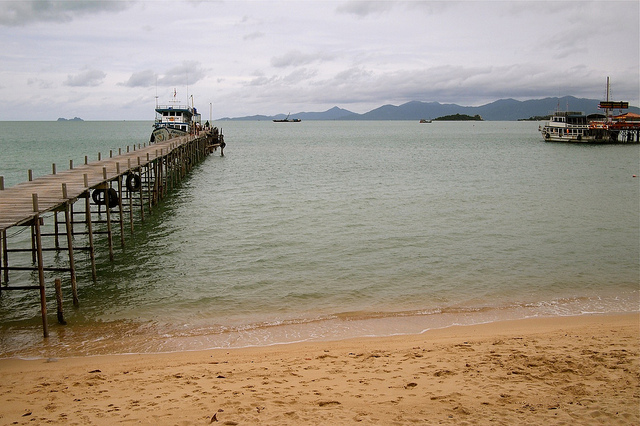
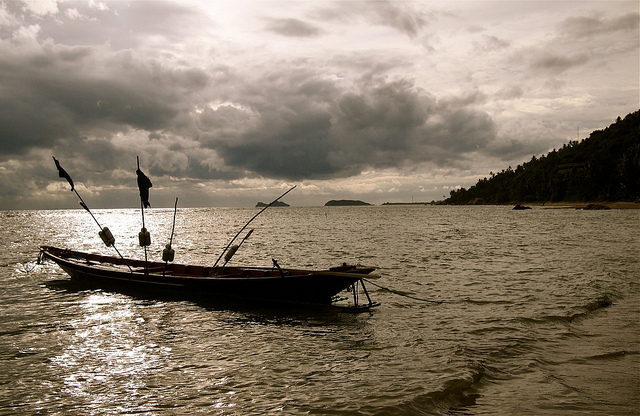
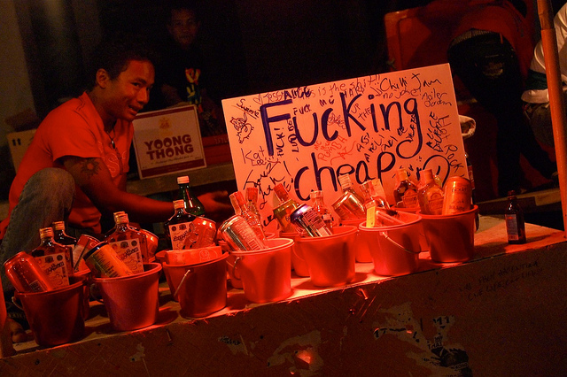
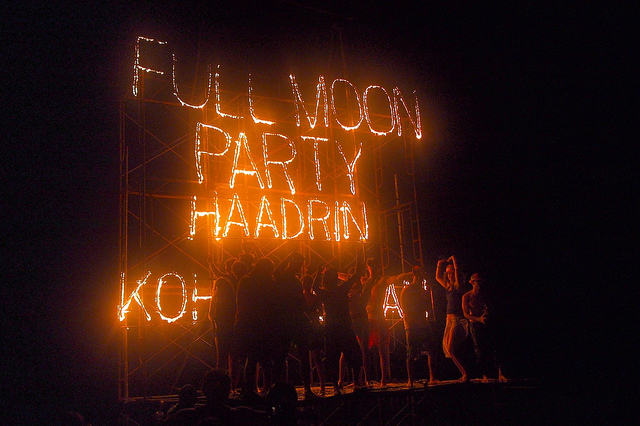
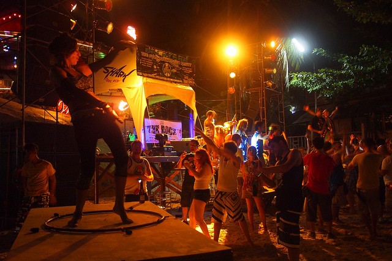
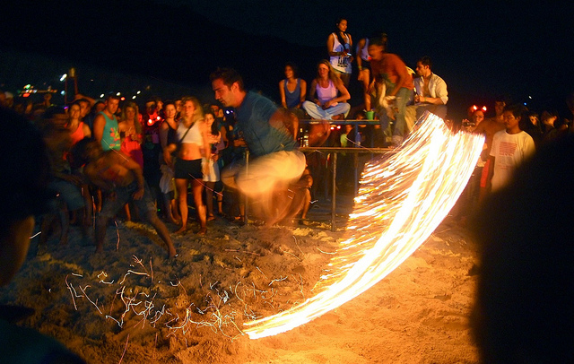
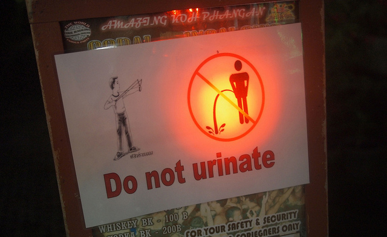

I had heard of the legendary full moon parties in Thailand before coming here, but I wasn’t entirely sure I’d get a chance to check one out. It wasn’t until I got set up in Koh Samui that I realized Koh Phangan, the island where the full moon parties take place, was literally next to us. So it seemed like a shame to be so close and to not visit it.

### Making Plans

To save money, I was originally thinking that my friend Scott and I could head over on the day of the event, party all night, and then simply come back in the morning without sleeping. Turns out that would have been a really bad idea, since the sleep we did end up getting was definitely welcome and needed.

Scott checked out CouchSurfing.com before we left for Koh Samui, and we ended up paying 600 baht (about $20) to get a cot added to some guy’s room (so basically a room with three single beds). The guy we met had just arrived from India, and he seemed like a nice enough fellow.

### Journey to Koh Phangan

Since I live in Bhoput currently, the nearest pier to my location is the Big Buddha pier about a 15 minute scooter ride away. We originally approached a travel agent about getting to Koh Phangan, and she wanted 800 baht (about $25) for a return ticket. Scott and I went down to the pier ourselves, and ended up buying tickets for 200 baht each way, for a total of about 400 baht (so basically half price on what the travel agent was offering). Granted, the travel agent’s ticket included pick-up at a local hotel, but we didn’t need that.

Big Buddha Pier, Koh Phangan in the background

Once arriving on the island, we immediately scoped out the nearest restaurant and ordered up some pad thai. Strangely enough, all the pad thai we had on Koh Phangan seemed to use thin glass noodles instead of the more common rice noodles that is typical of pad thai. Personally, I didn’t really like it since it made it more like spaghetti instead of pad thai, but it was still tasty enough.

### Checking Into Our “Hotel”

We walked through town and eventually made our way to the hotel where we’d be bunching up with our new CouchSurfing friend. While waiting to meet the guy, we decided to grab a few drinks at the bar. There we encountered an apparently inebriated waitress who really liked my smile, or so she said. At one point she asked us if we’d like to have a 500 baht “Special Happy drink” – we have no idea what she was offering, but we politely turned it down. It was definitely an interesting conversation and experience.

Koh Phangan

### Heading To The Beach

As the sun started going down, we made our way to the beach for the Full Moon Party. Along the way, you pass vendor after vendor selling “buckets” of alcohol. Basically for around 300 baht ($10), you can buy a sandbox pail containing a mixture of alcohol (about a Mickey’s worth), red bull, and your choice of soft drink. It was actually fairly tasty, and we estimated it contained about 5 or 6 normal sized drinks. I got a kick out of the marketing strategies of some of the vendors – one lady in particular was screaming “BUCKET BUCKET BUCKET BUCKET BUCKET” at everyone walking by.

Alcohol Buckets

### The Full Moon Party

I had no idea what to expect, but I was pleasantly surprised with the party. The beach was full of people, many covered in fluorescent marker, and there were various sound stages with people dancing around them all night. There were lots of things on fire at various spots on the beach, which seemed to attract scantily clad women like moths to a flame.

Full Moon Party

At one point in the evening Scott and I got invited to play a game to see if we could smash lightbulbs against a seemingly metal wall. While most people didn’t have any luck, both Scott and I managed to break our lightbulbs on the first try and were rewarded with our pick of stuffed animals. We grabbed the stupidest looking stuffed animals we could, and proceeded to walk around the beach with them on our shoulders for the rest of the night for shits and giggles. They were actually pretty big hits with most of the people we met on the beach.

Dancers at the Full Moon Party

I found everyone to be super friendly, and we chatted with various groups over the course of the night. At one point I apparently dropped a bit of money while walking along the beach – someone ran up behind me, tapped me on the shoulder, and handed it back. I also saw quite a few people with Digital SLR cameras, which made me a bit disappointed that I left mine back in Koh Samui. Regardless, I managed to get a few shots from the evening on my E-PL2 micro four-thirds camera.

Skipping Ropes of Fire

Oddly enough, there were no real bathrooms for anyone to use during the evening, other than a few pay-as-you-go stalls back in town. As a result, there was a pretty steady line of both guys and gals peeing in the ocean water as the night went on. Seeing a guy urinating into a body of water isn’t that strange an occurrence where I’m from, but seeing girls squatting with their pants down in the water in plain site was a pretty strange sight.

No Peeing, Or Slingshot Guy Will Get You

We encountered one establishment that had a sign up strictly informing people not to pee, or a guy with a slingshot would come after them. Sure enough, there was a real security guard on the premises, and he had a slingshot. So you don’t want to mess around by peeing in the wrong location.

We called it quits around 5am and found the nearest pizza/burger joint for a late night snack. We managed to make it back to the hotel for a quick four-hour nap, and then made our way back to the ferry for the ride back to Koh Samui.

All in all it was a pretty awesome event, and I’m definitely glad to have taken the time out to participate. If you’re heading to Thailand and are going to be anywhere near Koh Phangan during a full moon, I definitely suggest making the trip over and checking out the Full Moon Party.