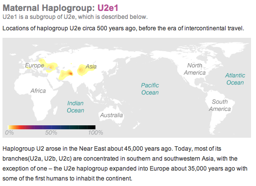
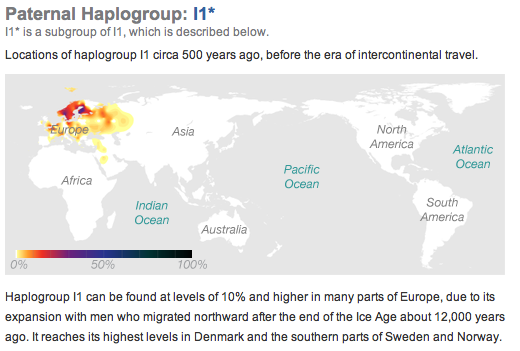
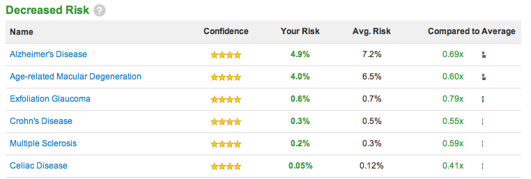
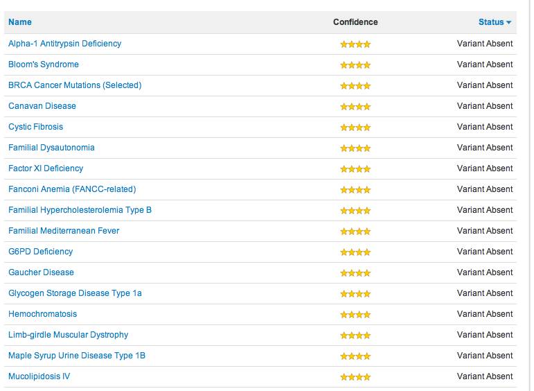

Last year my friend Dave got his genetic profile done up by [23andMe](http://23andme.com). Basically they can take a saliva sample, extract your DNA from it, and then compare it against all the current research in the field of genetics.

When they originally launched they were asking over $400 for each profile. I’ve been patiently waiting for a sale to get mine done, and eventually managed to find a coupon to bring the cost down to $99. So right before leaving to Thailand I mailed off a saliva sample to California and have been waiting for the results.

Some people have told me previously that they actually wouldn’t want to know if they are susceptible to any ailments. As far as I’m concerned, it’s still a really new area of research, so a big warning flag isn’t really going to worry me at this point. I also know that many of the results come about due to associations (people with a certain disease had particular genes), but that doesn’t necessarily mean it was the causal factor.

I thought I’d share some of the results just to show what kind of data that can extract from your DNA.

### Maternal Haplogroup

23andMe gives you information about your family lines. If you’re a guy, you can get both of them out of your DNA, but I believe women can only get their mother’s line out of theirs.

Maternal Lineage

My mom’s line is one of the oldest in Europe, and I believe was even around back when Neanderthals were around (so I’m part cave-man, big deal). As my grandparents were from the Ukraine, this matches up from what I know.

### Paternal Haplogroup

Based on the data from 23andMe, my dad’s genes come from Europe, tracing back to Scandinavia.

Paternal Lineage

My dad’s father was born in Yorkshire in England, so it also matches what I know about my lineage.

### Physical Traits

Based on my genes, here is a list of physical traits that I should probably have:

Physical Traits

Some comments:

- Alcohol Flush Reaction – Correct, I don’t flush.
- Bitter Taste – Yup, I can taste bitter things.
- Earwax Type – Wet it is!
- Eye colour – My eyes change a bit, but are mostly blue.
- Hair curl – Yup, I have curly hair.
- Lactose Intolerance – I’m not lactose intolerance, so correct again.
- Malaria Resistance – Never had it, so not sure.
- Male Pattern Baldness – I mostly have all my hair, and my dad still has all his hair. My uncles on my mom’s side are all slightly balding. But, the genes say I’m at reduced risk, so I’m rolling with that.
- Muscle Performance – I think all my physical education teachers would agree that I’m not sprinting material

So, pretty much all accurate based on the ones I know about.

### Disease Risk

Here’s a list of the diseases which I’m apparently at a decreased risk of obtaining:

Disease Risk

### Carrier Status

There’s also a breakdown of all the dormant diseases that I may be a carrier of. Thankfully I don’t have any, but here’s what the list looks like:

Carrier Status

### Summary

As part of the process, everyone is required to sign up for a one year membership. What that gives you is updates to your data whenever new criteria are obtained. For example, if they find new genes for cancer, they re-run all the genetic information (which they store at their facility) against the new criteria, and update your profile. So you get real-time updates whenever there is something to report.

For $99, I think it’s money well spent. For the most part, there were no surprises on the report for anything, especially when I factor in my family history in a few areas. But it’s good to get confirmation on a few areas, and to know things I’m at risk for and also not at risk for.