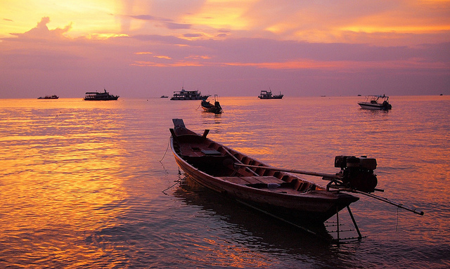

I left Koh Samui in the afternoon on Friday and made my way down to the Maenom ferry dock. I booked a high speed catamaran with [Lomprayah](http://www.lomprayah.com/). They actually had a deal going on where they would include a pick-up at your hotel, so that worked out great. They give you a 20 minute window where you need to wait in front of your hotel, and eventually a shuttlebus picks you up and takes you down to the ferry. We actually were there with plenty of time to spare, but I suspect that’s deliberate since they have their own restaurant and store there, and there’s not much else to do.

The ferry to Koh Tao took around two hours, with a brief stop over in Koh Phangan. I whipped out my laptop for most of the trip and did some work, but they actually had a small TV at the front showing some comedy show, so most people were just doing that.

I grabbed a quick bite to eat when I landed at Koh Tao, and decided to hike my way to my hotel. I was staying at a place called the Sairee Hut Resort, which was basically on the opposite end of the main beach. So it took me roughly 30 minutes to walk there along a small concrete road.

Most rooms in Thailand are pretty cheap. I don’t think I’ve paid more than $35 for a hotel room since being in Thailand, and at that price you usually get something pretty nice. I mostly use [Agoda.com](http://agoda.com) out in Asia, since they seem to have the best coverage.

Along the road to my hotel I saw a big sign for a pub crawl that was going on that night, so I decided I would check that out. I went for a little dip in the pool and then had a few drinks by the pool. While I was eating the sun was setting next to the beach hut I was in, so I put my fork down and took a few shots.

Sunset in Koh Tao

But once that was done I decided to toss on a pair of jeans and head down to the pub.

Pub Crawlers

The pub ended up being a really great time. There were two Australian guys who were playing live music, and they kept asking people to come join them. Since they had a tambourine on them, I decided to get on stage and help turn the awesome knob up a few notches. Prior to that I had been sitting at the bar by myself just enjoying the atmosphere, but some girl eventually invited me to join her and her friends, which was great.

We ended up at another cool pub down the road, and eventually shut it down. Unfortunately at that point I started to walk home and somehow ended up getting myself completely lost. Unlike North America, there aren’t a lot of street lights to help you once most establishments shut down. Not only that, a lot of stores close their windows after they shut down, so the buildings don’t look like you remember them when you pass by later.

I eventually had to pay someone to drive me close to my house, since I was tired and just wanted to go to sleep. I found some Thai grandma and she got her daughter to give the stupid Canadian a scooter ride back to my place for a few bucks.

There’s only really one main stretch in Koa Tao, so I spent most of the next day just wandering around and taking advantage of the pool.

Koh Tao is mostly known for its diving, but I didn’t have enough time to get any dives in. One day perhaps I’ll try and get my diving certification, but that’s probably a ways off.

Needless to say, Koh Tao is a beautiful island, and it was great to just chill out and enjoy some of the scenery.

Longtail Boat in Koh Tao

I had to get up early this morning to make my way to Koh Phi Phi. It was a pretty long trip, and I nearly missed my flight, but I made it. More on that in my next entry.