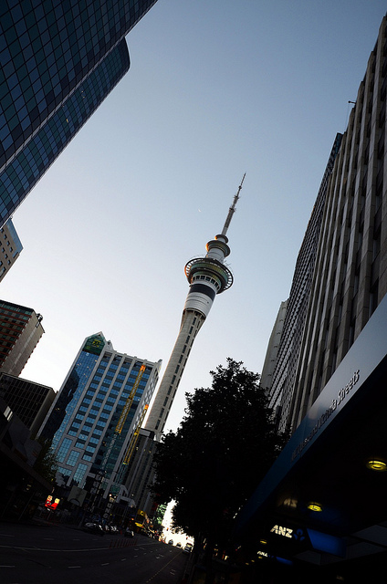
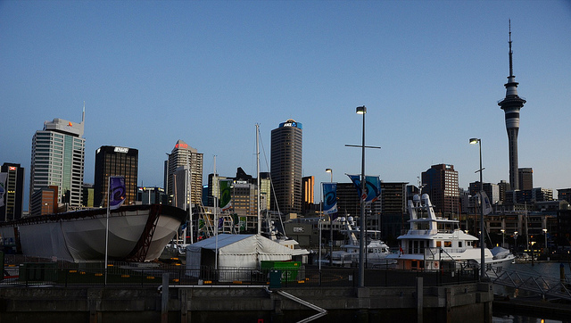

I left Koh Samui just a few days ago and flew up to Bangkok. My original plan was to spend three days in the city and then fly out to Auckland, New Zealand on the following Monday. Unfortunately though, the flood crisis in Bangkok was hitting the tipping point, and residents were being urged to get out of the city if they had the means. Since Air Canada was offering free change fees on all flights in and out of Bangkok, I decided to change my flight around.

All in all it worked out for the best. Instead of a 10 hour layover in Kuala Lumpur, I ended up with a direct flight to Auckland on Thai Airways. The plane wasn’t full so ultimately I ended up having most of a row to myself. I watched about a movie and a half on the flight, and managed to sleep through quite a bit of it. So the flight didn’t really seem that eventful to me.

Auckland's Skytower

I’ve heard that New Zealand customs can be a bit of a pain, mainly due to how protective New Zealand is for its agriculture. But since I wasn’t bringing in any food items, I was hoping everything was going to be a breeze. Unfortunately, I was wrong.

I won’t go into too much detail, but ultimately I ended up spending about 30 minutes in a back room in a one-on-one session with a custom’s agent. They said it was because I had visited a series of high-risk countries recently (Singapore, Malaysia, Indonesia, etc), but strangely enough they never asked me about any of those trips. They spent a lot of time verifying what I was saying on the internet. For example, when I said I worked/owned BraveNewCode, they went to the BraveNewCode website and verified that my name was on the about page. They also asked for the phone numbers of everyone I knew in New Zealand, which I couldn’t provide (who uses the phone nowadays anyways?)

Despite all of this, they didn’t actually search my luggage, which I found odd. In fact, I would have welcomed a search if it would have gotten me out of there sooner. I had to pass everything through another x-ray machine, but after that I was on my way downtown. I caught a $16 shuttlebus from the airport which ended up dropping me off about 200m from my apartment in downtown Auckland.

I have to say, it’s great to be back in the “first world” again. While Asia was a great experience, the little things (such as not being able to drink the tap water) get to you after a while. Hot showers, accessible groceries, being able to walk down the street without having someone yelling at you to come into their store – all nice changes. And plus, the weather is pretty much right in my comfort zone – highs of 18-20C, lows of 12C. For me that’s basically jeans and a light button-up shirt weather.

Auckland's Skytower

I spent about three hours walking around downtown Auckland last night, so I have a pretty good lay of the land. I’ll probably take a ferry over to one of the neighbouring islands this upcoming weekend (where they have wineries), but will most likely stay close to home during the week. The following two weekends are taken up by my sailing course, and I’m definitely looking forward to that. I also have a friend here from Argentina that I’m hoping to go for drinks with this week, and it’ll be great to catch up.

But Auckland is definitely a welcome change from south-east Asia, and I’m looking forward to spending a month in the city.