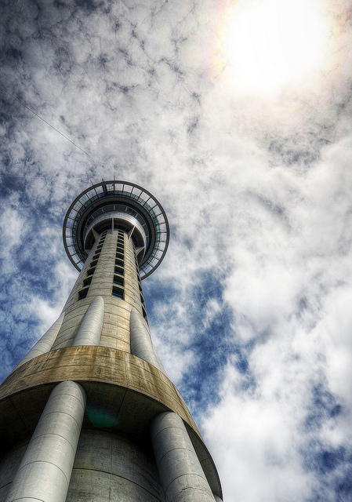

Skytower in Auckland

I’m only in Auckland until the end of the month, but I have a pretty busy schedule until then. This weekend I start sailing lessons with the [Penny Whiting](http://www.pennywhiting.com/) sailing school. It looks like there are about 8 people in our group, so it should be a fun experience. I’ve already received some introductory material, so I’ll spend the next few evenings going over it to get ready for the course on Saturday.

One of the items we were told is that we’re not allowed to wear any non-white soles on the sailboat. That gave me a good excuse to go out and buy a new pair of Adidas casual shoes (a nice change from sandals). So I’m doing my best to break them in before the weekend.

I also got selected to be a part of a private Tweet-up organized by Air New Zealand on the [first 787 to arrive in the southern hemisphere](http://www.nzherald.co.nz/business/news/article.cfm?c_id=3&objectid=10764704). I haven’t received all the details yet, but I suspect a small group of us will head down to the airport on Monday and spend a few hours checking it out.

There’s still quite a bit left of Auckland to see, so hopefully I manage to find some time to slot it all in. At the end of the month I’ll be checking out of my apartment here and will be taking [The Overlander](http://en.wikipedia.org/wiki/Overlander_(train)), which is a 12 hour train ride down to Wellington. I’ve been told Wellington is more artsy and trendy than Auckland, so it’ll be an interesting change.