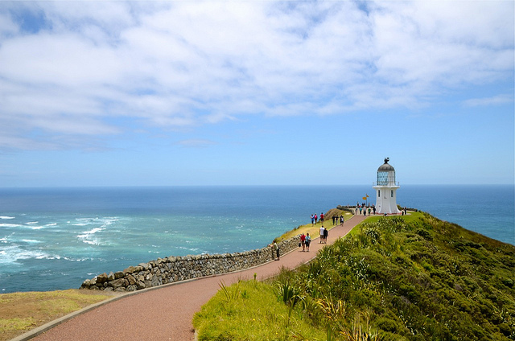
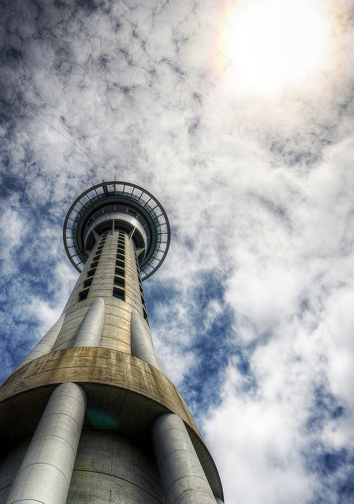
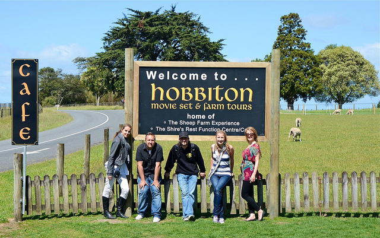

Now that I’ve had time to reflect on my time in New Zealand, I thought I would post an update with what I thought of the country in general.

First, New Zealand is gorgeous. I didn’t get a chance to visit the South Island on this trip, but I made my way from tip to tip of the North Island. One thing that’s pretty amazing there is just how green the grass is. We have green grass in Canada, but it’s more of a florescent green in New Zealand – it’s pretty surreal. It’s like what grass looks like when you bump the saturation up on a typical grass shot in photoshop, except you don’t have to do that in New Zealand. In addition much of the landscape involves rolling hills, which made for some pretty spectacular vistas.

### Costs

Given that New Zealand is essentially a series of two islands in the middle of the Pacific Ocean, it shouldn’t really come as a big surprise that it’s an expensive country. But truthfully I was surprised at just how pricey it was. It wasn’t unaffordable, but it was definitely on the edge, and that’s without doing any tours and what-not.

Cape Reinga, Northern Tip of New Zealand

Here are a few examples. I rented a short term apartment in New Zealand that was on the edge of the downtown core. A similar apartment in Vancouver’s trendy Yaletown district would probably cost around $2,000 CAD for a month. My apartment in Auckland cost around $3,000 NZD for the month. A pita or a kebab on the street was typically around $11 NZD, and a steak at a typical restaurant was around $36 – $40 NZD.

If you want to do any tour, you should be prepared to bend pretty far over. An 8 hour Lost tour in Oahu, Hawaii cost me around $100 USD for the day. A tour of Hobbiton leaving from Auckland was priced at $255 NZD, and it’s about a 6 hour adventure.

### Auckland

Auckland's Skytower

I was told by quite a few people that I shouldn’t spend much time in Auckland as it wasn’t that fun a city. But I actually had a pretty good time there. The pub scene in Auckland was a nice welcome change from southeast asia. One aspect I particularly liked was how you had to order most food and drinks at the bar in the pub. This involved walking up to the counter, looking at a menu, and then ordering directly from the bartender. I think it encourages people to socialize around the bar, and probably saves the pubs a bit of money by not having to employ a bunch of servers.

While in Auckland I obtained my Sailing Certificate of Competence from a famous New Zealander named Penny Whiting. It cost me $700 NZD for the course, but it was a lot of fun, I met quite a few people, and I now can crew a sailboat, something that I’ve wanted to do for about 10 years.

### Wellington

I spent almost a week in the city of Wellington, which has been called the “Coolest little capital in the world” by various travel books. It’s definitely a fun and vibrant city, filled with pubs and coffee shops. But it’s not a very large city, and I had covered most of the downtown core in just a few days. I was originally planning on spending a full month in Wellington, but I think I would have probably been a bit bored by the end of my month there.

I was told there was a huge coffee culture in Wellington, and there were definitely quite a few cafés. But I didn’t think it was any more than a typical city has, even when walking down the famous Cuba street which is known for its coffee shops.

That said, there definitely seems to be more of an arts scene in Wellington, and there are plenty of theatres of cinemas to visit. Given that Weta studios is in Wellington, I was hoping I might run into some random cast members from The Hobbit, but no such luck unfortunately.

### Hobbiton

Without a doubt, the best part of my trip to New Zealand was a visit to Hobbiton in Matamata. Hobbiton is the actual movie set where the Hobbits lived in the Lord of the Rings trilogy. Prior to this year, a visit to Hobbiton would have allowed a visitor to see a few Hobbit house facades that were left from the original trilogy – most of the original set was destroyed after filming.

Team Hobbit

Thankfully since the Hobbit is filming now in New Zealand, the entire set was reconstructed from scratch. So when we visited Hobbiton, we were able to see it exactly as it was in the Lord of the Rings. Not only that, but there’s a whole new area that was constructed just for use in The Hobbit, an area not yet seen by the general public.

As such, we were forced to sign agreements before entering that we wouldn’t post any photos that we took of Hobbiton until a later date (I assume once the first movie is released). So while I would love to share what I saw there, it’ll have to wait probably until December of 2012.

### Final Thoughts

Ever since I saw The Lord Of The Rings, I’ve wanted to visit New Zealand. I’m happy I finally got a chance to spend some time there, and explore the North Island. I would have liked to have spent some time on the South Island, but due to lack of funds and some crappy weather, I decided to forego it this time and save it for another visit. Unlike many other travellers, I never fret when I don’t manage to see everything when I visit a country. I just look at it as another opportunity to go back and visit the country again in the future.