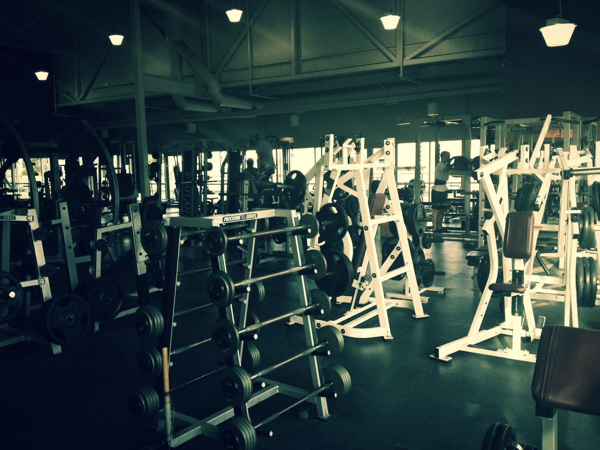

I decided when I got back from New Zealand that since I was going to be stuck at home for about four months I might as well try and get back in shape. Prior to all my surgeries and that bad infection I got that time in Vancouver, I was actually pretty skinny. But between all the recovery periods and the hardcore antibiotics I was on (vancomycin often causes weight gain in people and animals, probably because it wipes out a lot of the beneficial intestinal bacteria), I somehow put on a pile of weight. It also didn’t help that I ate primarily restaurant food for most of last year while traveling.

I actually don’t really have a hard time losing weight. The trick for me is controlling all the variables though. That means cooking most meals for myself, spending lots of time at the gym, and knowing when to say no for outings. For examples, birthdays are usually out for me because everyone tries to force-feed me cake. I also generally avoid any dinners at other people’s houses, since usually it involves drinks and a bunch of food that I am trying to stay away from. Plus people seem to always associate food with happiness, and hosts generally aren’t happy unless you are eating, which makes it hard to stay on a diet.

So in many ways, I’ve been a bit of a deliberate hermit these last few months, eating lots of tuna salads and avoiding all starchy carbs for the most part.

The good news is I’m down twenty pounds in about two months. I have another ten pounds to go before I’m down to the weight I was when I used to play rugby (which for all intents and purposes is sort of where “skinny Duane” starts to occur). But I’ve already started the process of replacing clothes with skinnier versions, and recently had to buy a new belt.

My goal was to drop thirty-five pounds or so before leaving for South America at the end of April. Right now I’m on track for that, but my trip to Cape Town might throw a wrench into everything. So we’ll see.

But I’m looking forward to doing a pile of travel later this year as the skinny, slightly more athletic version of myself.