Back when I was in Thailand, Scott and Sam gave me the official invite to their wedding in Cape Town, South Africa for March of 2012. I was actually really excited about visiting Cape Town, but after leaving New Zealand I was pretty much out of money and had a lot of expenses back home to deal with. But I decided it was important for me to go, so I bit the bullet and purchased a $1,500 plane ticket to Cape Town, South Africa, leaving from Las Vegas (flights are always quite a bit cheaper out of the United States, and I was going to be down there for my mom’s birthday anyways).

### Journey

Cape Town is pretty much as far away from Vancouver/Las Vegas as you can get. My journey consisted of a 10 hour flight from Las Vegas to London, a 2.5 hour layover in London, followed by another 12 hour flight to Cape Town. So with connections it was an entire day of travel. Thankfully between an Ativan tablet I took and a few drinks on the plane I managed to sleep for more than half of the journey, which definitely helped with the jet lag when I landed.

One interesting aspect of this trip was that I was involuntarily (but happily) upgraded on two of the flights I had on British Airways. I suspect that means they oversold their economy class tickets, but they didn’t upgrade many people and apparently I made the cut. I’m not sure what the criteria was, because I don’t have any elite status (although I did register for a British Airways frequent flier number and paid a decent price for my ticket). Regardless, I got to spend two flights with way more room, noise cancelling headphones, and a pretty fancy meal.

I arrived into Cape Town at around 6:30am in the morning, just in time to see the sun coming up around the airport. My friend Samantha (and next door neighbour in Thailand) was nice enough to come to the airport and pick me up in the morning in her spiffy convertible Cooper Mini.

[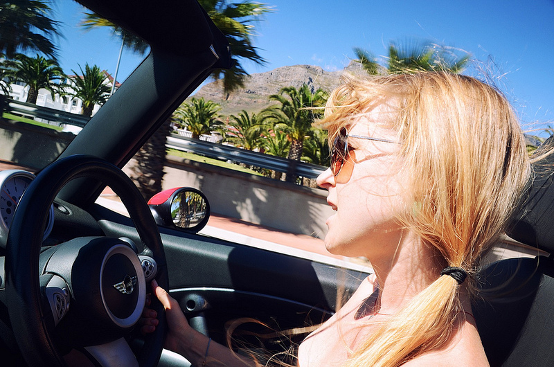](_images/visiting-cape-town-south-africa-1.jpg)Sammy, Driving

### Around Cape Town

Cape Town is easily one of the most gorgeous places I’ve ever been to. The scenery around the city is breathtaking, consisting of scenic vistas, pristine blue water (so blue in fact that I commented that photoshopping it wouldn’t be necessary), and the majestic backdrop of Table Mountain in many of the shots.

[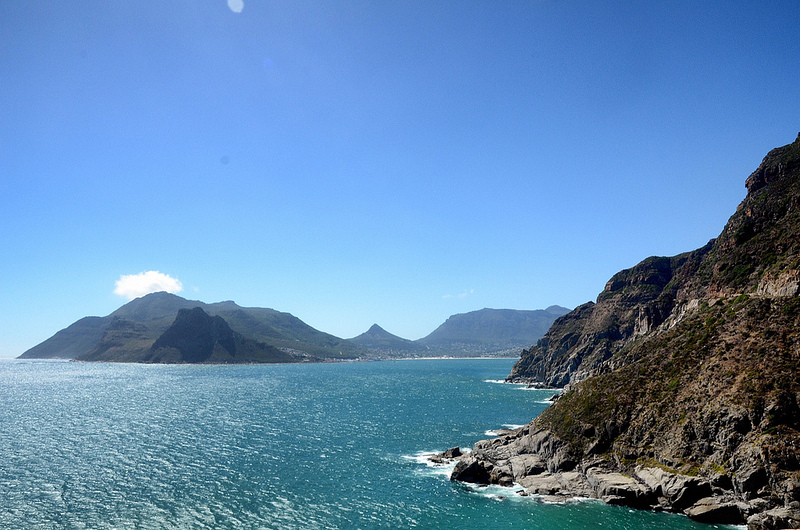](_images/visiting-cape-town-south-africa-2.jpg)Cape Town

Samantha took me on an amazing road trip round most of Cape Town with the top down in her convertible. You can see the road along the mountain in this photo.

[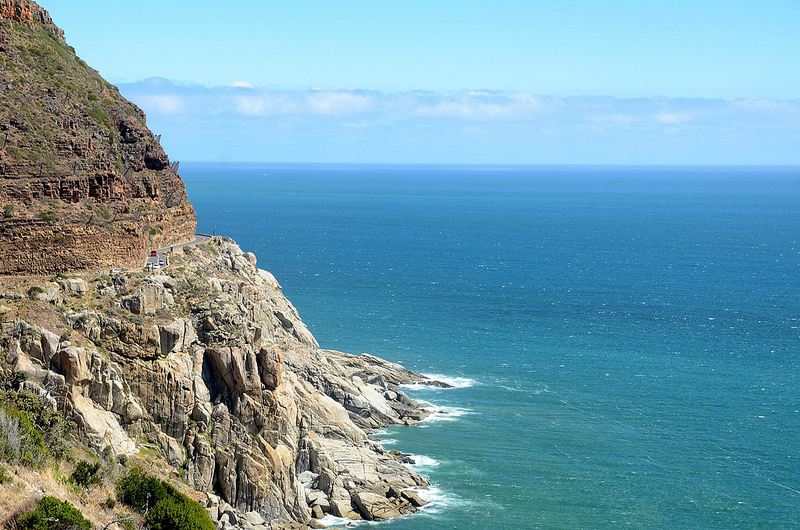](_images/visiting-cape-town-south-africa-3.jpg)

### Boulders Beach

Like Ushuaia, Argentina, Cape Town is home to a few colonies of penguins, one of which is out in an area known as Boulders Beach. Since I saw three species of penguins in Argentina (Magellen, King and Gentoo), I thought it was be cool to see the African penguin up close. So Samantha drove me down to Boulders Beach (about a 45 minute drive from Cape Town). Of course we had to stop at a winery on the way and drink some wine.

[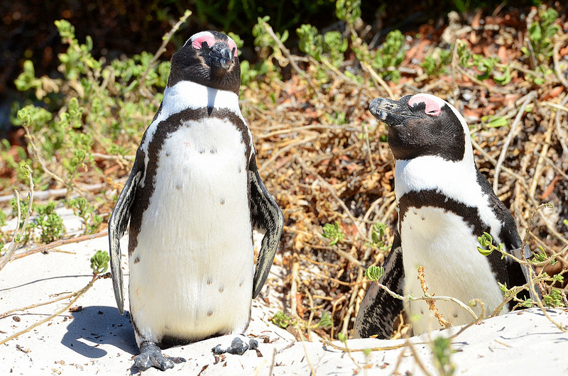](_images/visiting-cape-town-south-africa-4.jpg)African Penguins at Boulders Beach

They reminded me a lot of the Magellen penguin in Argentina (and of course, a bit like Waddles!).

### Hike Up Lion’s Head

There are several hikes within the Cape Town area, one of which is known as the Lion’s Head. It’s a popular hike to do during the full moon, and people often take flashlights up so they can slowly make their way down after the moon rises. So a group of about ten of us decided to do it the night after the full moon (which typically has less people).

[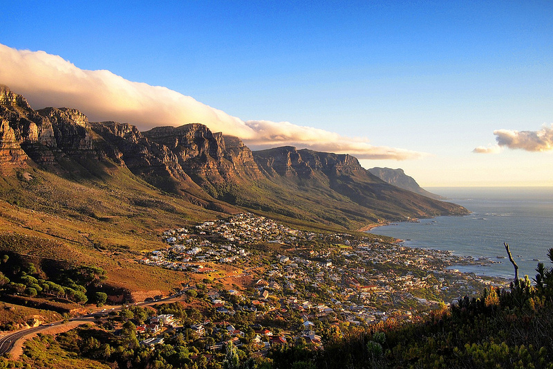](_images/visiting-cape-town-south-africa-5.jpg)Cape Town, Viewed from Lion's Head

[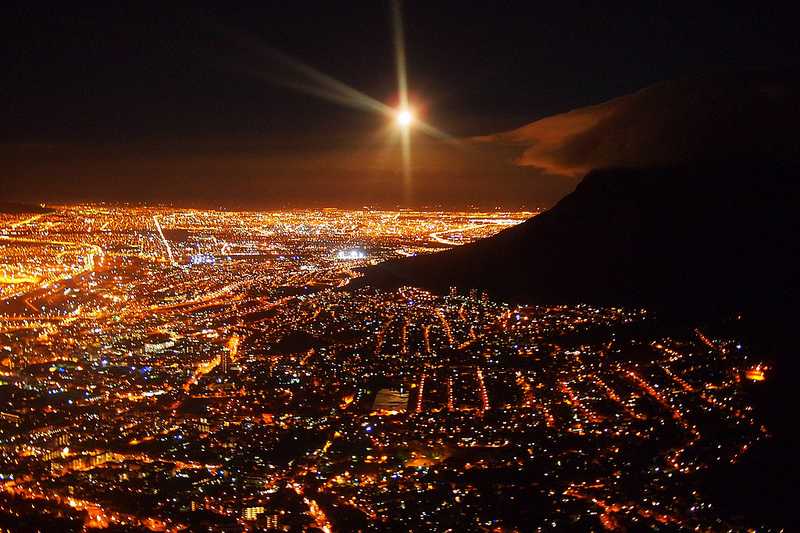](_images/visiting-cape-town-south-africa-6.jpg)Moon Rising over Cape Town

### Abseiling Down Table Mountain

For Scott’s stag, a bunch of us decided to abseil (i.e. rappel) down the side of Table Mountain. I actually really hate heights (and flying for that matter), but I decided to push my own personal boundaries a bit by participating.

I have to say, once I was all hooked into the harness and standing at the top of the mountain, I was pretty freaked out. That’s definitely the scariest part of the whole journey, when you basically have to transition your weight from your legs to the rope, and hope like hell that it holds you all the way down.

At that point, the Abseiling guys take a photo. The view from Scott’s vantage point was the best, so here is what it looked like (and that was the view on the way down).

[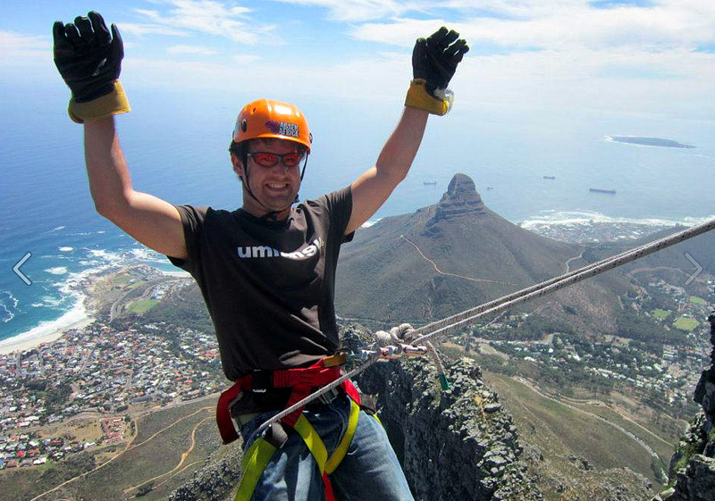](_images/visiting-cape-town-south-africa-7.jpg)Scott, About to Abseil Down Table Mountain

You can actually see Lion’s Head in the background, along with the hiking trail we used to climb up to the top.

### Wedding

Obviously the whole point of the trip was for Scott and Samantha’s wedding. One of the first activities I got to participate in was the official cocktail tasting to determine which ones would be included during the reception. I went down to a bar with Samantha and Adeline and spent an afternoon tasting fancy cocktails, which was heaps of fun.

[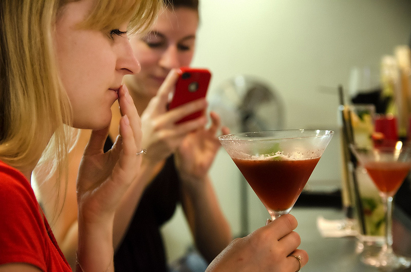](_images/visiting-cape-town-south-africa-8.jpg)Samantha, Tasting Cocktails

The actual wedding was held about 45 minutes out of Cape Town in a beautiful mansion on the beach.

[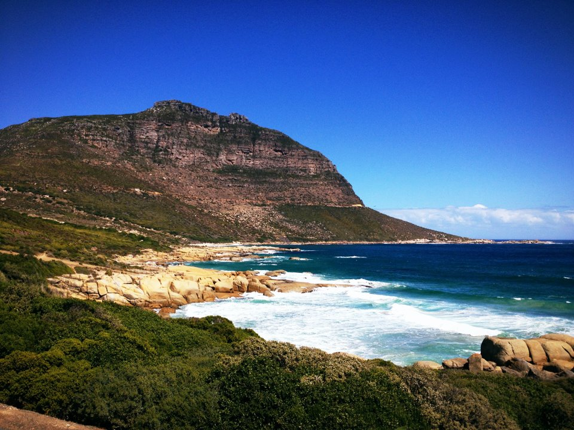](http://www.migratorynerd.com/wordpress/wp-content/uploads/2012/03/capetown9.jpg)View at the Wedding Venue

And of course the highlight of the night, seeing two friends get married.

[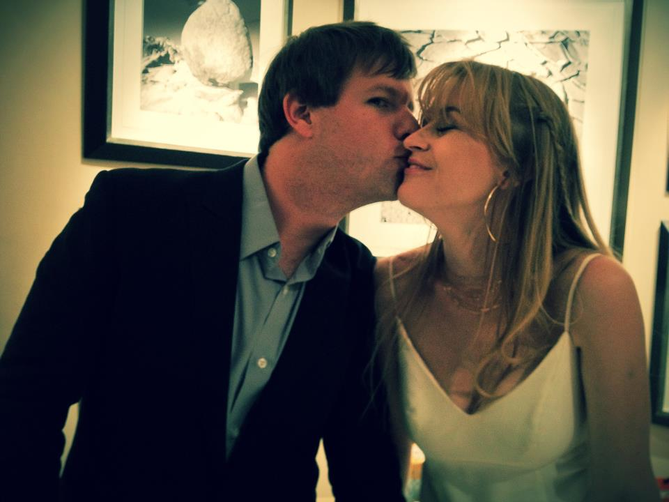](http://www.migratorynerd.com/wordpress/wp-content/uploads/2012/03/capetown10.jpg)Scott and Sam, Happily Ever After

### Final Thoughts

I am so happy that I made the journey to Cape Town, first and foremost to see Scott and Samantha get married, but also because it’s easily one of the most beautiful places I’ve ever been to on the planet. The people were amazingly friendly, the scenery was absolutely gorgeous, and the weather was fantastic.

[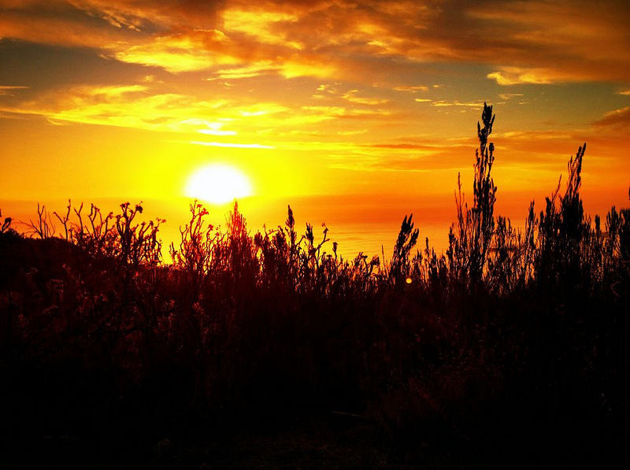](_images/visiting-cape-town-south-africa-11.jpg)Cape Town Sunset from Signal Hill

This is actually the first trip in a full year where I’ve brought most of my camera equipment, and I’m really happy I did (even though my backpack was super heavy). During this trip I realized just how much I’ve missed photography these last few years, and definitely want to get back into it again. So without a doubt you’ll see a lot more photos from me going forward, especially when I head back to Buenos Aires soon.

[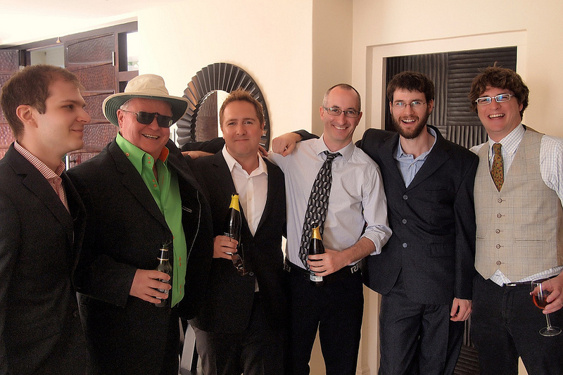](_images/visiting-cape-town-south-africa-12.jpg)New Pals

And like many other of the trips I’ve been on, I made a lot of new friends on this one, which is one of the best parts of traveling around the world. Without a doubt, I will miss Cape Town and all the great people I met there.

I’m back in Canada for five weeks and then heading back to South America again. The first stop on the trip is Buenos Aires, and I am really looking forward to visiting the city again and reconnecting with some old friends.