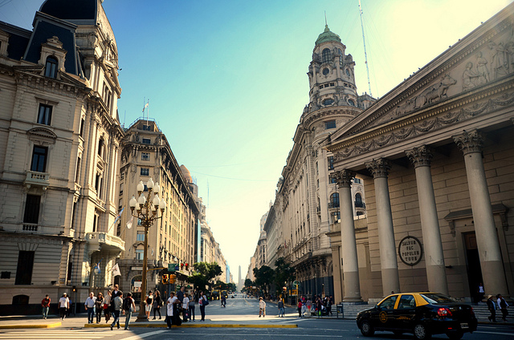
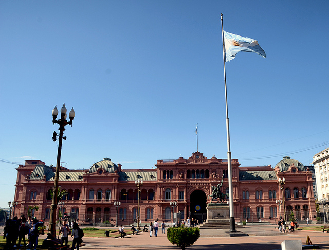
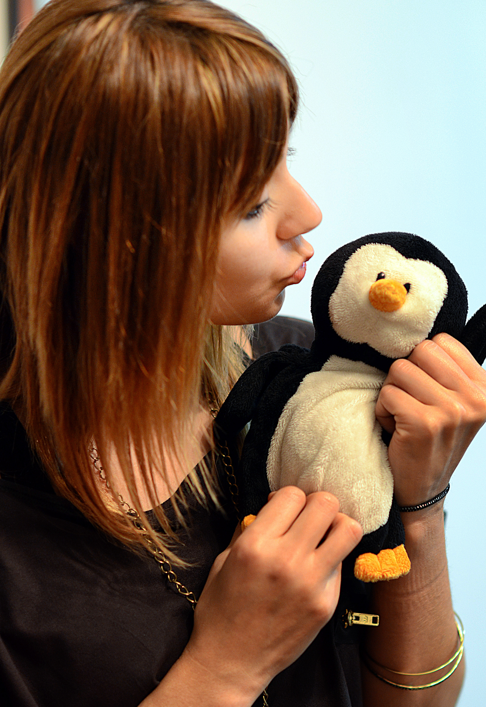

To be honest, it still feels a bit strange to be using the “Argentina” category on this blog again. When I left in March of last year, I wrote my final entry and had not envisioned coming back so soon. But as I mentioned in my previous post, after being away for a while I started to miss some of the better parts of this city, as well as some of the friends that I have here.

Buenos Aires was my first trip that I set out on in January of 2011. I was still a very green and naive traveller, not really knowing what to expect or how I would deal with new situations. Back then many of my experiences seemed frustrating, and the first six weeks or so were a bit hard since I didn’t know anyone really in the city.

Buenos Aires, near Plaza de Mayo

After a year of travel I thought it might be interesting to go back to Buenos Aires again to see if my impressions of the city had changed at all. While I had debated it for a few months, I finally pulled the trigger after leaving New Zealand and decided to come back to Argentina and also try to get to Brazil for a week.

Without a doubt, being back is already a far different experience.

First, the weather is a lot more mild than it was last time. While I love summer, a steady few weeks of near 40C temperatures gets a little old after a while. Being able to walk around the city with jeans and a light hoodie on is a nice change.

Second, I know how the city works now, and have already taken the subway around a few times and visited all the best grocery spots near me (which took me a while to figure out last time). I spent nearly two weeks getting my cell phone working last time, but this time had it going within a day or two of landing here.

Third, I do have some actual friends here this time. My first night back I met up with Andrew and Cintía, two of the people I met at an expat event when I moved here. The next day I met up with my friend Vanesa, who I last saw in New Zealand. And on Friday night I hung out with Annie, a friend of mine from 2011 that’s also interested in photography. I’m hoping to attend a few other events in the next week or so and add a few more friends to my social circle. But it is nice having some friends here right from the start.

Café Tortoni, one of the top 10 most beautiful cafés in the world

I originally thought that Buenos Aires was a fairly dirty city when I visited here last time. And while it’s definitely not as clean as Canada walking around (probably nothing in the world is), it doesn’t seem like I remember it. I suspect that’s because I’ve seen far dirtier places in the last year, particularly in South East Asia.

I also suspect that many of the tourists have already left for home. Most people visit this part of the world in the middle of summer, which is between January and March roughly. Not many people do what I am doing now, and that’s visiting here in the fall and winter. So I think I’m going to have a more authentic visit this time (in fact, other than a few expats that I know, I don’t think I’ve run into anyone else yet who is traveling).

## Spanish

I haven’t really had many opportunities to break out the Spanish yet (other than the basic phrases used to order food and what-not), but I’m going to start looking for them. I’ve already hit a few scenarios where I’ve tried to speak Spanish, only to be handed off during the conversation to someone else who speaks english (which happened last time as well). That makes it hard to actually get practice, but it’s something I’ll hopefully keep working pressing forward on. I’ll probably just start refusing to speak in English in those types of scenarios.

Casa Rosada

I may take a few weeks of lessons again, just to get one-on-one practice speaking with someone who is paid to be tolerant with mistakes. I’m hoping that brings my confidence up a few notches. I’m also going to try attending a few Spanish exchange events, where basically you rotate around the room taking to people in Spanish for five minutes and then English for five minutes. I stumbled through it once last time, and I did fairly horribly, but my knowledge of the language is far greater than it was last time I was here, so I think it should be easier.

I spent time back in Canada watching Argentina TV over the internet, and I’m finding it easier and easier to pick out all the words in a conversation. I still have trouble understanding a lot of it, most likely because of missing vocabulary, but I can often pick out the words I don’t know amidst the ones I do.

Annie and Waddles, my traveling penguin

In addition, a few of the english programs have Spanish subtitles. Last time I was here I used to read them but was completely lost with the seemingly endless verb endings. Now I pretty much know all the possible verb conjugations in Spanish, and it’s not very often I see a verb without knowing how it was conjugated.

## Summary

I’m definitely enjoying being back in Argentina, and it’s been nice seeing some of my old friends again, especially ones that I last saw on the other side of the world. I’m here until the end of June, at which point I’ll head back home for my third surgery. In between I have a 9 or 10 day trip to Brazil that I’m looking forward to. But all in all I’ll have six full weeks here – in that time I’m planning on retracing my old steps again, and enjoying some of the Argentine culture.