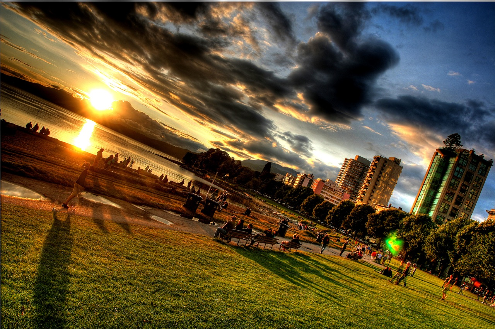

Vancouver has always been the only destination I’ve considered for the past few years to spend summer near. Last year unfortunately was a bit of a bust due to the weather, but I managed to spend four months around the Vancouver area back in the summer of 2011. I came back from Argentina at the end of June and spent a month in my home town, and am now in Yaletown for the remainder of August.

Vancouver’s English Bay

For the first time in ages, I don’t have any travel plans at the moment. The main reason for that is because I am scheduled to have surgery on September 7th to finally correct a fractured eye socket that occurred back in 2006. I’ve had two similar reconstructive surgeries, one in 2006 and one in 2007 – unfortunately neither of them really managed to correct the root problem. This upcoming surgery promises to be the one that finally fixes it all for me, so I’m definitely looking forward to the date and ultimately getting it over with.

So until it’s all over and behind me, I’m not going to make any travel plans.

Assuming everything works out, I would like to visit Europe sometime in the next few months, possibly Malta, and more than likely Serbia. Knowing that I’m likely to visit quite a few countries in Europe if I end up going, I started the process of renewing my passport at the start of July. It should arrive any day now, which means I will be ready to possibly see something new again once my surgery is all over.

But until then, I’ll continue with my holding pattern around the Vancouver area, catching up with friends and also spending some time enjoying the beautiful BC summertime weather.