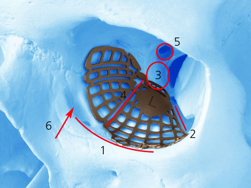

In exactly four weeks from today, I’ll probably be waking up in Vancouver General Hospital after having my third surgery to correct some orbital fractures I received in 2006. I met with the surgical coordinator yesterday to complete all the pre-surgery documentation giving the surgeons my consent to operate on me, one more time.

The surgeon performing the operation is one of the best in his field, even internationally. Years ago he helped start Singapore’s eye care centre, and he frequently travels and speaks at international conferences. He’s published several different books on eye surgery, and was recommended to me by pretty much all the surgeons I contacted in the United States over the last year. He recently retired from public practice, but after reviewing my case, decided to perform one more operation in an effort to help me out.

Assisting with the surgery will also be [Dr. David Rossman](http://www.ratemds.com/doctor-ratings/949684/Dr-David-Rossman-Vancouver-BC.html), another ophthalmologist in the Vancouver area.

The previous two surgeries on me were performed by Plastic Surgeons (which in Canada is a pretty broad field encompassing a lot of different specialities). Their approach to correcting my problem was to reconstruct my orbital floor essentially using a plastic sheet. In both cases the results were less than ideal, mainly due to the extent of my injury. After going over my case with me, my current surgeon said that both surgeons did the best they could, but my case is rather unique and requires a special approach.

Normally when the orbital floor fractures, it does so in the middle, leaving a bony shelf on all sides of the defect. In those cases, you simply have to slide a plastic sheet over top to bridge the hole (similar to bridging a hole in the ground with a piece of plywood). In my case though, the bony shelf is missing entirely on at least one side, and is very minimal on the remaining sides. That means there’s nothing really stable to rest an implant on, and the main difficulty with my case.

So this time they are going to remove the plastic and reconstruct my eye socket using an anatomic titanium orbital implant. This implant is basically pre-molded to the internal dimensions of the eye socket. Unlike a piece of plastic, which primarily can only used to fix the orbital floor, the titanium implant has two wings on it, meant to be folded up to reconstruct the sides of the eye socket as well. The final position of titanium implant will permanent thanks to a few titanium screws put into the bone of my orbital rim.

I was told yesterday that the implant has already arrived, and is waiting for me at the hospital already (it’s similar to the one shown in the photo, but not exact – the one I am getting extends towards the other side of the eye socket as well).

Right now all indications are that this surgery is going to be the one that finally fixes it for me. Based on all the research I’ve done, titanium is really the only method that can properly fix this, and that’s the approach being used. In addition I have not one, but two of the best specialists in the field in the operating room during the operation.

Unlike last time though I have been told that I will probably be kept in the hospital overnight for observation. That leads me to believe that recovery from this surgery is going to be harder for me. Regardless, in four weeks this six year ordeal will hopefully be finally over for me.

Four years ago I basically gave up hope that this could be corrected properly, so to be only four weeks away from hopefully having this finally fixed is both surreal and exciting for me right now.