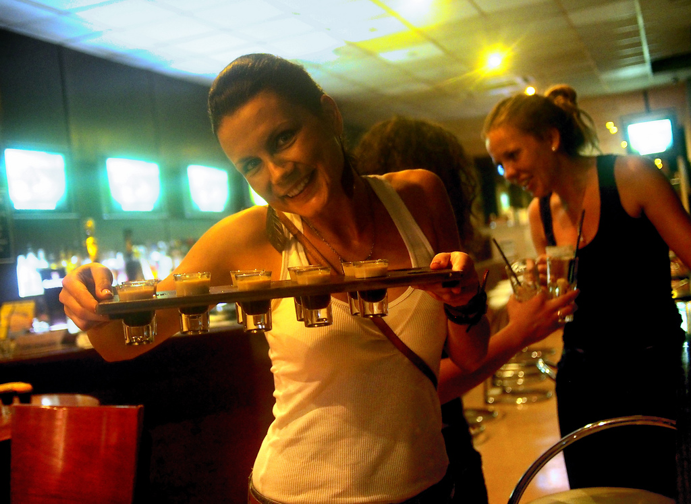
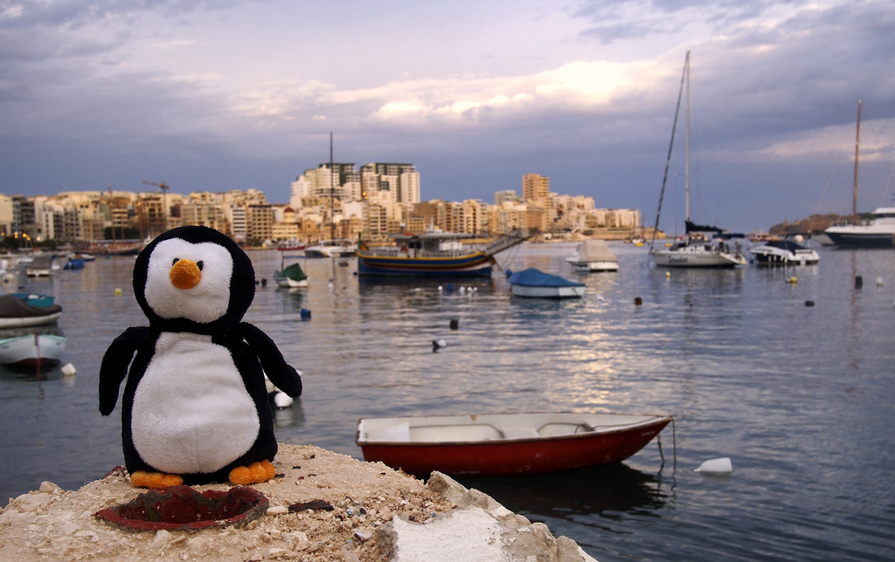
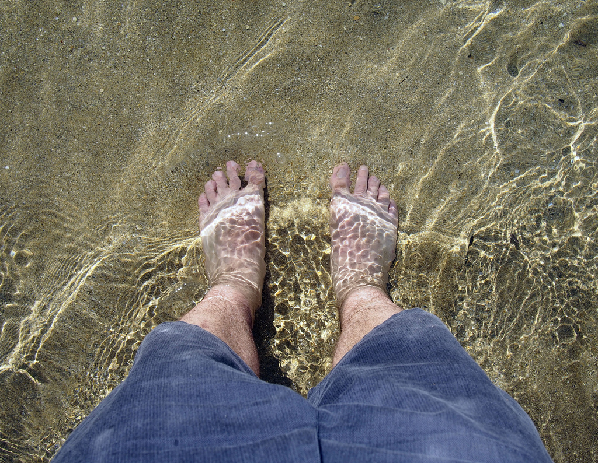

I left Vancouver approximately five weeks ago, and headed for Malta via Paris. My ultimate goal was to end up in Serbia, but I thought I would stop and visit two friends of mine that I met in Kuala Lumpur last year: Krisztina and Debbie. Here’s a summary of my one-week visit to Malta.

Despite all the travel I do, I actually really hate flying, and would say I have a mild phobia. To counteract that, I usually have a bottle of Ativan (anti-anxiety medication) with me on the plane. For short haul flights (generally less than an hour or so), I typically don’t bother, since I’ll end up feeling a bit loopy after the plane lands. But anything over that amount of time and I usually pop a pill to calm my nerves on the plane.

That’s why for the most part I generally stick with bigger name schedule carriers as opposed to the low-cost carriers. It could be in my head, but I just feel a bit safer on a British Airways or a United than I do on Ryan Air and what-not.

Flights out of Vancouver to Europe were over $1,000 at the time for both one-way and return flights, which is quite expensive. Thankfully I found a sale on Air Transat that would get me to Paris for about $500. I’ve flown Air Transat before, and it’s nothing to write home about – generally you are pretty cramped and there’s not really any perks. But in this case I was willing to be a tad uncomfortable in exchange for saving $500.

Thankfully the flight to Paris was pretty uneventful, and I even had a french girl next to me to chat with periodically. The weird thing for me and Ativan is that I rarely remember any of the details of the flight after it’s over, but I’m generally alright with that.

I sat around the airport in Paris for a few hours, and eventually boarded an Air Malta flight to Malta. My friends actually weren’t able to pick me up, but I managed to get my phone working as soon as I landed and found a taxi to the right place. Jump ahead a few hours, and we were down at the bar catching up over trays of shooters.

Krisztina, getting us shots

My friends managed to arrange me a little apartment in Sliema, which is a little suburb near Valetta. Since I was actually trying to get some work done during the week, I mostly stayed near Sliema, but did a bit of exploring on the weekend and in the evenings with my friends.

Valetta, Malta

Waddles in Malta

We managed to sneak in a day at the beach as well, complete with transportation in a convertible.

Beach in Malta

My Feet in the Mediterranean

While I was only in Malta for a week, I had a great time visiting the country and catching up with my friends. If you’re looking for a warm place to visit in the Mediterranean where english is widely spoken, then definitely check out the country of Malta.

From Malta I got on a plane and headed to Rome, Italy – but I’ll save that for another entry.