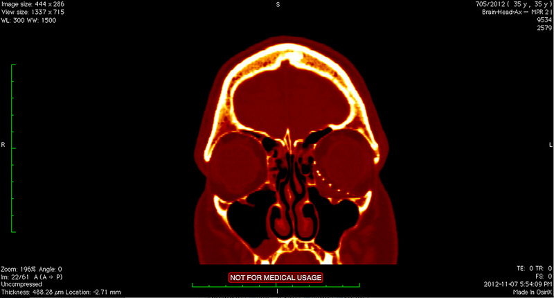
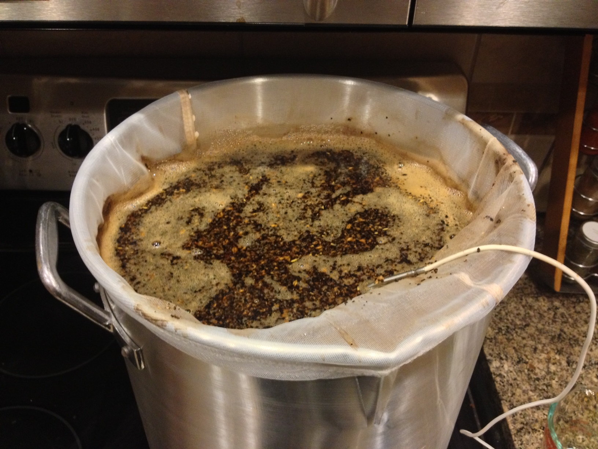

I’m back now from Europe, and taking a well deserved rest from travel for a few months. While I had a good time on my last trip, it wasn’t something I was totally looking forward to at the time, mainly because I had just gotten through recovering from a big surgery and was enjoying life around home.

In terms of my surgery, I think the end result is quite a bit better. I had a private CT scan done in Serbia so I could gain some peace of mind with regards to the outcome, and here was the end result.

CT scan from after my third surgery

You can basically see the titanium mesh which is under my left eye (shown on the right), and the complete lack of bone underneath it, which was the source of most of my issues. The implant has restored the proper configuration of the inside of my eye socket, and the final position of my eye is almost back to where it used to be.

For now though I’m back at home, and in the process of unpacking into my apartment. My plan is to lay low for the next few months, save some money, hit the gym, and then possibly head out around April for a few weeks somewhere. I typically have advertised where I’m going before I go, but I think for the next trip I’m just going to up and leave one day and take a well deserved internet break during the process. I think it would be interesting to go completely offline and then post all the photos when I get back (you know, like people used to sort of do).

My 2nd beer: a milk stout

I’ve also taken up a new hobby around home – brewing beer. I was originally inspired by my friend [Dave](http://mezzoblue.com), so I decided to try my hand at it. I’ve already made two different batches, and have made quite a few mistakes during both. But I am making process, adapting, and so far having a bit of fun as well.

It’s a little premature, but as soon as I make some more progress I’ll start a new “beer” category on this site and share some of the results. That’ll most likely be sometime around the time that I get to taste the end result of the first batch.