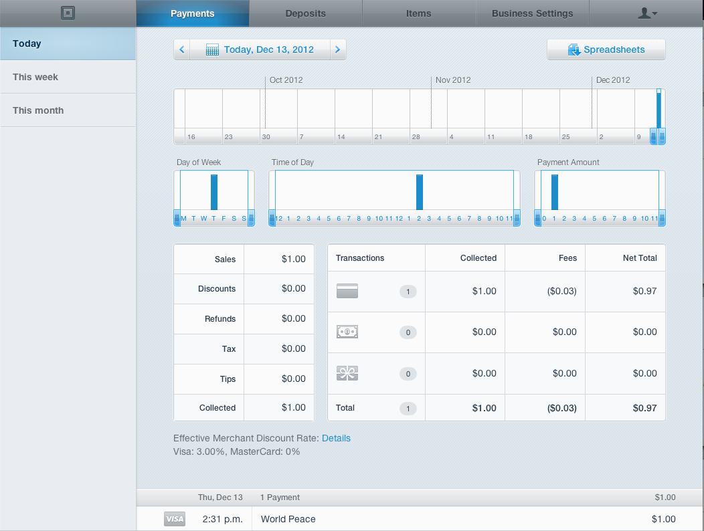

So last month when I was in eastern Europe I saw that [Square](https://squareup.com/#payments/2012-12-13) released their Square credit card reader that plugs into the headphone jack on iOS devices and can be used in Canada. Apple has always had a mobile credit card system at their Apple stores, but it’s something that’s been harder to obtain for the rest of us. I look at this type of device as a potential game-changer, since it essentially puts commerce into all of our pockets.

I have quite a few friends that have written books – now they can sell them at events and take credit cards there. Other friends of mine are in bands – they can sell merch themselves at events now. Have a restaurant or a pub – you can now impress customers by letting them pay using an iPod or an iPad.

Today was the day I got to take it for a test drive, and I have to say that I was really impressed. I recently picked up an iPad mini (which I think is the perfect size for doing something like this), so I decided to install the Square application there and try it out.

After installing the application, the first thing I was asked to do was to login to the iOS app using my email address and password that I used when I signed up to Square.

Log-in to your account

You’re then presented with a 6-page mini-tour that you can use to find out more about the process, or simply skip (which is what I did).

Square welcome message

The first thing I did was attempted to add an item. In this case, I added an item to my inventory called “World Peace”, priced at the low price of $1.00.

Adding an item

I then clicked on that product, which immediately added it to the top as an item to be charged for. The total price was updated to $1.00, and I was given the option (by pressing that button) to charge that price to a credit card.

Plugging in the reader

I didn’t have the reader plugged in yet, so I inserted it at this point in the process. The application immediately detected that it had been inserted, and put an overlay on the screen with that information for a few seconds.

At that point I swiped the card through the reader, which immediately brought up a screen showing the card was being authorized.

Authorizing the card

Once that’s done a screen comes up requesting the card holder to sign. I thought this was pretty cool – you basically just grab the device and use your finger to make a signature. I noticed that the signature wasn’t able to be accepted until it was something substantial (i.e. a quick mark wouldn’t work – you need to make at least a few scribbles).

Signing for the purchase

Next I was asked where I wanted the receipt to go. You are given a few options, via a text message or by email. I chose the option to have the receipt by email, and simply entered the email address that I wanted to receive it at.

Opting for an email receipt

  
Once the email is sent you get a notification that it went out successfully. Email sent confirmation

It took about 3 or 4 minutes for the email receipt to show up in my inbox, but eventually it came. The header image and the logo are both configurable via the Square website, so it’s very easy to customize the branding.

Email receipt

After that was all done I decided to head over the Square website and see what information was presented there. There’s actually a really informative dashboard view that shows you all your sales as well as which items have been purchased.

Square dashboard

All in all I found the process to be extremely user-friendly and definitely well thought-out. I really think this device is going to be a game-changer, and I’m glad there is a new evolution of payment solutions going on besides for PayPal. The most incredible thing about this for me is that **it’s all free** – the application is free to install and the credit card reader was free (sent from Square after signing up). You have to pay merchant fees of course, but they are definitely reasonable compared to other offerings such as PayPal. I’m definitely impressed with this device, and I hope they do well with it.

If you can’t get a device from Square in a reasonable amount of time, or are looking to pick up more than one, you can [buy the Square credit card reader](http://amzn.to/14vuywY) from Amazon.