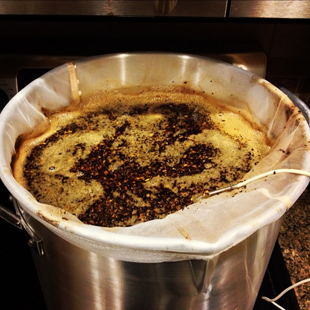

About a week after I brewed my first beer I decided I would get another one in the queue so I would have one more to taste when they became ready. I decided to try my hand at a milk stout, another type of beer I thoroughly enjoy.

I spent some time looking at other milk stout recipes and ultimately crafted something in BeerSmith2 that I thought would taste pretty good (based on a theoretical imagination in my head of what each of these base malts taste like).

Unfortunately I missed my FG on this one by a huge amount (like 15 pts). I finally tracked it down to an improper estimate of mash efficiency in BeerSmith2 based on a few other changes I made. Ultimately I have a huge problem with how BeerSmith2 calculates this number. From a home-brewer’s perspective, mash efficiency is a pretty important number as it’s something that influences the amount of grain to buy and also something that can easily be measured and adjusted. Unfortunately there’s no direct way in BeerSmith2 to make this adjustment. What can be adjusted is something known as the Brewhouse Efficiency, a number that represents the efficiency of the entire process.

So if you want to change your mash efficiency number in BeerSmith2, you basically have to mess around with your Brewhouse Efficiency until it indirectly calculates the Mash Efficiency you want. I’ve seen the author of the program defend this position, but many others have the same frustration as me. It’s something so fundamental to the process that it really seems like something you should be able to adjust. It makes far more sense in my mind to adjust Mash Efficiency directly and have Brewhouse Efficiency be calculated indirectly based on all your other loses in the system. I took a look at Beer Alchemy (another brewing program) and it allows for Mash Efficiency to be entered directly, so I may switch to that.

Sweet Stout

Regardless, Beer 1202 arrived stillborn from the kettle at approximately 11pm on December 8th, 2012 – he was properly disposed of after a short period of mourning. I supposed I could have boiled it for 5 hours or so to get my gravity where I needed it, but then I probably wouldn’t have been left with much to bottle.

After this event I adjusted my equipment profile in BeerSmith2 to properly reflect my setup, so hopefully that will carry over to expected gravity readings.

## Ingredients

AmountMalt Type4 lbsSuperior Pale Ale8 ozFlaked Oats8 ozMaris Otter Pale4 ozCaramunich (40L)4 ozRoasted Barley8 ozLactoseLooking at the ingredients after the fact it probably should have been apparent it would have come up weak, but I trusted the numbers the software gave me at the time, which turned out to be a bad idea. This smelled heavenly while it was mashing/boiling, so I’ll probably do a proper one up at some point.

## Key Take-aways - Make sure whatever software you are has a mash efficiency that reflects the process you are using. For BIAB I usually hit around 65-66%. I’ve been told for batch sparging that 75% is a reasonable target