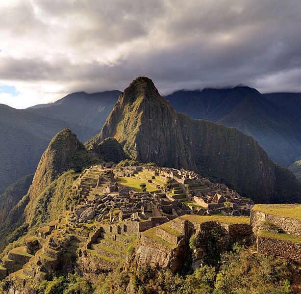
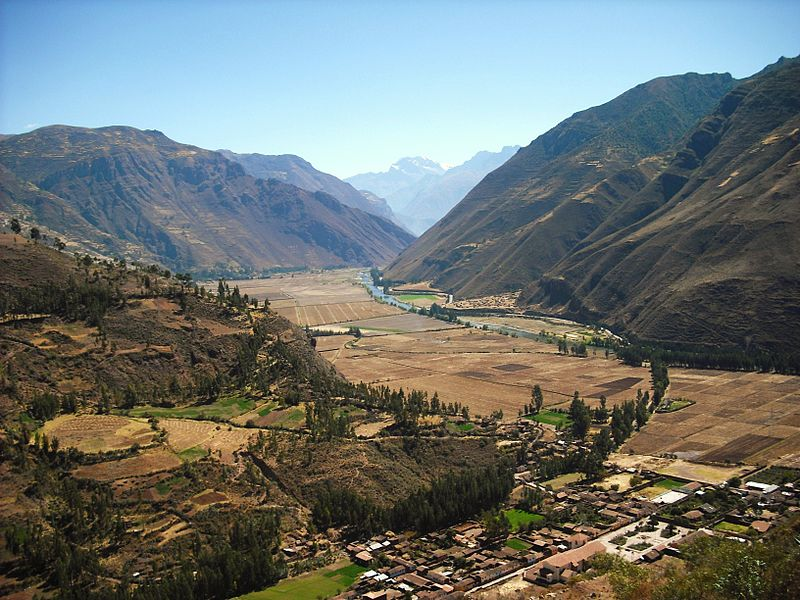

I was sort of hoping to keep this trip a secret, but enough people know now that it doesn’t seem to make any sense to not talk about it anymore (basically, I suck at secrets).

While I have been to South America twice now, there is one destination there that I have never been able to make happen on my previous trips – I have always wanted to visit Peru, and in particular Machu Picchu, the Lost City of the Incas (now found, thankfully). So I decided to finally plan a trip to Peru.

Machu Picchu, photo from Wikipedia

I’ve also aligned the trip to coincide exactly with my birthday, which will be a nice change from my normal birthday (which I usually always try to make rather quiet, but ends up usually involving shooters and a hangover).

Machu Picchu is one of the New Wonders of the World, and it’ll be the 4th one I’ve visited. Technically there are 7 of them, but the Pyramids in Egypt get an honorable mention, so I’ll try and visit that one too someday. But I already have an empty frame on my wall in a set of Wonders of the World, and I’ll fill it with a shot from Machu Picchu as soon as I’m back.

I will only be back in Canada for about a week after Australia, and then I will board a plane for Lima, Peru. I’ll spend a night or two there, and they fly to Cusco, which is basically the staging area for Machu Picchu and the Sacred Valley. I am also debating flying to the Amazon as well, and spending a few days in a totally Internet-free area in the Amazon Rain Forest, which seems like a pretty cool adventure.

The Sacred Valley, Photo from Wikipedia

The highlight for me will of course likely be Machu Picchu, and I’ve sort of planned my itinerary around me being there on my actual birthday, which is April 7th. I’m hoping I can find a fun group of Peruvians in a bar somewhere to help me with a few drinks in the evening, but hopefully seeing the sun rise above Machu Picchu on my birthday will be a pretty unique experience.

It’s a quick trip, and one of the only ones I have taken in a few years where I plan to not do any work whatsoever. If I do the Amazon trip, then I really can’t do any work since there’s no Internet (and often no power at all for most of the day). But given that I’m heading to Australia in two days, I haven’t really given my Peru trip too much thought at this point.

But once the trip is over, I’ll be at home for a few months before embarking on another pretty exciting adventure, starting in June. But that’s a post in itself, and I’ll save it for a later time.