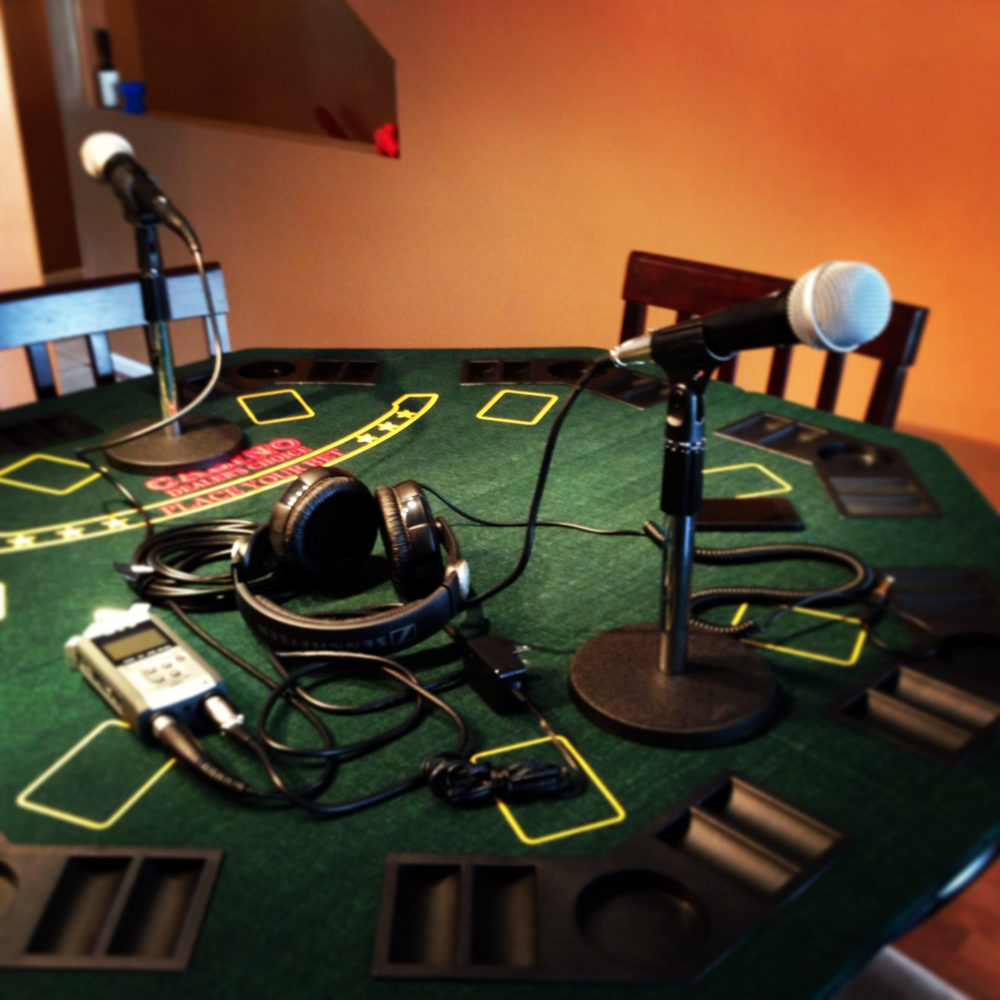

I had an opportunity the other day to record an hour long podcast with my friend John Biehler. John recently started a technology-based podcast called [TekEh](http://tekeh.com/) that has a particular emphasis on Canadian content and guests.

His first episode was Kemp Edwards from HootSuite, and talked mainly about the experiences of being in Austin, Texas for South by Southwest.

I was excited to be the second guest in the series, and spent an hour sipping a rum and coke and talking about WordPress, our experiences at [BraveNewCode](http://www.bravenewcode.com) creating commercial plugins, having clients, photography, travelling around the world, and everyone’s favourite beverage, beer. It was a really fun experience, and I hope I get additional opportunities to record a few podcasts in the near future.

To take a listen, head on over to [TekEh](http://tekeh.com/podcast/episode-002-duane-storey/) and subscribe to the Podcast on iTunes or listen to the embedded audio there.