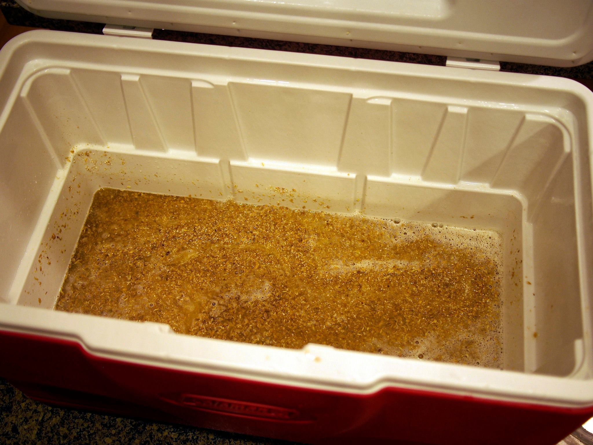
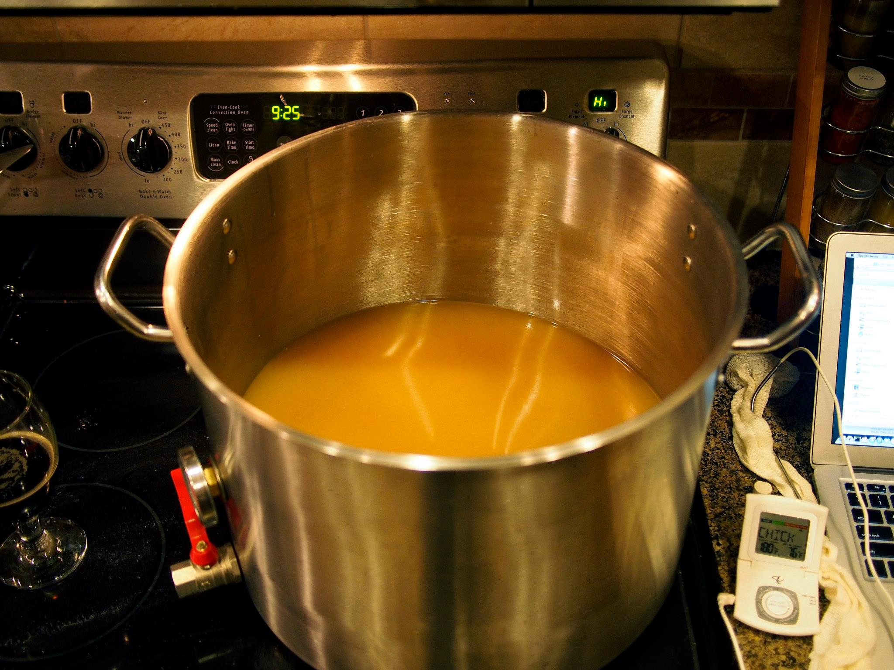
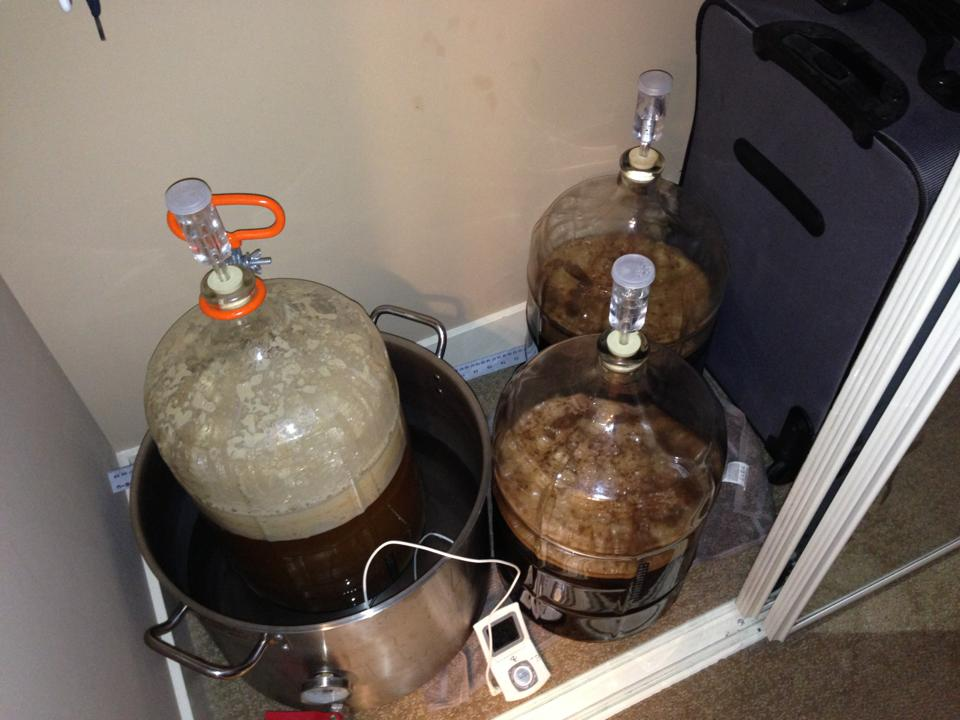
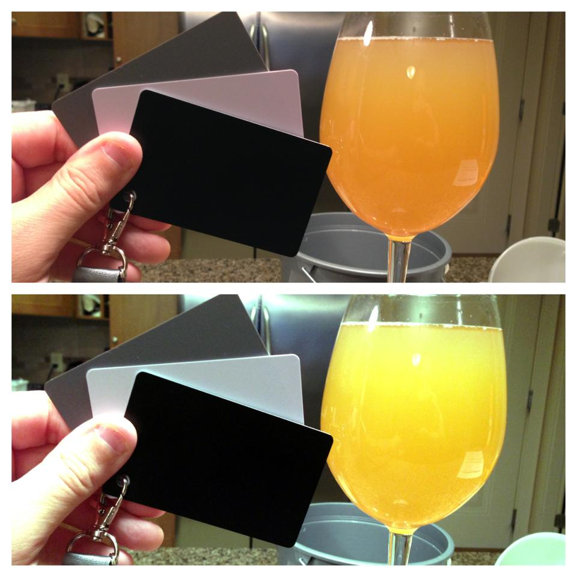

Back when I got back from Europe in December, I decided I needed a hobby to help me get through the cold Canadian winter. I eventually decided to take up beer making, since a) I like beer b) some of my friends brew beer and c) most of my friends like to drink beer, especially when it’s free.

I’ve probably done close to 10 all-grain beer brews so far, and I wanted to share some of the things I have learned in this adventure. Had I read a post like this before I started, it probably would have saved me lots of pain and grief. But in the nature of giving back to beer drinkers and brewers around the world, here are some of my thoughts about all-grain brewing.

### Mash Temperature Is Important

Mashing

One of the hard parts about brewing beer is that almost everyone gives you different advice. For example, I’ve had some people tell me that the temperature of the mash isn’t really all that important. Others have told me the exact opposite, in that it is crucial to maintain the target temperature.

My own experience has led me to believe that mash temperature is pretty critical to achieving the desired result in your beer. For example, I brewed an oatmeal stout that most people said tasted really good. Unfortunately I ended up mashing it a bit too low, and the resulting beer lacked both head and a substantial mouthfeel (i.e. the thickness of the beer). So while it tasted good, the experience of drinking it wasn’t ideal.

I actually meant to mash that one around 153F – 154F, and should have ended up with a medium mouthful. Unfortunately it turns out that the way I was mashing was actually causing the temperature to be quite a bit lower than I thought, which led to a thin (i.e. watery) beer in this case.

And that leads me to the second point.

### Stir Your Mash

The flaw in my process was that I wasn’t stirring my mash enough after doughing in my grains. I would normally put the grains in and then give it a few good stirs, but it turned out there were quite a few hot and cold spots around the mash. So while some areas in the mash were at 158F for example, others were around 145F, which is way too low. Depending on where the thermometer probe was placed, it would register anything from 145F – 158F, and often something in the middle which made me think it was the correct temperature.

After stirring the mash for longer, and taking care to thoroughly distribute the grains, I quickly realized that the mash temperature that it stabilized at was often a few degrees lower than my target temperature, causing the beers to come out thinner than desired. I quickly adjusted to this deficiency by increasing the temperature of my strike-water by a few degrees, which has helped reach my target. If anyone has any doubts about their process, I recommend sticking your temperature probes in a few different places in your mash to check the temperature – if it deviates at various spots around the mash, then it’s time to keep stirring.

I still have issues with my mash cooling off too much during the mash though, so perhaps I need to invest in a better cooler. I currently have to add boiling water a few times during the process, and then stir until I get back to my target temperature – this works, but it is a bit of a pain as I have to constantly monitor the mash when I’d much rather be drinking and beer and relaxing.

### Don’t Let Your Wort Burn

It seems weird at some level that a liquid can be subject to burning, but it can happen with wort, and sometimes does. For a while I noticed that some of my beers were coming out slightly darker than predicted, and I wasn’t entirely sure why.

Wort

I just assumed it was caramelization of the sugars in the wort and moved on. But it wasn’t until a few weeks ago when I decided to do a really hardcore clean of all my pots when I noticed what looked like scorched wort on the bottom of my brew kettle. It was only a small amount, but I suspect it was probably contributing some weird toasted flavours to some of the wort I boiled in it, and possibly contributed to some darkening.

So I think it’s super important to do a hardcore clean of the brew kettle after each and every beer you brew. In my case that means using steel-wool and a lot of pressure to get rid of that stuff at the bottom of the kettle (whereas before I was just doing a thorough clean with soap and a cloth).

### Make Sure Fermentation Is Complete

One of the first stouts I made was an oatmeal stout. It tasted quite good, and was a drinkable beer at first, but after a while I noticed that most of the bottles I would open would gush all over the place and make a mess. If it was just beer dumping out the top, I wouldn’t have worried about it much. But the gushing process also disturbed all the yeast at the bottom of the bottle, which meant that you’d have to drink yeasty beer, or wait until it all settled later on.

Fermentation

I originally thought that these beers got a small infection, and that infection was causing the gushes. But after brewing 5 or 6 more beers, I actually think what had happened is that I simply hadn’t let fermentation finish. At the time I bottled it had only been about 10 days of fermentation, and the bubbles had stopped mostly after around day 4. But the final gravity I measured was quite far off of the one that was predicted – I think I was expecting around 1.020, but it ended up at 1.030. I measured it over the course of a few days before bottling, and it seemed stable, but I think the reality was that it would have slowly fermented further had I left it another week to ten days.

And what had happened in that case is that it had finished fermenting in the bottles. Not enough to cause any of the bottles to deform, but enough to produce carbon dioxide and essentially cause over-carbonation (that increased with time) in those beers.

So ultimately patience is the key. It’s hard to be patient on your first couple of brews (I was anxious to bottle after a week), but now I don’t find it hard to wait 3 weeks to see if fermentation is done (mostly because I have several previous brews around to drink and pass the time).

### Be Careful With The Foam

For sanitizing my equipment, I use Starsan foam like many other home brewers. It’s an acidic solution that can kill most organisms in as little as 30 seconds, but it is recommended to leave the solution in contact for 2 minutes or longer. One of the great things about Starsan foam is that it is advertised as a non-rinse sanitizer, meaning you can simply leave it in the bottle or the kettle, and pour your beer or wort into it as well.

Beer Colour

For whatever reason, I have found that leaving Starsan in my bottles has led to the darkening of my beers over time. I can’t be 100% certain it is the Starsan, but as it’s the only real culprit, it does seem likely. Starsan is an acidic product, so it basically kills organisms based on its acidity. In theory when you add enough liquid, it’ll dilute the Starsan and make the solution more neutral from a pH perspective.

I had one beer in particular where it was definitely a nice yellow/golden colour when fermentation was complete. After bottling though, the beer seemed to get more and more red as time went on. When I opened one around the 3 week more, it resembled more of an amber ale than it did a pale ale. The local beer supplier suggested it was due to a pH change in the beer, which made me consider Starsan. To test the hypothesis, I added a mild solution of baking soda (sodium bicarbonate) to a glass of the reddish beer. Sodium bicarbonate essentially is a buffer solution, which in theory should bring the pH closer to normal After mixing it in the beer and waiting a few minutes, the beer slowly turned back to a golden/yellow colour, albiet a muddier version.

It’s quite possible the fault was mine – I may have made an extra-concentrated solution of Starsan and used that to sanitize my bottles. Or it’s possible there is something in the local water that may be interacting with the Starsan (my Starsan solution goes cloudy quite quickly, which others seem to indicate that there’s a reaction going on with the water). But going forward I’m not taking any chances – I decided to rinse the Starsan out of everything after it is sanitized, and then use it right away. I bottled a German Hefeweizen last week, making sure to rinse all the Starsan out of the bottles before filling them. It’s been a week and the beer appears to be the same light-yellow colour it was when I bottled, so right now confidence is high that the Starsan was the culprit, at least for me.

### Have Fun

After correcting most of these issues slowly over time, I’m at the point where I feel pretty confident that when I brew a beer it is going to turn out to be a good beer to drink. But hopefully others can learn from some of my mistakes and save themselves a little bit of the learning process, resulting in better brews in less time.