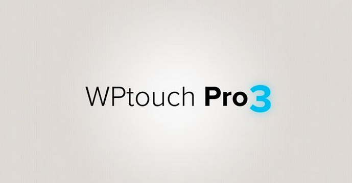

I’ll do a big post about the launch of WPtouch Pro 3.0 in a few days, but for now all I’ll say is that it has been a fairly massive undertaking that we started almost a full year ago.

We’ll be revealing everything on Thursday, but for now everyone will have to make due with a quick teaser:

If you’re interested in being notified when we launch in a few days, head on over to [BraveNewCode.com](http://www.bravenewcode.com/) and sign-up at the bottom. We’re definitely looking forward to pulling back the veil and showing everyone what we’ve been working on for quite a while now.

### WPtouch Pro 3.0: Now Available

WPtouch Pro 3.0 is now available!

WPtouch Pro 3.0 and the three included themes

If you’re interested in picking up a copy, then head on over to the main [WPtouch Pro 3.0 product page](http://www.bravenewcode.com/wptouch/) and purchase a copy. WPtouch Pro 3.0 has a 7-day refund guarantee, so you can test out the product risk-free during that time period.