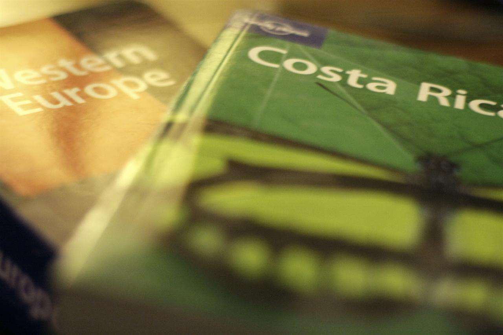
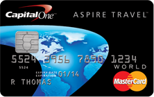

I’ve been a ‘world traveler’ for almost two and a half years now. Back then I hadn’t really been away from Canada for very long before, and the thought of spending multiple weeks, let alone multiple months, in a foreign country was a pretty strange idea.

Now the idea of loading a backpack up and heading to a new country feels about as foreign to me as doing a load of laundry. If I saw a plane ticket somewhere for a good price, I could probably be at the airport in three hours, ready to go on a new adventure.

One of the pains of being away for an extended period of time though is figuring out how to accomplish many of the things you normally do at home (such as paying bills) while away. It’s not as easy as it sounds, and there are lots of different tricks I use to make it work. There are still a few areas that are problematic for me, but I’m hoping to take care of them shortly. But here are some of my tips for traveling for a year or longer around the world.

### Phone Calls &amp; Services

I use Skype everywhere to make calls. Since they have an iPhone application as well, I often can simply use my iPhone (when I have a data plan) to call most places in the world for pennies a minute. It’s super simple.

I still use [Voice Network](http://www.voicenetwork.ca/) for virtual phone numbers, but not all that often anymore. Really I should set up a 1-888 number for myself, and simply give that to everyone who wants to ever call me. But then I would have to update it from time to time, and I have a feeling I’d forget. But one nice part of using that service is that it will email you messages after people leave them, which is a nice option. So maybe I’ll give it another go.

### Banking

Before setting out on my first adventure, I switched my main bank from a discount bank to a [full service bank account](http://www.migratorynerd.com/travel/full-service-bank-accounts/) with TD. Looking back on all my travels, it’s something I am really glad I did, as TD really helped me out a few times when I was in a bit of trouble. For example, when I was in Argentina I left my bank card at an ATM machine and couldn’t take out money for a while. Since TD wasn’t able to get a new bank card to be easily, what they did do is modify my business bank card (which is also at TD) so that I could access my personal account from the “Savings” account on my TD business debit card.

I also carry a secondary bank card at PC Financial (a low-cost bank), and have both it and my TD card tied to my personal PayPal account. Using PayPal it’s possible to move money between my bank accounts, first by transferring money into PayPal from one bank, and then withdrawing it into the other bank. This process probably takes a full week to complete, but it’s an option to move money electronically between two bank accounts back home when I’m in another country. I haven’t had to really make use of this yet, but it’s all set up and waiting just in case I hit a snag sometime.

### Paying Bills

Paying bills online is pretty straightforward: pretty much every bill I receive can be paid via TD’s website, including personal and business taxes. For my next trip I plan to set a few of them up on automatic payment plans, since it seems a bit silly for me to have to login once a month simply to pay the same amount (or very nearly the same amount) each time. That’s time I could be off doing something more fun, like exploring or trying some new foods.

### Faxes

I hate faxes. Any company that still requires documents to be faxed should go back to the stone-ages where they belong. Generally the only faxes I’m forced to send are for our Visa and Mastercard merchant accounts for BraveNewCode and the odd government service.

I used to use MyFax in the old days, but it was a flat monthly fee that was expensive enough that I hated paying it. I also had a few bad experiences with them, namely the hassle I received when trying to cancel previously. So I can’t really recommend them anymore.

I switched to [PayPerFax](http://www.payperfax.com/) a while ago, and have been pretty happy with them. Instead of a flat monthly fee, you simply pay on a per-fax basis, which is a much better business model for how I use it. I sent a three page fax a while ago and I think it was $2, so if you send more than three or four a month then there are probably cheaper alternatives. But it’s nice for me to know that I can easily save something as a PDF, digitally sign it, and then fax it back if I need to using PayPerFax.

### Credit Cards

I have a TD First Class travel VISA, which is one of the best credit cards available in Canada. It’s a premium card (i.e. it has a yearly fee), but since I keep $5,000 in my bank account at all times, TD gives it to me for free. That card offers a lot of travel perks, and I have been able to buy at least one flight using only points from it. The only annoying thing that I’ve experienced with this card is a few times when they’ve disabled it on me because I have been traveling in another country. Whenever I call them to complain, they generally lecture me about letting them know ahead of time whenever I go on a trip. From my perspective though it seems silly and ironic that I have to constantly update them with my itinerary, especially considering it’s a VISA **meant for travel**.

I read some tips from some other world travellers a while ago, and one thing they recommended was rotating through your rewards cards every year. Since each credit card company gives you a sign-up bonus, basically you maximize the amount of free stuff (such as points, travel rewards, etc.) that you get by dumping your card and getting a new one each year. My TD card doesn’t cost me anything to own, so I’m simply going to use it as a backup, but I just received my new fancy one: the [Capital One Aspire Travel World](http://www.capitalone.ca/credit-cards/aspire-travel-world/).

I found a few website reviews that ranked this #1 out of all the travel cards in Canada, so I figured it was the one to get. It offers 35,000 bonus miles when you sign-up (many cards only offer 25,000), and also gives you two points for every dollar instead of just 1. It does have a yearly fee, but based on my spending habits I think it’ll still be worth it. I generally spend about $2,000 a month on my credit card, so that will equate to about 48,000 points by the end of the year. According to their charts that should result in about 83,000 points a year from now, or around $830 worth of travel. We’ll see how it shapes up a year from now.

### Paying Employees

It’s hard to believe there was ever a time at BraveNewCode when we didn’t have a real payroll system. But the truth is at the time when we hired our first employee we were still cutting cheques ourselves to pay people. When I would travel I would typically pay myself via a bank transfer from my company to my personal account, but everyone else generally required a manual cheque.

When I started looking for a better solution, I eventually found [TelPay](http://www.telpay.ca/). TelPay lets you transfer money to multiple people at once, and even do CRA submissions on your behalf. Unfortunately it isn’t all that smart, and you still need to calculate how much tax to without and what to send to the CRA. In addition, it’s one of the ugliest user interfaces I’ve used in a while, and only runs under Windows. So I basically had to have a copy of Windows on my Macbook Air simply to do payroll a few times a month. Yuck.

About a year ago I was in the Toronto area, debating between doing yet another payroll run using TelPay or throwing myself off the top of the CN Tower to avoid it, when [Martin](http://mkuplens.com/) let me know about a great alternative: [Wave Payroll](https://www.waveapps.com/payroll/). Wave is for Canadian companies only, but it has an attractive web interface that makes paying people within Canada super easy. Paystubs are generated automatically and can be viewed online, and employees can update their profile information (including bank transit numbers for direct deposit) whenever they want. Not only that but it calculates the proper tax withholdings for everyone, and submits these automatically to the CRA on your behalf. Basically this ends up saving me a few hours of headache each month, and definitely makes the process so much easier for employees.

### Handling Mail

If you’re away from home for a few weeks, then you can just let your mail pile up in your mailbox and take care of it when you get back. But if you go for months at a time, it becomes a lot trickier to deal with, especially if you don’t want to burden anyone else. Having family collect it for you is one option, but then they need to process everything on an item by item basis and let you know.

When I went to Argentina the first time, I ended up renting a UPS mailbox for a year and simply forwarded my mail there. The idea was for my brother-in-law to pick it up once and a while and let me know what was waiting for me. Unfortunately life gets in the way sometimes and a few items that were time critical didn’t make it to me in time. If it’s just personal items, that’s not the end of the world. But when you’re trying to run a business (or multiple businesses), getting information on a timely basis is pretty important (especially when it comes to government letters and items from your lawyer).

While I’ve known about this option for a while, I’ve decided to try something new: a virtual mailbox with [The Network Hub](http://www.thenetworkhub.ca/) in Vancouver. Basically they’ll let me know on a week by week basis what mail arrives for me, and ultimately scan these items (if I desire) and send to me over email. So no matter where I am in the world I can be sure to receive my mail on a weekly basis.

At $50 a month, it’s not really all that cheap. But if you pay for a year at once (which I did), it’s only $42.50 a month, which makes it a little more palatable. That’s about three times the cost of the UPS box I was renting, but it’s nicer option since I don’t have to harass anyone to check my mail for me, and I can be guaranteed not to miss anything time critical while I’m away from home.

### Travel Insurance

Most travel VISA cards will generally cover trips up to a few weeks in length, but after that you need some other type of coverage. I still generally use [BCAA](http://www.bcaa.com/travel) for my travel insurance whenever I go anywhere, and so far I have thankfully never had to make a claim. I did learn though that you can purchase it directly from their website, and used that for my last trip, which saved a bunch of time.

For those people in other countries, I’d recommend purchasing from [World Nomads](http://www.worldnomads.com/af.aspx?affiliate=mignerd&subid=&utm_source=mignerd&utm_medium=textlink&utm_campaign=easy_url). You can obtain a quick quotation here.

#wn_calculator {width:550px; background: #01A9DA url('http://worldnomads.com/turnstile/qp/common/images/bg_module_footer_wn_555_nopromo.jpg') bottom left no-repeat; font-size:11px; -moz-border-radius: 4px; -webkit-border-radius: 4px; border-radius: 4px;}
#wn_calculator #blue550 {width:520px; margin: 15px;}
#wn_calculator #blue550 h2 {font-size: 22px; color: #FFF; border:none;}
#wn_calculator #blue550 h2 span { color:#FFF; font-size: 100%; display:block; padding:5px 0;}
#wn_calculator #blue550 .blueLogo {display:block; position:absolute; top:10px; right:10px;}
#wn_calculator #blue550 .rowWrap { margin: 12px 0; }
#wn_calculator #blue550 .submit.button { position:relevant; float:left; margin:10px 0 0 265px;}
#wn_calculator #blue550 .checkbox {display:inline; float:left; margin-bottom:3px;}
#wn_calculator #blue550 .checkbox label {width:auto;}
#wn_calculator #blue550 select#qp-coverage, #wn_calculator #blue550 select#country-residence, #wn_calculator #blue550 select#qp-province{width:250px!important;}
#wn_calculator #blue550 label, #wn_calculator #blue550 h4 { color: #FFF;font-weight: normal;float: left;width: 243px;text-align: right;display: inline;margin-right: 20px;font-size: 13px;}
#wn_calculator #blue550 #footer {position: relative; width:100%; float:left; }
#wn_calculator #blue550 #footer .supp-links {display:block; position: relative; margin:-30px 0 30px 430px;}
#wn_calculator #blue550 #footer .supp-links a {color: #8EC9DA; display:block; width:110px;}
#wn_calculator #blue550 #footer #wn_insurers {display:block; position:relative; float:left;}
  
			writeHTML('mignerd','','English');
		 

### In Summary

I’ve learned a great deal about managing things remotely in my 2.5 years of travel, but there are still a few areas that could use improvement. It would be nice to cut arbitrary cheques remotely somehow, and I haven’t quite figured out how to do that. Telpay has an option to wire money internationally, but I haven’t done all the paperwork to make that work yet. But I’m not sure I really want to ever look at that user interface again to be honest.