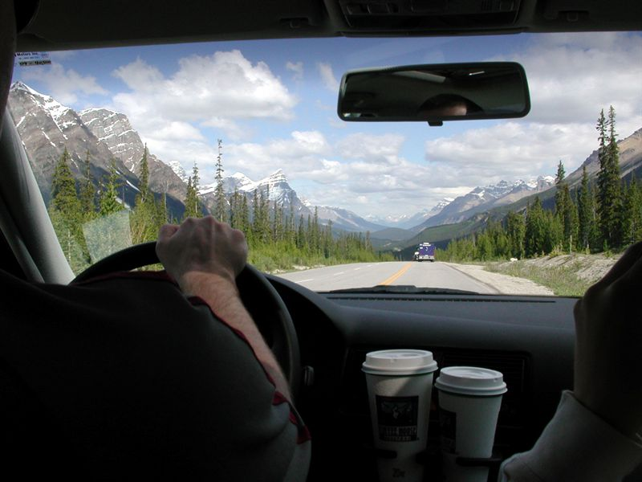
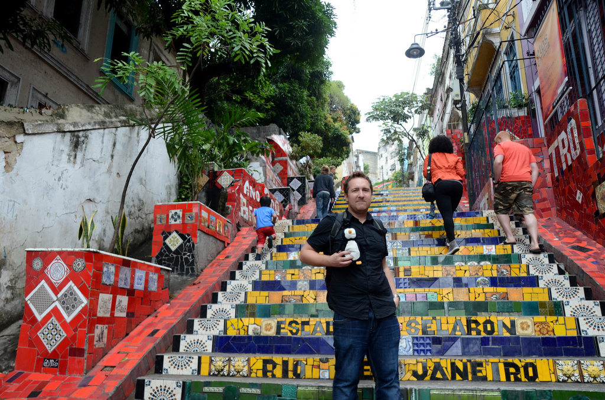

In just three days, I’ll be heading to the airport again on what will undoubtedly be a great tour of North America. I’m meeting [Luciana](http://twitter.com/lutessaroto) in Toronto, and her and I will slowly make our way via train to Québec City. From there we are going to head back to Ottawa for a weekend, then off to Banff, Lake Louise and hopefully Jasper. After a brief stop in Vancouver, we’re going to head down to San Francisco for some San Francisco Giants baseball action, and hopefully a few winery tours.

Driving in the Canadian Rocky Mountains

Many of the places we are heading to are places I haven’t spent much time in. While I’ve driven through Québec City before, I have never spent any time there and am looking forward to wandering the streets with Luciana (plus I need to get my yearly poutine fix in Québec). I also have never been to Napa Valley before, so doing a few winery tours in that part of California will be great.

Me and Waddles in Brazil

At the end of it all, I’m heading back to Brazil with Luciana for likely a few months. I made a few friends down there before that I’m looking forward to catching up with, and it sounds like I have a few new ones waiting for me when I arrive. So it’s going to be a great adventure, and I’m looking forward to hitting the open skies again.