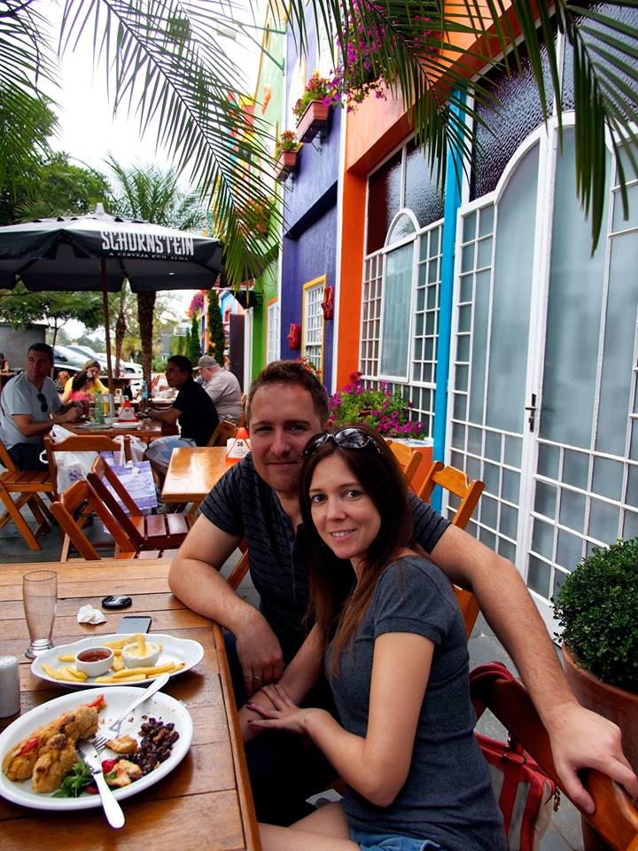

I’m currently down in São Paulo, Brazil, living with my girlfriend Luciana in her apartment in [Vila Leopoldina](Vila_Leopoldina). The original plan was to spend two or three months here exploring Sao Paulo, and then eventually head to Europe to continue on with our travel adventures.

Our plans have changed somewhat though in that Luciana is now able to travel sooner than she would have originally been able to. So we’ve decided to accelerate our plans slightly, first by heading on a trip to Machu Picchu tomorrow, and second by heading to Europe in just a few weeks.

I’ll be heading back to Canada on August 8th to see some friends and some family, and then I’ll be heading to Madrid to meet Luciana. She’s forced to stay back in Brazil for an exam for her MBA, but we’ll meet up shortly after that.

In terms of São Paulo, my main observation is that **it is big**. At 19 million inhabitants, it’s one of the biggest cities in the world, and definitely the largest one I’ve ever been to. Logistically that means getting anywhere in car is a huge challenge. Sometimes we’ll head somewhere to visit some friends, only to have to drive 30 – 45 minutes simply to get there. The locals are often frustrated because of the traffic, and I can understand why.

I’ve had a great visit here in Brazil though, and it’s been great learning how to cook some typical Brazilian foods (such as Feijoda and Moqueca de Peixe). I’ve also had the opportunity to meet a lot more people this trip, and it just reinforces my previous impression of how welcoming and accommodating the Brazilian people are.

I probably won’t get a chance to come back to Brazil until next year sometime, but when that time comes I’m looking forward to perhaps seeing a bit of the Brazilian countryside.