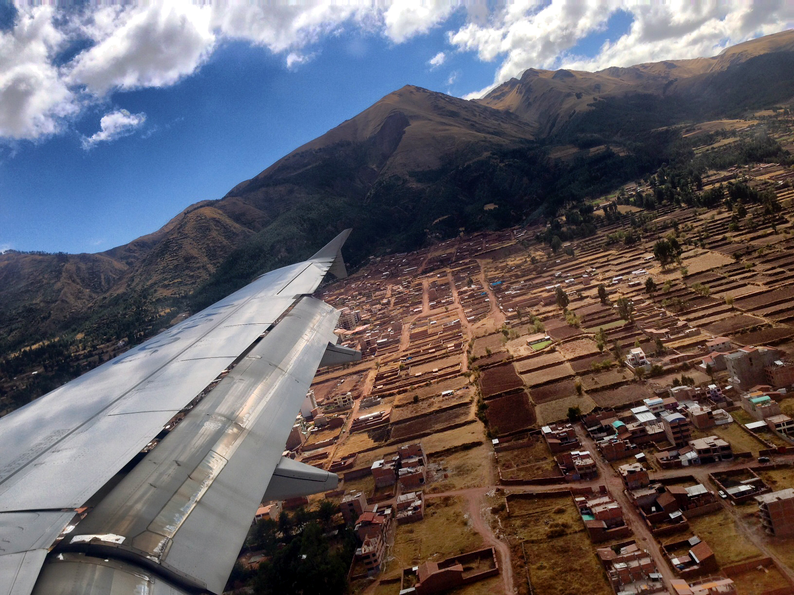
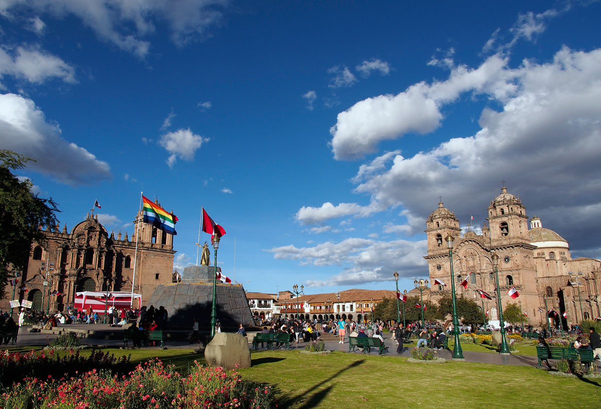
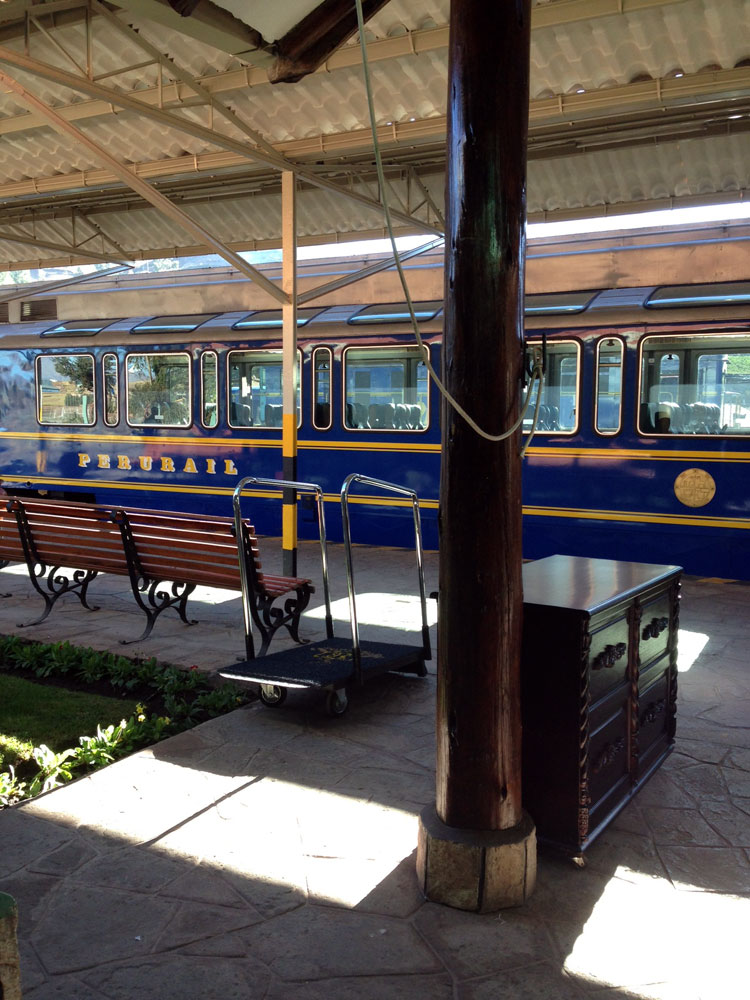
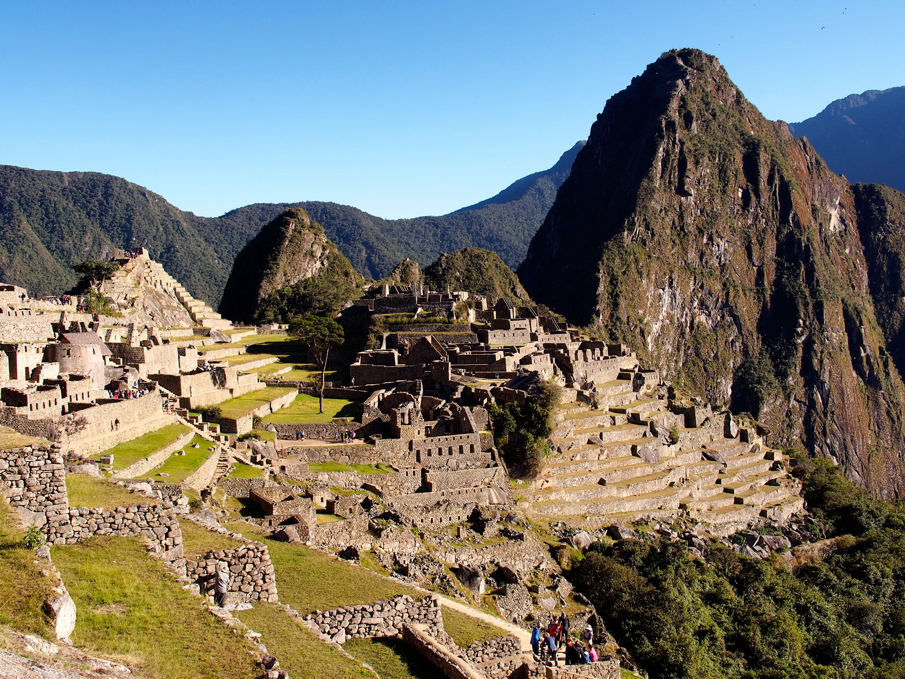

It has been a long-time dream of mine to finally visit Machu Picchu, the Lost City of the Incas. I actually tried several times over the last few years, but somehow never made it to the ruins. I even bought a plane ticket earlier this year from Vancouver to Cuzco, Peru, but ended up not being able to go due to work commitments. Since I’ve been living in Brasil for the last month with my girlfriend, we decided it would be a good opportunity to finally visit Peru and Machu Picchu.

### A Few Days In Cuzco

Most people who visit Machu Picchu initially have a stop in [Cuzco](http://en.wikipedia.org/wiki/Cusco), a medium-sized city approximately one hour by airplane from Lima. For a city of about 300,000 people, the downtown core feels surprisingly small, and easy to navigate by foot.

Driving around the city on the other hand can be a bit scary since most of the roads are for single lane traffic only and often congested due to all the tourist traffic around town. The streets are all rough and mostly made of stone, remnants of the original Inca architecture prevalent throughout the city. As one taxi driver put it, “I guess the Inca weren’t thinking about traffic when the built the city hundreds of years ago.”

Landing in Cuzco

The city itself is situated at roughly 11,800 feet above sea-level, which means that the air is thinner than most people are used to. That can lead to altitude sickness in many people, as their bodies have a hard time obtaining the oxygen that they need from the air. Most of the time this results in nothing more than shortness of breath while walking around, but sometimes people get headaches or diarrhoea.

Plaza De Armas in Cuzco, Peru

I actually ended up with a headache for about two days which I directly attributed to the altitude. I tried taking various over-the-counter pain medications, but they didn’t do much to help with the pain.

Mate de Coca – a local remedy for altitude sickness

The local remedy for altitude sickness consists of té de coca (tea made from coca leaves). While the warm tea helped fend off the Peruvian cold, I can’t say for certain whether or not it did anything to help adjust to the altitude. Most hotels and hostels in Cuzco, Aguas Calientes and the Sacred Valley offer free té de coca, so definitely try it out and see what you think, especially if you are suffering any of the symptoms of altitude sickness.

Many people who visit this part of the world choose to head immediately to the Sacred Valley upon arriving in Cuzco since it has a lower elevation and is much easier for the body to adjust to. If you choose this option, then you should allow yourself a day or two in Cuzco to do some exploring on your way back from Machu Picchu. We stayed three nights in Cuzco, but I think in retrospect that two would have been enough to explore the city and also sample some of the cuisine.

### Buying Tickets To Machu Picchu

Most people choose to buy their tickets to Machu Picchu online via the [official Machu Picchu website](http://www.machupicchu.gob.pe/). We were originally going to purchase them that way as well, but my girlfriend has an international student card (ISIC) and unfortunately the discount wasn’t offered via the website. So we decided to purchase the tickets in person at the *Ministerio De Cultura* government office in Cuzco, approximately a 15 minute walk from the main Plaza de Armas.

Prior to attempting this though, you should visit the [official website](http://www.machupicchu.gob.pe/) and see just how many tickets are left on the day you want to visit Machu Picchu. We made the mistake of waiting too long, and when we arrived at the office to get our tickets they told us there were no more available for the day we wanted to visit. They then proceeded to sell us tickets for the next day, and insisted we could still visit Machu Picchu on the day we wanted, even though the date on our tickets wouldn’t match.

We were obviously skeptical of this, and were worried they were just taking our money and telling us whatever they needed to in order to get rid of us. A few of the tour guides who were in line buying tickets for other people said this was normal and not to worry, but the guy selling the tickets didn’t do much to reassure us. As it turned out we had no problem visiting Machu Picchu with the tickets, even though they were issued for another day. Your mileage may vary though, so do your best to get the tickets for the actual date you need them.

To buy your tickets, you will need to bring your passport as well as your transportation tickets (i.e. Peru Rail if you are taking the train) to get to Aguas Calientes. I have no idea why they insist on seeing your transportation tickets, and can only assume it’s to make sure you’re actually going to visit Machu Picchu and not simply buying the tickets to scalp later on (if that’s even possible).

At the time of this article, a normal adult ticket to Machu Picchu was 128 Peruvian Soles ($47 CAD), and a student ticket was 64 Soles ($23.50 CAD). If you want to hike up to the top of [Huayna Picchu](http://en.wikipedia.org/wiki/Huayna_Picchu), the mountain often shown in the background in photos to Machu Picchu, you will need to pay slightly more.

Up until recently I have been told that they only accepted cash at the ticket office in Cuzco. When we were there though they had started accepting credit cards, and I had no problem paying with my mastercard there. You can also buy your tickets to Machu Picchu at any of the various tourism agencies around the city, but they often add an extra fee for helping you out (at one place we talked to that fee was 30 Peruvian Soles). But I you don’t want to hike down to the official ticket office and don’t mind parting with an extra $11 CAD, you can save yourself a bit of time and headache by purchasing through a tourism agency.

### Peru Rail Trip To Aguas Calientes

The train station in Cuzco wasn’t operational when we were there, which meant that we needed to take the train to Aguas Calientes from Poroy, a small town approximately a 20 minute drive by taxi from Cuzco. Thankfully taxis in Peru are quite affordable, and that trip only cost us 30 Peruvian Soles (about $8 CAD). The person at the front desk of our hostel was nice enough to book it for us, so all we had to do was wake up early and meet the taxi driver outside.

Peru Rail Trip to Aguas Calientes

I don’t have a ton of experience traveling by train, but the [Peru Rail](http://www.perurail.com/) trip from Poroy to Aguas Calientes was a relaxing trip with a really great view. We opted for the Vistadome experience on the way there since it was advertised as having really great views thanks to the heavily windowed train carriages. For the most part Peru Rail delivered on that experience, although I was a bit bummed out that our seat faced backwards, which meant that by the time we saw some landscape to take a photo of, it was almost too late to take any photos.

On the way back we opted for the Expedition experience, which sounded like a far less enjoyable experience than Vistadome. But we both enjoyed the Expedition, and thought the views from the train were identical, and often better since there are no seats facing in the opposite direction on the Expedition (although you don’t get a free snack like the Vistadome passengers receive).

When we were planning our trip to Machu Picchu, we decided to stay two nights in the city of Aguas Calientes. That way we could arrive the night before, get up early to see the ruins, and then be able to relax for the evening before taking the train again in the morning. In retrospect I think that one day in Aguas Calientes would have been more than enough. It’s a cute little town nestled in the mountains, but it’s one of the biggest tourist traps I’ve visited in all my travels – you have to deal with people constantly harassing you to come into their shops and restaurants, and also get slapped with hidden charges (often 20% of the total cost) that are magically added to your bills. The restuarant owners will often tell you this is a local or tourist tax, but that’s not actually true – we successfully had the item removed from the bill at one location thanks to some advice from another travel book that warned us about this practice.

I also got the impression that many of the people working in the tourism industry in Aguas Calientes didn’t actually like tourists in any capacity. I imagine that dealing with 2,500 visitors to Machu Picchu every day can be tiring, but it would have been nice to get the odd smile or even a genuine greeting from people involved in the tourist industry while we were there. But mostly people seemed a bit depressed about the whole experience, which is something I’ve read before as well from other people’s experiences.

I hate being judgemental when I travel, but Aguas Calientes is one of the few places I’ve been to that has a really negative vibe to it, which is ironic given how important the town is and how prestigious Machu Picchu is. So in short, I think it is best to spend as little time as you can in Aguas Calientes and instead spend more time in Cuzco or the Sacred Valley.

### Buying Your Bus Ticket To Machu Picchu

Bus Tickets, photo by [Luciana](http://lutessaroto.wordpress.com)

Just when you thought there wasn’t possibly anything else that the Peruvian government could charge you for, you’ll learn that you also need to spend more money getting from Aguas Calientes up to the ruins at Machu Picchu. If you arrive from the train station, hang a left as soon as you hit the river and then cross the bridge to the other side. Hang a right and walk for 15 seconds or so until you see the ticket office on your left. If you need same-day tickets, then this is the ticket office for you. If you are buying for the next day, then the ticket office you want is on the other side of the street approximately 50 feet further down the road.

At the time of writing, return adult tickets were $18.50 USD, which seemed to be the preferred currency at the booth (I’m not sure why, as every other expense was in Peruvian Soles). You can hike up to Machu Picchu, or alternatively hike down, so if you’re looking to save money and are in better shape than I am, you can opt out of one or both legs of the bus trip.

### The Final Payoff, Machu Picchu

Many people try and wake up very early in the morning to catch the 5:30am bus so that they are up at Machu Picchu in time to see the sunrise. We were originally debating doing that also, until I did some research the night before and found out that you need to be in line at 4am for that to be possible. We had had a few really early mornings in a row, and I just didn’t think I could function if I had to get up at 4am. So we decided instead to try and be up at the ruins around 8am, which we figured would still be early enough to catch some of the favourable morning light.

We actually met another couple on the train to Aguas Calientes who decided to take the 5:30am bus up to Machu Picchu. We met them after visiting Machu Picchu and they said that the line for 5:30am bus was probably one of the longest lines they had seen in their lives, and wished they hadn’t bothered. As for us, we got in line for a bus at around 7:15am, and only waited about 5 minutes before we boarded. After navigating about 15 minutes worth of switchbacks on the bs, we found ourselves at the entrance gates to Machu Picchu, and only moments away from our first view of Machu Piccu.

Our first view of Machu Picchu

All in all we spent about three hours or so walking around the ruins and exploring the landscape. Machu Picchu really is a magical place, and it’s almost hard to believe that such a place even exists.

Machu Picchu and the Surrounding Landscape

Machu Picchu is the 4th Wonder of the World that I’ve visited, and definitely the most impressive of all the ones that I’ve seen. As an engineer it’s really hard to wrap my head around the fact that the Incas built this magnificent retreat way up in the mountains hundreds of years ago.

My 4th Wonder of the World, Machu Picchu

### Final Thoughts

I have wanted to visit Machu Picchu for a very long time, so it really was surreal to finally be in the Peruvian mountains and witnessing the ruins in all their glory. I’ve now seen four Wonders of the World: Chichen Itza in Mexico, the Colosseum in Rome, Cristo Redemptor in Rio de Janeiro, and now Machu Picchu in Peru. In terms of costs, Machu Picchu is easily the most expensive of those trips, primarily because of how isolated Machu Picchu is.

While you could conceivably visit Peru without visiting Machu Picchu, it would be a waste of a trip in my opinion as Machu Picchu really is one of the highlights in South America. But there are many costs associated with the trip: the plane ride to and from Cuzco, the train ride to Aguas Calientes (which is supposedly the highest cost per mile of any train route in the world), the ticket to Machu Picchu, and the final bus rides up and down the mountain. Not factoring in accommodation or food, a person is looking at close to $500 to visit Machu Picchu when already in Lima, more if you have to get to Peru from somewhere else.

But then again, there aren’t many other places where you can see the architectural marvel that is Machu Picchu, or gain insight into a civilization that disappeared hundreds of years ago. And that in itself is almost priceless, at least for me.