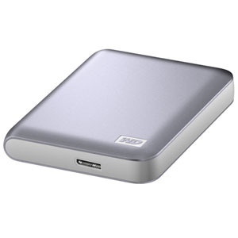

After traveling the world for almost 2.5 years, I’ve become pretty knowledgable, mostly through trial and error, about which technology is useful to bring along during a trip and which should simply stay at home. It’s not always obvious, as evidenced by about 2 pounds worth of technology currently in my suitcase which I haven’t made use of in a long time.

But one item that I’ve found practically indispensable is a portable [external hard drive](http://www.amazon.com/gp/product/B008S4TGDM/ref=as_li_qf_sp_asin_il_tl?ie=UTF8&camp=1789&creative=9325&creativeASIN=B008S4TGDM&linkCode=as2&tag=duanstor-20), especially since many of the new laptops (such as my Macbook Air) have a limited amount of built-in SSD storage.

WD My Passport

The best external hard drive for travel or whenever you are on the go, in my opinion, is the [WD My Passport](http://www.amazon.com/gp/product/B008S4TGDM/ref=as_li_qf_sp_asin_il_tl?ie=UTF8&camp=1789&creative=9325&creativeASIN=B008S4TGDM&linkCode=as2&tag=duanstor-20) series of drives, as they are dependable and affordable compared to other drives with a similar capacity. I also find that they are quite light, which is really nice when you find yourself needing to take a drive in your backpack. In fact if you own a Macbook Air, I’ve personally found that this is the best external drive for the Macbook Air since it’s small and light just like the laptop.

I personally use my drive mostly for storing automated backups from my Macbook Air (via Time Machine), backups of all the photos I take during my trips, and also to store about 100 movies or so that I can watch whenever I get bored. Since my internal SSD drive only stores 256 GB of information, my [WD My Passport 2TB](http://www.amazon.com/gp/product/B008S4TGDM/ref=as_li_qf_sp_asin_il_tl?ie=UTF8&camp=1789&creative=9325&creativeASIN=B008S4TGDM&linkCode=as2&tag=duanstor-20) drive can store 8x the information.

Since I rely on my laptop to make income, it’s important to me to be able to restore my computer in the event of a catastrophic drive failure. Thankfully that has never happened, but it’s good to be prepared. In the event that my laptop were to die (or the hard drive) and I were forced to buy another one, I could theoretically restore my computer to it’s pre-crash state in only a few hours. When I’m back at home I typically do a backup of everything to my [Drobo](http://www.amazon.com/gp/product/B00AMAJGOO/ref=as_li_qf_sp_asin_tl?ie=UTF8&camp=1789&creative=9325&creativeASIN=B00AMAJGOO&linkCode=as2&tag=duanstor-20) unit.

One thing to watch out for is to make sure you match the technology of your computer to the technology of your hard drive. For example, my Macbook Air supports USB 3.0, but my previous hard drive only supported USB 2.0. When I upgraded to a USB 3.0 drive, a full backup from my Macbook Air went from taking about 20 hours down to taking about 2 hours – so it’s a huge time savings.

This is my third ‘My Passport’ external hard drive that I’ve taken around the world with me, and I personally have been really happy with it. If you’re looking to grab one, you can check out the current [WD My Passport price on Amazon](http://www.amazon.com/gp/product/B008S4TGDM/ref=as_li_qf_sp_asin_il_tl?ie=UTF8&camp=1789&creative=9325&creativeASIN=B008S4TGDM&linkCode=as2&tag=duanstor-20).