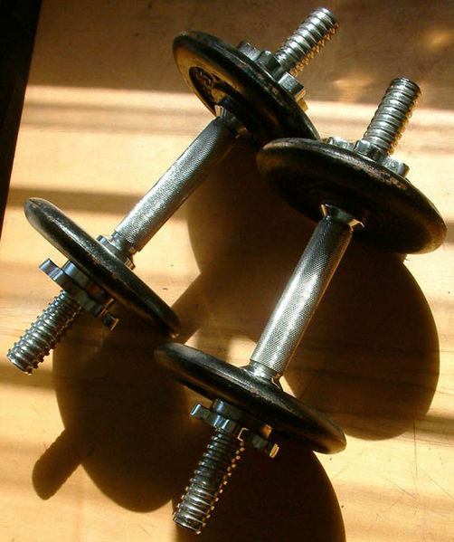

Cyclical Ketogenic Diet (CKD), photo from [Wikipedia](http://en.wikipedia.org/wiki/File:TwoDumbbells.JPG)

It’s no surprise to anyone reading my site that I’m a big advocate of reducing carbs. Pretty much everything out there nowadays is full or both refined carbohydrates and sugar, often in the form of high fructose corn syrup. While complex carbohydrates aren’t that bad for a person, anything that converts immediately into glucose (such as simple carbs and sugars) can cause large insulin spikes, leading to fat gain and ultimately diseases such as diabetes.

Unfortunately there’s so much misinformation in this area that most people are completely confused about carbohydrates, insulin, and most other areas in the realm of food and nutrition.

Despite what most nutritionalists will tell you, the body can work just fine without carbohydrates. In fact, about five years ago I did a little experiment where I reduced my carbohydrate intake to around 20 grams a day for around four months. Not only did I feel better, but I also lost almost 40 lbs, all without going to the gym.

The body stores carbohydrate internally as glycogen. Glycogen can be readily broken down and converted into glucose to meet the energy needs of the body. For every one gram of glycogen stored, the body requires 3-4 grams of water. That’s why most people seem to lose a few pounds of weight immediately starting any diet (more pronounced on a low carb diet) — the extra weight is the body shedding the water that was used to bind the glycogen. It’s also a sound bite that most people on TV use to try and discredit low carbohydrate diets — that the weight lost is simply water. That’s true of course, but it’s also true of any other diet. If you lose 20 lbs on a low-carb diet, and then carb back up again, you’ll probably gain about 5 lbs as water is rebound to glycogen, but you still will have lost 15 lbs of fat.

When carbohydrates are restricted from the body, glycogen will be utilized to fuel cells within the body. When glycogen runs out (usually without about 24 hours or so), the body will then look to the fat cells to try and make up the energy deficit. While some organs in the body can use free fatty acids directly, other organs, such as the brain, can’t (free fatty acids are too large to cross the blood/brain barrier).

The body then converts free fatty acids into ketone bodies, which can be utilized by many organs in the body, including the brain and heart. While the brain will eventually derive 70% of its energy from ketone bodies, the glucose that it does require can easily be made within the body by a process called gluconeogensis.

There are debates in the research world about whether a diet completely lacking in carbohydrates can still make an athlete competitive. Most research seems to show there’s a definite degradation of performance in the short term, but after about two weeks or so, the difference in athletic performance on a low-carb diet vs a high-carb diet is negligible.

That said, there are a few sports/activities where having a readily available supply of glucose is an advantage, such as weight lifting. Weight lifting is an anaerobic activity that requires short bursts of energy. As converting fat into usable energy is arguably a slower process that utilizing glucose, many athletes prefer to have a limited glycogen store for work outs, even while maintaining a low-carb diet.

A particular diet was developed a few years ago to try and address these concerns. That is, how you can adapt a low-carbohydrate diet to someone that also wants to be able to perform at 100% in the gym, and also lose weight in the process. One such diet is called the Cyclical Ketogenic Diet (CKD).

Any diet that forces the body to produce ketones from fat is called a ketogenic diet. Ketogenic diets (which cause insulin levels to plummet) have actually been used for years to treat several ailments, including epilepsy when it doesn’t respond to medication. They also have the advantage of causing people to readily lose fat, since fat storage cannot take place when insulin is lacking. Atkin’s is a ketogenic diet, as are most diets that include less than about 50g of carbs per day.

The main premise behind the cyclical ketogenic diet is to adhere to a high-fat, moderate protein, low-carb diet during the week, but allow yourself one large cheat day each week. On the cheat day (usually on the weekend), the goal is to replenish all the glycogen in both the muscle in the liver such that they can be drawn upon over the course of the week for performance in various anaerobic activities, such as weight lifting. Because glycogen re-synthesis requires carbohydrate, most cheat days are composed almost entirely of carbohydrates (i.e. beer, nachos, pasta, all great Saturday foods).

Obviously if you go crazy on your cheat day, you’ll not only refill your glycogen stores, but also cause excess energy to be stored as fat. So you have to be conscious of the amount of food you eat such that your glycogen is filled, but not overfilled. But in theory the carbohydrates you eat on your cheat day will be converted into muscle and liver glycogen, while the rest of the body will continue to obtain energy by breaking down fat.

There’s also anecdotal evidence that having a large spike of food once per week limits the body’s ability to down-regulate the basal metabolism, and also stimulates the thyroid gland, which raises metabolism.

Given that I’ve been going to the gym for the past few months, I thought I’d try the Cyclical Ketogenic Diet (also known as the CKD) for a few weeks and see if I feel any difference at the gym. This is basically the end of week one, so I had a cheat day last Friday. From now until Friday, I’ll go back to eating low-carb food choices, which should make it so that I’m back in ketosis again probably tomorrow night.

Tim Ferris (author of one of my favourite books, [The 4-Hour Workweek](/travel/reviews/books/the-4-hour-workweek-review/)) is an advocate of the CKD, and talks about a modified version [on his site](http://www.fourhourworkweek.com/blog/2007/04/06/how-to-lose-20-lbs-of-fat-in-30-days-without-doing-any-exercise/).

You can also read a bit more about it [in these forums](http://www.bodybuildingdungeon.com/forums/nutrition/2156-cdk-cyclical.html), or do a Google search.

#### Books About Low-Carb Diets

Here are a few of my favourite books that discuss low-carb diets in general and why they work so well. A low-carb diet is very similar to the cyclical ketogenic diet (CKD), except that the CKD allows a full-on cheap day once a week.

- [The 4-Hour Body: An Uncommon Guide to Rapid Fat-Loss, Incredible Sex, and Becoming Superhuman](http://www.amazon.com/gp/product/030746363X/ref=as_li_qf_sp_asin_il_tl?ie=UTF8&camp=1789&creative=9325&creativeASIN=030746363X&linkCode=as2&tag=duanstor-20) – Tim Ferris is a huge advocate of the CKD, and he discusses aspects of it in this book, as well or other great tips for improving your body.
- [Why We Get Fat And What To Do About It](http://www.amazon.com/gp/product/0307474259/ref=as_li_qf_sp_asin_il_tl?ie=UTF8&camp=1789&creative=9325&creativeASIN=0307474259&linkCode=as2&tag=duanstor-20) – my favourite book on food and nutrition is Good Calories, Bad Calories by Gary Taubes. That book is difficult to read though, so the same author created this book to make the material easier. I highly recommend reading this book for anyone who is trying to lose weight or understand carbohydrate metabolism.
- [Wheat Belly](http://amzn.to/16DomPC) – I recently read this book which claims that the modern version of wheat (which is nothing like the wheat that used to be eaten hundreds and thousand of years ago) is one of the main sources of obesity in the world currently.