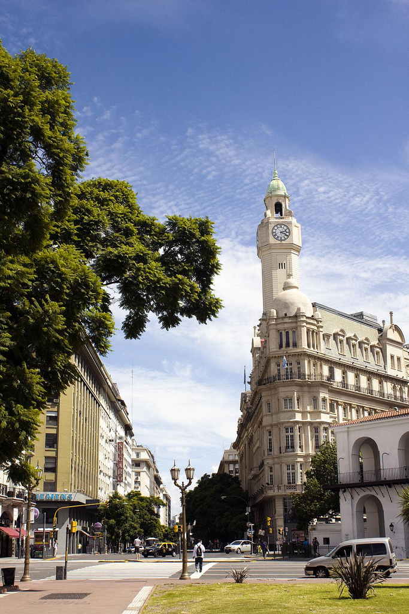
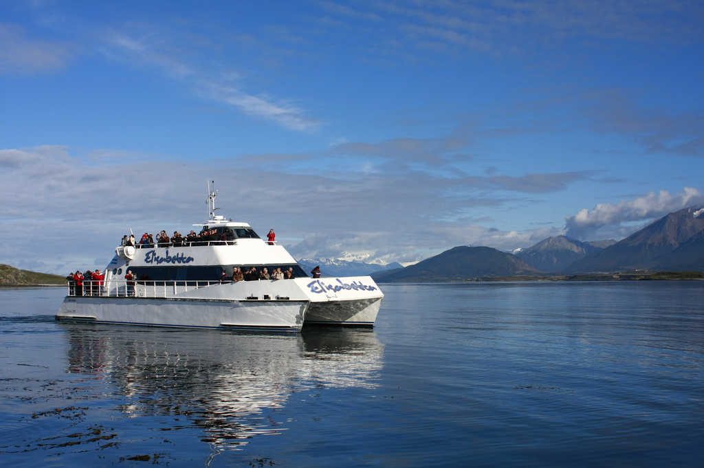
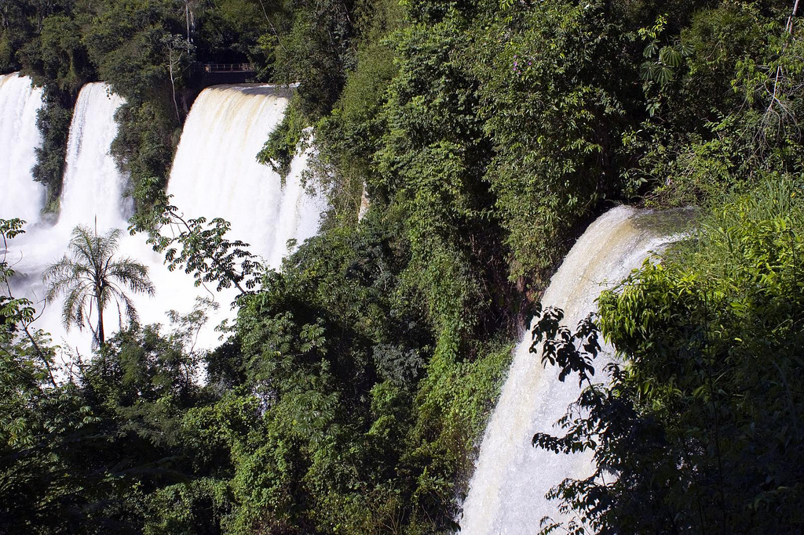
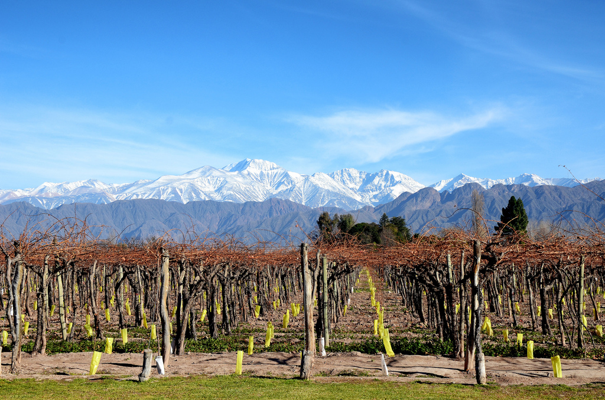
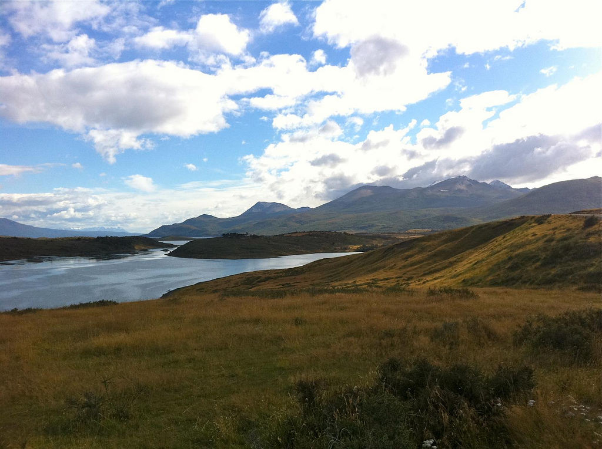
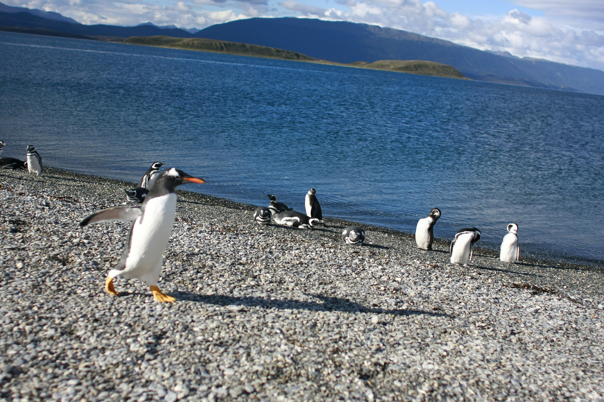
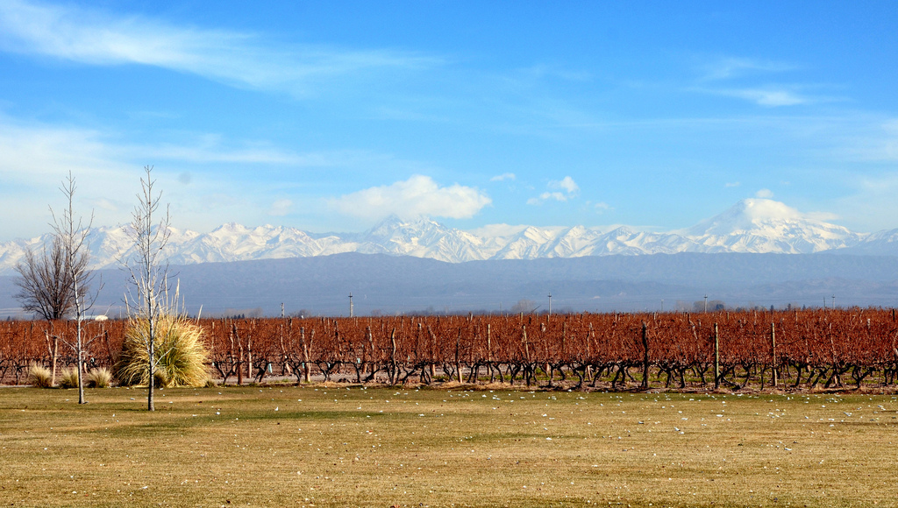
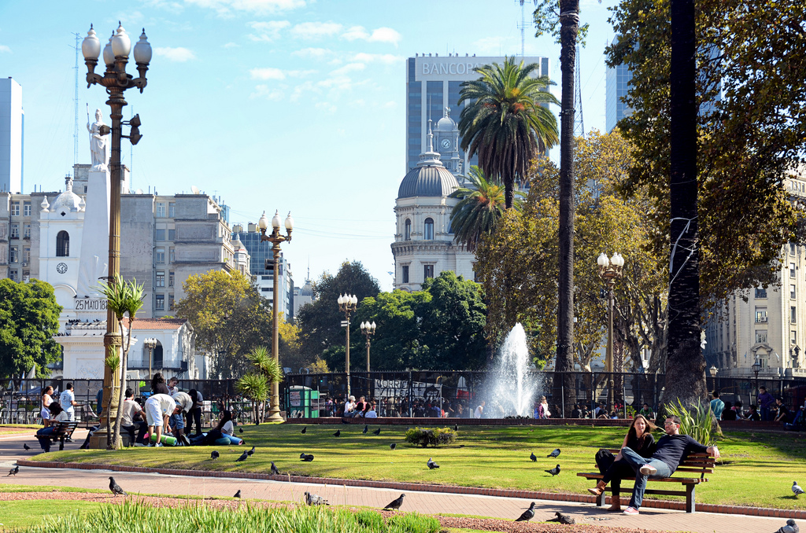
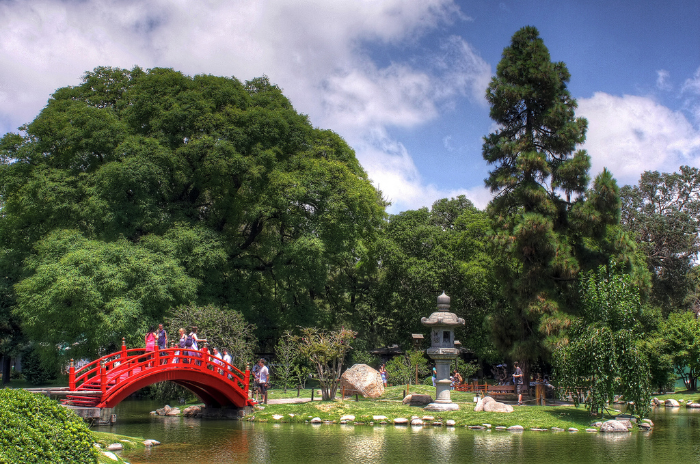

In 2011 I spent three months living in the beautiful country of Argentina in South America. I enjoyed my trip so much that in 2012 I went back and spent another two months there. From the steaks and tango in Buenos Aires, to the vineyards of Mendoza, to the rolling hills and epic landscape of Patagonia, the Argentina scenery all around the country is absolutely amazing.

If you’re thinking about taking a trip to South America, then definitely make sure you visit Argentina, one of the prettiest countries that I’ve ever been to. It’s also a great place to eat steak, if you’re a meat eater.

Here are a few of the photos I took during my two trips representing some of the beautiful Argentina scenery.

 
			#gallery-1 {
				margin: auto;
			}
			#gallery-1 .gallery-item {
				float: left;
				margin-top: 10px;
				text-align: center;
				width: 33%;
			}
			#gallery-1 img {
				border: 2px solid #cfcfcf;
			}
			#gallery-1 .gallery-caption {
				margin-left: 0;
			}
			/* see gallery_shortcode() in wp-includes/media.php */
		     Buenos Aires      The Beagle Channel, Near Ushuaia      Iguazu Falls   
     Mendoza      Tierra Del Fuego      Penguins near Ushuaia   
     Mendoza      Plaza de Mayo, Buenos Aires      Japanese Gardens in Buenos Aires   
 

All in all, I had an amazing five months in Argentina, with the highlight being a [four day trip to Ushuaia, Argentina](/destinations/south-america/argentina/update-from-the-end-of-the-world-ushuaia-argentina/), the southernmost city in the entire world.

If you’re considering a trip to Argentina, consider grabbing [Lonely Planet’s Argentina Country Guide](http://www.amazon.com/gp/product/174220015X/ref=as_li_qf_sp_asin_il_tl?ie=UTF8&camp=1789&creative=9325&creativeASIN=174220015X&linkCode=as2&tag=duanstor-20) or the [Frommer’s Guide to Argentina](http://www.amazon.com/gp/product/1118009649/ref=as_li_qf_sp_asin_il_tl?ie=UTF8&camp=1789&creative=9325&creativeASIN=1118009649&linkCode=as2&tag=duanstor-20) to make the most of your time in the country.